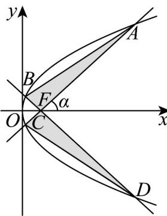

> [!faq]- 《第三章 圆锥曲线的方程（高效培优单元测试·强化卷）》官方解析
>
> > [!success]- **【答案】** $\alpha$ ，当 $\alpha = 45^{\circ}$ 时，如图所示的“蝴蝶形图案（阴影区域）”的面积为（）  A 4 B 8 C 16 D 32
>
> > [!note]- **【解析】**
> > 由题意知 $F(2,0)$ ，直线 $AC$ 的倾斜角 $\alpha = 45^{\circ}$ ，则直线 $AC$ 的方程为 $y = x - 2$
> >
> > 联立 $y^{2} = 8x$ ，消去 $y$ 可得： $x^{2} - 12x + 4 = 0$ ，解得 $x = 6 \pm 4\sqrt{2}$
> >
> > $$
> > x _ {A} = 6 + 4 \sqrt {2} x _ {C} = 6 - 4 \sqrt {2}
> > $$
> >
> > 由抛物线的定义可得 $\left|AF\right|=x_{A}+2=8+4\sqrt{2}$ ， $\left|CF\right|=x_{C}+2=8-4\sqrt{2}$
> >
> > 根据抛物线的对称性结合 $AC, BD$ 是过抛物线焦点 $F$ 的两条互相垂直的弦，
> >
> > 可知 $\left|DF\right|=\left|AF\right|=8+4\sqrt{2}$ ， $\left|BF\right|=\left|CF\right|=8-4\sqrt{2}$
> >
> > 故 $S_{\triangle AFB} = \frac{1}{2}|AF|\times |BF| = \frac{1}{2}\Big(8 + 4\sqrt{2}\Big)(8 - 4\sqrt{2}) = 16$
> >
> > 故“蝴蝶形图案（阴影区域）”的面积为 $2 \times 16 = 32$
> >
> > 故选 **D**
