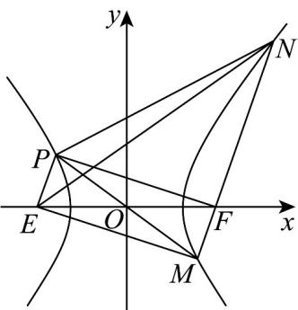

> [!faq]- 《第三章 圆锥曲线的方程（高效培优单元测试·强化卷）》官方解析
>
> > [!success]- **【答案】** D
>
> > [!note]- **【解析】**
> > 如图所示：设点 E 为双曲线的左焦点，不妨设 $\left|FM\right|=m$ ，则 $\left|NF\right|=2m$
> >
> > 
> >
> > 由双曲线的定义可得 $\left|EM\right|=2a+m$ ， $\left|NE\right|=2a+2m$ ，易知O为EF的中点，
> >
> > 由双曲线的对称性，知 $O$ 为 $PM$ 的中点，故四边形PEMF为平行四边形.
> >
> > 因为 $PF \perp FM$ ，故四边形PEMF为矩形，则 $\angle EMN = 90^{\circ}$
> >
> > 由勾股定理得 $\left|EM\right|^{2}+\left|MN\right|^{2}=\left|EN\right|^{2}$ ，即 $(2a+m)^{2}+9m^{2}=(2a+2m)^{2}$ ，解得 $m=\frac{2}{3}a$
> >
> > 故 $\left|EM\right|=\frac{8}{3}a,\left|MF\right|=\frac{2}{3}a$ ．又 $\left|EF\right|=2c$
> >
> > 由勾股定理可得 $\left|EM\right|^{2}+\left|MF\right|^{2}=\left|EF\right|^{2}$ ，即 $\frac{64}{9}a^{2}+\frac{4}{9}a^{2}=4c^{2}$ ，整理可得 $c=\frac{\sqrt{17}}{3}a$
> >
> > 故该双曲线的离心率为 $e=\frac{c}{a}=\frac{\sqrt{17}}{3}$
> >
> > 故选：D
> >
> > 4. 椭圆 $E: \frac{x^2}{6} + \frac{y^2}{2} = 1$ ，圆 $C_1: x^2 + y^2 = r_1^2 (r_1 > 0)$ 与椭圆 $E$ 相交于 $A_1, B_1, C_1, D_1$ 四点，圆 $C_2: x^2 + y^2 = r_2^2 (r_2 > 0, r_2 \neq r_1)$ 与椭圆 $E$ 相交于 $A_2, B_2, C_2, D_2$ 四点·若矩形 $A_1B_1C_1D_1$ 与矩形 $A_2B_2C_2D_2$ 的面积相等，
> >
> > 则 $r_1^2 + r_2^2 = (\quad)$ A. 12 B. 8 C. 6 D. 4
> >
> > 【答案】B
> > 【详解】不妨设点 $A_{1}(x_{1},y_{1}), A_{2}(x_{2},y_{2})$ 在第一象限，
> > 由矩形 $A_{1}B_{1}C_{1}D_{1}$ 与矩形 $A_{2}B_{2}C_{2}D_{2}$ 的面积相等，
> > 得 $4x_{1}y_{1}=4x_{2}y_{2}$ ，即 $x_{1}^{2}y_{1}^{2}=x_{2}^{2}y_{2}^{2}$ ，
> > 又 $A_{1}(x_{1},y_{1}), A_{2}(x_{2},y_{2})$ 在椭圆 $E$ 上，则 $x_{1}^{2}\cdot2\left(1-\frac{x_{1}^{2}}{6}\right)=x_{2}^{2}\cdot2\left(1-\frac{x_{2}^{2}}{6}\right)$ ，即 $x_{1}^{2}-x_{2}^{2}=\frac{x_{1}^{4}-x_{2}^{4}}{6}$ ，解得 $x_{1}^{2}+x_{2}^{2}=6$ ，
> > 从而 $y_{1}^{2}+y_{2}^{2}=2\left(1-\frac{x_{1}^{2}}{6}\right)+2\left(1-\frac{x_{2}^{2}}{6}\right)=4-\frac{x_{1}^{2}+x_{2}^{2}}{3}=2$ ，
> > 所以 $r_{1}^{2}+r_{2}^{2}=x_{1}^{2}+y_{1}^{2}+x_{2}^{2}+y_{2}^{2}=6+2=8$ 。
> >
> > 故选 **B**
