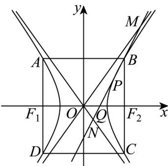

> [!faq]- 《第三章 圆锥曲线的方程（高效培优单元测试·强化卷）》官方解析
>
> > [!success]- **【答案】** D
>
> > [!note]- **【解析】**
> > 因 $\frac{c}{a}=\sqrt{3}\Rightarrow\frac{c^{2}}{a^{2}}=\frac{a^{2}+b^{2}}{a^{2}}=3\Rightarrow\frac{b^{2}}{a^{2}}=2$ ，则 $E:\frac{x^{2}}{a^{2}}-\frac{y^{2}}{2a^{2}}=1$
> >
> > $$
> > \frac {c ^ {2}}{a ^ {2}} - \frac {y ^ {2}}{2 a ^ {2}} = 1 \Rightarrow \frac {c ^ {2} - a ^ {2}}{a ^ {2}} = \frac {y ^ {2}}{2 a ^ {2}} \Rightarrow y ^ {2} = 2 b ^ {2} = 4 a ^ {2}
> > $$
> >
> > $$
> > B (c, 2 a)
> > $$
> >
> > $$
> > C (c, - 2 a)
> > $$
> >
> > $$
> > \left| B C \right| = 4 a
> > $$
> >
> > $$
> > \left| F _ {1} F _ {2} \right| = 2 c = 2 \sqrt {3} a
> > $$
> >
> > 由题可得四边形 ABCD 为矩形，则四边形 ABCD 面积为 $\left|F_{1}F_{2}\right|\left|BC\right|=8\sqrt{3}a=8\sqrt{3}$ 从而 $a=1\Rightarrow E:x^{2}-\frac{y^{2}}{2}=1$ 则 $l:\frac{x_{0}x}{a^{2}}-\frac{y_{0}y}{b^{2}}=1\Leftrightarrow2x_{0}x-y_{0}y=2$
> >
> > 又可得双曲线渐近线方程为： $y = \pm \sqrt{2} x$ ，将渐近线方程与直线 $l$ 方程联立，
> >
> > 可得 $\left\{\begin{aligned}&2x_{0}x-y_{0}y=2\\ &y=\sqrt{2}x\end{aligned}\right.$ 或 $\left\{\begin{aligned}&2x_{0}x-y_{0}y=2\\ &y=-\sqrt{2}x\end{aligned}\right.$
> >
> > $$
> > M \left(\frac {2}{2 x _ {0} - \sqrt {2} y _ {0}}, \frac {2 \sqrt {2}}{2 x _ {0} - \sqrt {2} y _ {0}}\right), N \left(\frac {2}{2 x _ {0} + \sqrt {2} y _ {0}}, \frac {- 2 \sqrt {2}}{2 x _ {0} + \sqrt {2} y _ {0}}\right)
> > $$
> >
> > 令 $y = 0$ ，可得直线 $l$ 与 $x$ 轴交点为 $Q\left(\frac{1}{x_0},0\right)$
> >
> > $$
> > S _ {\triangle O M N} = \frac {1}{2} | O Q | \left| y _ {M} - y _ {N} \right| = \frac {1}{2 \left| x _ {0} \right|} \cdot \left| \frac {8 \sqrt {2} x _ {0}}{4 x _ {0} ^ {2} - 2 y _ {0} ^ {2}} \right|.
> > $$
> >
> > 因 $P\left(x_0,y_0\right)$ 为双曲线 $C$ 上任意一点，则 $x_0^2 -\frac{y_0^2}{2} = 1\Rightarrow 4x_0^2 -2y_0^2 = 4.$
> >
> > 则 $S_{\triangle OMN} = \frac{1}{2|x_0|}\cdot \left|\frac{8\sqrt{2}x_0}{4x_0^2 - 2y_0^2}\right| = \sqrt{2}$
> >
> > 故选：D
> >
> > 
