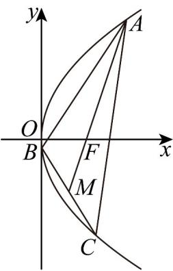
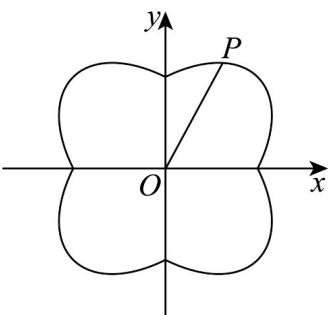

> [!faq]- 《第三章 圆锥曲线的方程（高效培优单元测试·强化卷）》官方解析
>
> > [!success]- **【答案】** A. 线段 $BC$ 的中点坐标为 $\left(\frac{12 - y_0^2}{8}, -\frac{y_0}{2}\right)$ B. 直线 $BC$ 的方程为 $4x + y_0y + y_0^2 - 6 = 0$ C. $y_0 \in [-2\sqrt{3}, 2\sqrt{3}]$ D. $\frac{1}{k_{AB}} + \frac{1}{k_{AC}} - \frac{1}{k_{BC}} = \frac{y_0}{2}$
>
> > [!note]- **【解析】**
> > 设 $A(x_0,y_0),B(x_1,y_1),C(x_2,y_2),F(1,0)$
> >
> > 因为 F 为 VABC 重心，
> >
> > 所以 $\left\{\begin{aligned}x_{0}+x_{1}+x_{2}&=3\\ y_{0}+y_{1}+y_{2}&=0\end{aligned}\right.$ ，设 BC 中点 $M\left(x_{M},y_{M}\right)$ ，则 $AM=\left(x_{M}-x_{0},y_{M}-y_{0}\right)$ ，
> >
> > $\overline{AF}=\left(1-x_{0},-y_{0}\right)$ ，由重心分中线1:2得 $\overline{AF}=\frac{2}{3}AM$
> >
> > $$
> > \text {即} \left\{ \begin{array}{l} 1 - x _ {0} = \frac {2}{3} \left(x _ {M} - x _ {0}\right) \\ - y _ {0} = \frac {2}{3} \left(y _ {M} - y _ {0}\right) \end{array} \Rightarrow \left\{ \begin{array}{l} x _ {M} = \frac {3}{2} - \frac {x _ {0}}{2} \\ y _ {M} = - \frac {y _ {0}}{2} \end{array} , \right. \right.
> > $$
> >
> > 又点 A 在抛物线上，所以 $y_{0}^{2}=4x_{0}$ ，所以 $x_{M}=\frac{3}{2}-\frac{y_{0}^{2}}{8}=\frac{12-y_{0}^{2}}{8}$ ，即 $M\left(\frac{12-y_{0}^{2}}{8},-\frac{y_{0}}{2}\right)$ ，故 A 正确；
> >
> > $$
> > k _ {B C} = \frac {y _ {1} - y _ {2}}{x _ {1} - x _ {2}} = \frac {4 (y _ {1} - y _ {2})}{4 (x _ {1} - x _ {2})} = \frac {4}{y _ {1} + y _ {2}} = \frac {- 4}{y _ {0}},
> > $$
> >
> > $$
> > B C: y + \frac {y _ {0}}{2} = \frac {- 4}{y _ {0}} \left(x - \frac {1 2 - y _ {0} ^ {2}}{8}\right) \Rightarrow y _ {0} y + \frac {y _ {0} ^ {2}}{2} = - 4 x + \frac {1 2 - y _ {0} ^ {2}}{2} \Rightarrow 4 x + y _ {0} y + y _ {0} ^ {2} - 6 = 0, \text {故} ^ {\mathrm{B}} \text {正确};
> > $$
> >
> > 因为 $x_{M}=\frac{3}{2}-\frac{y_{0}^{2}}{8}>0$ ，所以 $y_{0}^{2}<12$ ，所以 $y_{0}\in(-2\sqrt{3},2\sqrt{3})$ ，故 C 错误；
> >
> > $$
> > \frac {1}{k _ {A B}} = \frac {x _ {0} - x _ {1}}{y _ {0} - y _ {1}} = \frac {4 \left(x _ {0} - x _ {1}\right)}{4 \left(y _ {0} - y _ {1}\right)} = \frac {y _ {0} ^ {2} - y _ {1} ^ {2}}{4 \left(y _ {0} - y _ {1}\right)} = \frac {y _ {0} + y _ {1}}{4}, \text {同理} \frac {1}{k _ {A C}} = \frac {y _ {0} + y _ {2}}{4}, \frac {1}{k _ {B C}} = \frac {y _ {1} + y _ {2}}{4}
> > $$
> >
> > 所以 $\frac{1}{k_{AB}} +\frac{1}{k_{AC}} -\frac{1}{k_{BC}} = \frac{y_0 + y_1}{4} +\frac{y_0 + y_2}{4} -\frac{y_1 + y_2}{4} = \frac{y_0}{2}$ ，故D正确.
> >
> > 故选：C.
> >
> > 
> >
> > 8. 窗花是中国传统剪纸艺术的重要分支，主要用于节日或喜庆场合的窗户装饰，尤以春节最为常见，它
> > 以红纸为材料，通过剪、刻等技法创作出精美图案，图案讲究构图对称、虚实相生.2025年春节，小明同
> > 学利用AI软件为家里制作了一幅窗花图案（如图），其外轮廓为方程 $C: x^{2} + y^{2} = 1 + |xy|$ 所表示的曲线·设
> > 图案的中心为O,P为曲线C上的最高点，则 $\left|OP\right| = (\quad)$
> >
> > 
> >
> > A. $\sqrt{2}$ B. $\frac{2\sqrt{3}}{3}$ C. $\frac{4}{3}$ D. $\frac{\sqrt{15}}{3}$
> >
> > 【答案】D
> >
> > 【详解】如图，设 $O$ 为原点，我们可以把 $x^{2} + y^{2} = 1 + |xy|$ 放入平面直角坐标系中，
> >
> > 
> >
> > 连接 $OP$ ，再利用曲线的对称性，我们不妨设 $P(x,y)(x,y\quad 0)$
> >
> > 因为 $x^{2} + y^{2} = 1 + xy$ ，所以 $x^{2} - yx + y^{2} - 1 = 0$
> >
> > 我们把 $x^{2} - yx + y^{2} - 1 = 0$ 视为以 $x$ 为主元的一元二次方程，
> >
> > 故 $\left\{ \begin{array}{ll}\Delta = (-y)^2 -4(y^2 -1) & 0\\ y & 0 \end{array} \right.$ ，解得 $0\leq y\leq \frac{2\sqrt{3}}{3}$
> >
> > 即 $y_{\max} = \frac{2\sqrt{3}}{3}$ ，代入 $x^{2} + y^{2} = 1 + xy$ ，解得 $x = \frac{\sqrt{3}}{3}$ ，此时 $P(\frac{\sqrt{3}}{3},\frac{2\sqrt{3}}{3})$
> >
> > 此时由两点间距离公式得 $\left|OP\right|=\sqrt{\left(\frac{2\sqrt{3}}{3}\right)^{2}+\left(\frac{\sqrt{3}}{3}\right)^{2}}=\frac{\sqrt{15}}{3}$ ，故D正确·
> >
> > 故选：D.
> >
> > ## 二、选择题：本题共3小题，每小题6分，共18分．在每小题给出的选项中，有多项符合题目要求．全部选对的得6分，部分选对的得部分分，有选错的得0分.
