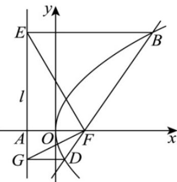

> [!faq]- 《第三章 圆锥曲线的方程（高效培优单元测试·强化卷）》官方解析
>
> > [!success]- **【答案】** ACD
>
> > [!note]- **【解析】**
> > 抛物线 $C:y^{2} = 4x$ 的焦点 $F(1,0)$ ，准线 $l:x = -1$ ，点 $A(-1,0)$ ，设 $B(x_{1},y_{1}),D(x_{2},y_{2})$
> >
> > 
> >
> > 对于 $\mathsf{A}$ ，直线 $BD:y = x - 1$ ，由 $\left\{ \begin{array}{l}y = x - 1\\ y^2 = 4x \end{array} \right.$
> >
> > 消去 $y$ 得 $x^{2} - 6x + 1 = 0$ ，所以 $x_{1} + x_{2} = 6$ ，所以 $\left|BD\right| = x_1 + x_2 + 2 = 8$ ，故A正确：
> >
> > 对于 B， $\left|BD\right|=x_{1}+x_{2}+2$ ，线段 BD 中点横坐标 $x_{0}=\frac{x_{1}+x_{2}}{2}=\frac{1}{2}\left|BD\right|$
> >
> > 弦 BD 中点到准线的距离为 $\frac{1}{2}|BD|$ ，因此以 BF 为直径的圆与准线相切，故 B 错误；
> >
> > 对于 $\mathbb{C}$ ，由 $\left|BF\right| = \left|BE\right|, BE\nparallel AF$ ，得 $\angle AFE = \angle BEF = \angle BFE$ ，同理 $\angle AFG = \angle DFG$
> >
> > 则 $\angle EFG = \angle AFE + \angle AFG = \frac{1}{2} (\angle AFB + \angle AFD) = 90^{\circ}$ ，故C正确.
> >
> > 对于 D，设直线 BD:x=ty+1，联立 $\left\{\begin{aligned}x&=ty+1\\ y^{2}&=4x\end{aligned}\right.$ ，得 $y^{2}-4ty-4=0$ ，则 $y_{1}y_{2}=-4$ ，
> >
> > $OB:y = \frac{y_1}{x_1} x$ 直线 $OB$ 与准线 $l$ 交于 $H(x_{H},y_{H})$
> >
> > 联立 $\left\{\begin{aligned}y&=\frac{y_{1}}{x_{1}}x\\ x&=-1\end{aligned}\right.$ ，解得 $y_{H}=-\frac{y_{1}}{x_{1}}=-\frac{y_{1}}{\frac{y_{1}^{2}}{4}}=-\frac{4}{y_{1}}$
> >
> > 又 $y_{2} = -\frac{4}{y_{1}}$ ，所以 $y_{H} = y_{2}$ ，即 $H$ 与 $G$ 重合，所以 $B, O, G$ 三点共线．故 $\mathsf{D}$ 正确．
> >
> > 故选 **ACD**
