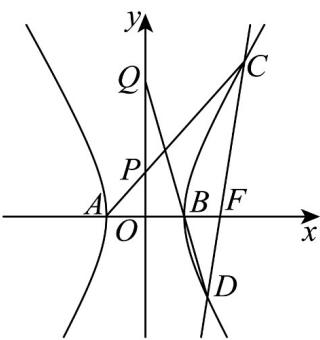

> [!faq]- 《第三章 圆锥曲线的方程（高效培优单元测试·强化卷）》官方解析
>
> > [!success]- **【答案】** $\frac{1}{3}$
>
> > [!note]- **【解析】**
> > 由题意可得， $c = 2$ ， $\frac{b}{a} = \sqrt{3}$ ，解得 $a = 1, b = \sqrt{3}, c = 2$
> >
> > 则 $E:x^{2} - \frac{y^{2}}{3} = 1$
> >
> > 设 $CD:x = my + 2$ ，与 $E:x^{2} - \frac{y^{2}}{3} = 1$ 联立得 $\left(3m^2 -1\right)y^2 +12my + 9 = 0$
> >
> > 设 $C(x_{1},y_{1}),D(x_{2},y_{2})$ ，则 $y_{1} + y_{2} = -\frac{12m}{3m^{2} - 1},y_{1}y_{2} = \frac{9}{3m^{2} - 1}$
> >
> > 则 $my_{1}y_{2} = -\frac{3}{4}\big(y_{1} + y_{2}\big)$
> >
> > $AC:y = \frac{y_1}{x_1 + 1}(x + 1)$ $BD:y = \frac{y_2}{x_2 - 1}(x - 1)$ 直线
> >
> > 则 $P\left(0, \frac{y_1}{x_1 + 1}\right)$ ， $Q\left(0, \frac{-y_2}{x_2 - 1}\right)$
> >
> > $$
> > \frac {\left| O P \right|}{\left| O Q \right|} = \left| \frac {y _ {1}}{x _ {1} + 1} \right| \cdot \left| \frac {x _ {2} - 1}{- y _ {2}} \right| = \left| \frac {y _ {1} (m y _ {2} + 1)}{y _ {2} (m y _ {1} + 3)} \right| = \left| \frac {m y _ {1} y _ {2} + y _ {1}}{m y _ {1} y _ {2} + 3 y _ {2}} \right| = \left| \frac {- \frac {3}{4} (y _ {1} + y _ {2}) + y _ {1}}{- \frac {3}{4} (y _ {1} + y _ {2}) + 3 y _ {2}} \right|
> > $$
> >
> > $$
> > = \left| \frac {y _ {1} - 3 y _ {2}}{- 3 y _ {1} + 9 y _ {2}} \right| = \frac {1}{3}
> > $$
> >
> > 故答案为： $\frac{1}{3}$
> >
> > 
