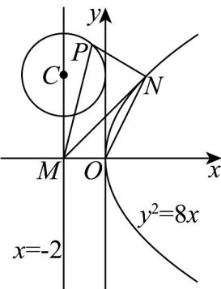
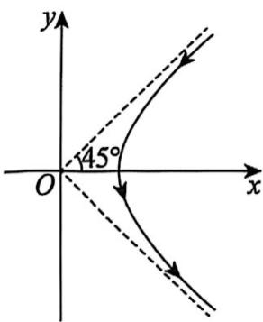
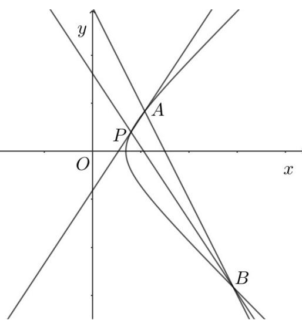

> [!faq]- 《第三章 圆锥曲线的方程（高效培优单元测试·强化卷）》官方解析
>
> > [!success]- **【答案】** $2 \sqrt{10}$
>
> > [!note]- **【解析】**
> > 设圆 $\left(x + 2\right)^{2} + \left(y - 4\right)^{2} = 2$ 的圆心为 $C(-2,4)$ ， $r = \sqrt{2}$
> >
> > 设直线 $ON$ 的方程为 $y = 2x$
> >
> > 联立 $\left\{\begin{aligned}y&=2x\\ y^{2}&=8x\end{aligned}\right.$ 可得： $4x^{2}-8x=0$ ，解得：x=0 或 x=2，
> >
> > 因为 $N$ 是抛物线在第一象限上一点，所以 $N(2,4)$
> >
> > 所以 $M(-2,0)$ ，点 $P$ 可理解为以 $M,N$ 为焦点的动椭圆与圆的一个交点，
> >
> > $\left|PM\right| + \left|PN\right|$ 可理解为椭圆上一点到两个焦点的距离之和为 $2a$
> >
> > 根据椭圆的性质， $2a=2\sqrt{b^{2}+c^{2}}$
> >
> > 因为焦距为 $\left|MN\right|=\sqrt{(2+2)^{2}+4^{2}}=4\sqrt{2}$ ，即 $c=2\sqrt{2}$ ，
> >
> > 当圆与动椭圆外切时 b 最小即点 P 到直线 MN 最近时 b 最小，
> >
> > 此时 $l_{MN}: y = \frac{4 - 0}{2 - (-2)} (x + 2) = x + 2$ ，即 $x - y + 2 = 0$ ，
> >
> > 点 $C(-2,4)$ 到直线 $MN$ 的距离为： $d = \frac{|-2 - 4 + 2|}{\sqrt{2}} = 2\sqrt{2}$
> >
> > $P_{\text{到直线}}MN$ 的最小值为 $d - r = \sqrt{2}$ ，即 $b = \sqrt{2}$
> >
> > 所以 $2a = 2\sqrt{b^{2} + c^{2}} = 2\sqrt{\left(\sqrt{2}\right)^{2} + \left(2\sqrt{2}\right)^{2}} = 2\sqrt{10}$ 为最小值.
> >
> > 故答案为： $2\sqrt{10}$
> >
> > 
> >
> > 14．1911年5月，欧内斯特·卢瑟福在《哲学》杂志上发表论文·在这篇论文中，他描述了用 $\alpha$ 粒子轰击
> >
> > 0.00004cm 厚的金箔时拍摄到的运动情况·在进行这个实验之前，卢瑟福希望 $\alpha$ 粒子能够通过金箔，就像子
> >
> > 弹穿过雪一样，事实上，有极小一部分 $\alpha$ 粒子从金箔上反弹·如图，显示了卢瑟福实验中偏转的 $\alpha$ 粒子遵循
> >
> > 双曲线一支的路径，则该双曲线的离心率为\_\_\_\_；如果 $\alpha$ 粒子的路径经过 $P(8,4)$ ， $A$ 和 $B$ 三点，记直
> >
> > 线 $PA$ ， $PB$ 的斜率分别为 $k_{PA}$ ， $k_{PB}$ ，且满足 $k_{PA} + k_{PB} = 0$ ，则直线 $AB$ 的斜率 $k_{AB} =$
> >
> > 
> >
> > 【答案】 $\sqrt{2}$ -2
> >
> > 【详解】设双曲线方程为 $\frac{x^2}{a^2} -\frac{y^2}{b^2} = 1(a > 0,b > 0,x > 0)$
> >
> > 根据题意一条渐近线方程为 $y = x$ ，所以 $\frac{b}{a} = 1$ ，即 $a = b$ ， $\therefore e = \sqrt{\frac{c^2}{a^2}} = \sqrt{\frac{a^2 + b^2}{a^2}} = \sqrt{2}$ ，即该双曲线的离心率为 $\sqrt{2}$
> >
> > 又经过 $P(8,4)$ ，所以 $\frac{64}{a^2} - \frac{16}{b^2} = \frac{64}{a^2} - \frac{16}{a^2} = \frac{48}{a^2} = 1 \Rightarrow a^2 = 48$ ，
> >
> > 所以双曲线方程为 $\frac{x^2}{48} -\frac{y^2}{48} = 1(x > 0)$
> >
> > 设直线 $AB$ 的方程为 $y = kx + m$ ， $A(x_1, y_1), B(x_2, y_2)$
> >
> > 
> >
> > $$
> > \left\{ \begin{array}{l} \frac {x ^ {2}}{4 8} - \frac {y ^ {2}}{4 8} = 1 \\ y = k x + m \end{array} \Rightarrow (1 - k ^ {2}) x ^ {2} - 2 k m x - m ^ {2} - 4 8 = 0 \right.
> > $$
> >
> > $x_{1} + x_{2} = \frac{2km}{1 - k^{2}} >0,x_{1}x_{2} = \frac{-m^{2} - 48}{1 - k^{2}} >0$ ，解得 $k <   - 1$ 或 $k > 1$
> >
> > $$
> > \Delta = (2 k m) ^ {2} + 4 (m ^ {2} + 4 8) (1 - k ^ {2}) = 4 (m ^ {2} + 4 8 - 4 8 k ^ {2}) > 0
> > $$
> >
> > $$
> > x _ {2} y _ {1} + x _ {1} y _ {2} = x _ {2} (k x _ {1} + m) + x _ {1} (k x _ {2} + m) = 2 k x _ {1} x _ {2} + m (x _ {1} + x _ {2}) = \frac {- 9 6 k}{1 - k ^ {2}},
> > $$
> >
> > $$
> > y _ {1} + y _ {2} = k \left(x _ {1} + x _ {2}\right) + 2 m = \frac {2 m}{1 - k ^ {2}}
> > $$
> >
> > $$
> > k _ {P A} + k _ {P B} = \frac {y _ {1} - 4}{x _ {1} - 8} + \frac {y _ {2} - 4}{x _ {2} - 8} = \frac {(y _ {1} - 4) (x _ {2} - 8) + (y _ {2} - 4) (x _ {1} - 8)}{(x _ {1} - 8) (x _ {2} - 8)}
> > $$
> >
> > $$
> > = \frac {x _ {2} y _ {1} + x _ {1} y _ {2} - 8 (y _ {1} + y _ {2}) - 4 (x _ {1} + x _ {2}) + 6 4}{(x _ {1} - 8) (x _ {2} - 8)}
> > $$
> >
> > $$
> > = \frac {- 9 6 k - 1 6 m - 8 k m + 6 4 - 6 4 k ^ {2}}{\left(x _ {1} - 8\right) \left(x _ {2} - 8\right) \left(1 - k ^ {2}\right)}
> > $$
> >
> > $$
> > = \frac {- 8 (8 k + m - 4) (k + 2)}{(x _ {1} - 8) (x _ {2} - 8) (1 - k ^ {2})} = 0
> > $$
> >
> > 若 $8k + m - 4 = 0$ ，则 $y = kx + 4 - 8k$ ，即 $y - 4 = k(x - 8)$
> >
> > 此时直线 $AB$ 过点 $P(8,4)$ ，不符合题意，
> >
> > 所以 $k + 2 = 0 \Rightarrow k = -2$ .
> >
> > 故答案为： $\sqrt{2}$ ，-2.
> >
> > 四、解答题：本题共5小题，共77分。解答应写出文字说明、证明过程或演算步骤。
