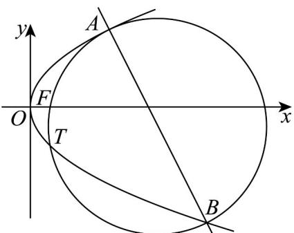
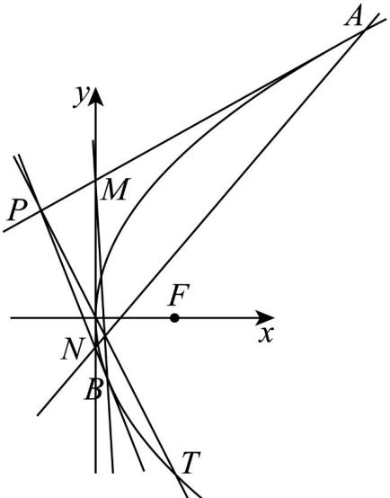

> [!faq]- 《第三章 圆锥曲线的方程（高效培优单元测试·强化卷）》官方解析
>
> > [!success]- **【答案】** (1) $y^{2}=8x$ (2) $2x + y - 24 = 0$ (3)证明见解析
>
> > [!note]- **【解析】**
> > （1）由题意，设 $E:y^{2}=2px,\ p>0$
> >
> > 将 $T(2, -4)$ 代入得， $(-4)^{2} = 2p\times 2$ ，解得 $p = 4$
> >
> > 所以 $E$ 的标准方程为 $y^{2} = 8x$
> >
> > (2) 设 $A(x_{1}, y_{1})$ , $B(x_{2}, y_{2})$ , 直线 AB: x = my + b
> >
> > 联立直线 $AB$ 与抛物线的方程，得方程组 $\left\{ \begin{array}{l} x = my + b \\ y^2 = 8x \end{array} \right.$
> >
> > 消去 $x$ ，得 $y^{2} - 8my - 8b = 0$ ，判别式 $\Delta = 64m^2 +32b > 0$ ，即 $b > - 2m^2$
> >
> > $$
> > y _ {1} + y _ {2} = 8 m, y _ {1} y _ {2} = - 8 b, x _ {1} + x _ {2} = m \left(y _ {1} + y _ {2}\right) + 2 b = 8 m ^ {2} + 2 b, x _ {1} x _ {2} = \frac {\left(y _ {1} y _ {2}\right) ^ {2}}{6 4} = b ^ {2}
> > $$
> >
> > 由 $F(2,0)$ ， $\overline{FA} \cdot \overline{FB} = 0$ ，得 $(x_1 - 2, y_1) \cdot (x_2 - 2, y_2) = x_1 x_2 - 2(x_1 + x_2) + y_1 y_2 + 4 = 0$
> >
> > 所以 $16m^{2} = b^{2} - 12b + 4$ ，FT中点的纵坐标为-2，则 $y_{1} + y_{2} = -4$
> >
> > 所以 $8m = -4 \Rightarrow m = -\frac{1}{2}$ ，代入 $16m^2 = b^2 - 12b + 4$ ，解得 $b = 0$ 或 $b = 12$ ，
> >
> > 当 $b = 0$ 时，点 $T$ 在直线 $y = -2x$ 上，不合题意，舍去，
> >
> > 故直线 $AB$ 的方程为 $2x + y - 24 = 0$
> >
> > 
> >
> > (3) 证明：设过点 $A(x_{1}, y_{1})$ 的切线方程为 $y - y_{1} = k(x - x_{1})$
> >
> > 与 $y^{2}=8x$ 联立，整理得 $ky^{2}-8y-8kx_{1}+8y_{1}=0$ ，
> >
> > $$
> > \Delta = 6 4 - 4 \cdot k (8 y _ {1} - 8 k x _ {1}) = 6 4 - 4 \cdot k (8 y _ {1} - k y _ {1} ^ {2}) = 0
> > $$
> >
> > 得 $\left(ky_{1}-4\right)^{2}=0$ ，即 $k=\frac{4}{y_{1}}$ （或 $2y\cdot y^{\prime}=8$ ， $y^{\prime}=\frac{4}{y}$ ，过点 $A(x_{1},y_{1})$ 的切线的斜率 $k=\frac{4}{y_{1}}$ ），
> >
> > 即过点 $A\left(x_{1},y_{1}\right)$ 的切线方程为 $y_{1}y = 4\left(x + x_{1}\right)$ ，即 $y = \frac{4}{y_1} x + \frac{y_1}{2}$
> >
> > 令 $x = 0$ ，得 $M\left(0,\frac{y_1}{2}\right)$
> >
> > 同理可得过点 $B\left(x_{2},y_{2}\right)$ 的切线方程为 $y = \frac{4}{y_2} x + \frac{y_2}{2}$ ，令 $x = 0$ ，得 $N\left(0,\frac{y_2}{2}\right)$
> >
> > 直线 $AN$ 的方程为 $y = \frac{y_1 - \frac{y_2}{2}}{x_1} x + \frac{y_2}{2}$ ，直线 $BM$ 的方程为 $y = \frac{y_2 - \frac{y_1}{2}}{x_2} x + \frac{y_1}{2}$ 。
> >
> > 设 $P(x_0, y_0)$ ，切线 $PA$ ， $PB$ 交于点 $P$ ，得 $y_0 = \frac{4}{y_1} x_0 + \frac{y_1}{2}$ ， $y_0 = \frac{4}{y_2} x_0 + \frac{y_2}{2}$
> >
> > 解得 $x_0 = \frac{y_1y_2}{8}$ ， $y_{0} = \frac{y_{1} + y_{2}}{2}$ ，点 $P$ 在直线 $OT:y = -2x$ 上，则 $y_{1}y_{2} = -2(y_{1} + y_{2})$
> >
> > 设直线 $AN$ 与直线 $OT$ 交于点 $Q$ ， $x_{Q} = -\frac{x_{1}y_{2}}{2y_{1} - y_{2} + 4x_{1}} = -\frac{y_{1}y_{2}}{8\left(2 - \frac{y_{2}}{y_{1}} + \frac{y_{1}}{2}\right)}$
> >
> > 同理，设直线 $_{BM}$ 与直线 $_{OT}$ 交于点W， $x_{W}=-\frac{y_{1}y_{2}}{8\left(2-\frac{y_{1}}{y_{2}}+\frac{y_{2}}{2}\right)}$ ，
> >
> > 由 $y_{1}y_{2} = -2(y_{1} + y_{2})$ ，得 $\frac{y_1}{2} -\frac{y_2}{y_1} = \frac{y_2}{2} -\frac{y_1}{y_2}$ ，则 $Q$ ， $W$ 两点重合，
> >
> > 即直线 AN 与直线 BM 的交点在定直线 y = -2x 上.
> >
> > 
