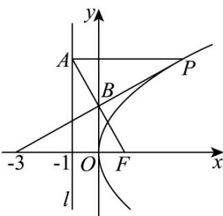

> [!faq]- 《第三章 圆锥曲线的方程（高效培优单元测试·提升卷）》官方解析
>
> > [!success]- **【答案】** A. $\frac{\sqrt{3}}{6}$ 或 $-\frac{\sqrt{3}}{6}$ B. $\frac{\sqrt{3}}{3}$ 或 $-\frac{\sqrt{3}}{3}$ C. 1 或 -1 D. $\sqrt{3}$ 或 $-\sqrt{3}$
>
> > [!note]- **【解析】**
> > 由题意， $F(1,0)$ ，准线为 l:x=-1
> >
> > 设 $P\left(\frac{t^{2}}{4},t\right)(t\neq0)$ ，则 $A(-1,t)$ ，
> >
> > 由于 $FA = 2FB$ ，则 $B$ 为 $AF$ 的中点，即 $B\left(0,\frac{t}{2}\right)$
> >
> > 又点 $(-3,0)$ 在直线PB上，
> >
> > 则 $k_{PB} = \frac{t - \frac{t}{2}}{\frac{t^2}{4} - 0} = \frac{\frac{t}{2} - 0}{0 - (-3)}$ ，解得 $t = \pm 2\sqrt{3}$ ，则 $k_{PB} = \pm \frac{\sqrt{3}}{3}\cdot$
> >
> > 故选：B.
> >
> > 
