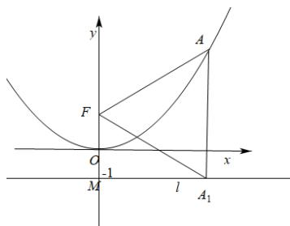

> [!faq]- 《第三章 圆锥曲线的方程（高效培优单元测试·提升卷）》官方解析
>
> > [!success]- **【答案】** B
>
> > [!note]- **【解析】**
> > 因点 $A$ 在 $C$ 上，则 $\left|AF\right| = \left|A_{1}A\right|$ ，又 $\left|A_{1}F\right| = \left|AF\right|$ ， $\therefore \triangle AFA_{1}$ 为正三角形，
> >
> > 如图，准线 l 与 y 轴交于点 M，在 Rt△A₁FM 中，∠MA₁F = 30°，所以 $\left|A_{1}F\right| = \frac{2}{\sin 30^{\circ}} = 4$ ，即 $\left|AF\right| = 4$ .
> >
> > 
> >
> > 故选 **B**
