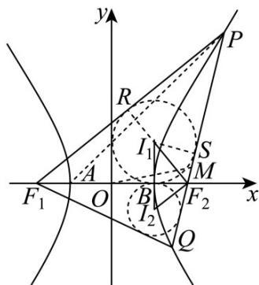

> [!faq]- 《第三章 圆锥曲线的方程（高效培优单元测试·提升卷）》官方解析
>
> > [!success]- **【答案】** ABD
>
> > [!note]- **【解析】**
> > 依题意，得 $a^2 = 1, b^2 = 3$ ，得 $c^2 = 4$ ，则 $A(-1,0), B(1,0), F_1(-2,0), F_2(2,0)$ .
> >
> > 设点 $P(x_{1},y_{1}), Q(x_{2},y_{2}), M(x_{0},y_{0})$
> >
> > 对于 A 项，如图，设 $\triangle PF_{1}F_{2}$ 的内切圆的切点为 R, S, T
> >
> > 
> >
> > 由双曲线的定义得， $PF_{1}^{*} + PF_{2}^{*} = 2a$ ，而 $|PR| = |PS|$
> >
> > 得 $RF_{1} + SF_{2} = 2a$ ，而 $RF_{1} \neq TF_{1}$ ， $SF_{2} \neq TF_{2}$
> >
> > 得 $TF_{1} + TF_{2} = 2a$ ，又因为 $BF_{1} + BF_{2} = (c + a) - (c - a) = 2a$
> >
> > 得切点 T 与点 B 重合，得点 $T(1,0)$ ，则内心 $I_{1}$ 的横坐标为 1
> >
> > 同理可得，内心 $I_{2}$ 的横坐标也为1，得 $I_{1}, B, I_{2}$ 三点共线，故A项正确·
> >
> > 对于 B 项，由 $\left\{\begin{aligned}x_{1}^{2}-\frac{y_{1}^{2}}{3}&=1\\ x_{2}^{2}-\frac{y_{2}^{2}}{3}&=1\end{aligned}\right.$ 相减得， $x_{1}^{2}-x_{2}^{2}=\frac{y_{1}^{2}}{3}-\frac{y_{2}^{2}}{3}$
> >
> > 得 $\frac{y_1 - y_2}{x_1 - x_2} \cdot \frac{y_1 + y_2}{x_1 + x_2} = 3$ ，即 $k_{PQ} \cdot k_{OM} = 3$ ，故 B 项正确；
> >
> > 对于 C 项，设直线 l 的倾斜角为 $\theta$ ，连接 $I_{1}F_{2}, I_{2}F_{2}$
> >
> > 则 $\angle I_{1}SF_{2} = \frac{\pi}{2},\angle I_{2}F_{2}B = \angle BI_{1}F_{2} = \frac{\theta}{2}\mid BF_{2} = c - a = 1,r_{1} = \frac{1}{\tan\frac{\theta}{2}},r_{2} = \tan \frac{\theta}{2}$
> >
> > 若 $r_1 = 2r_2$ ，则 $\tan \frac{\theta}{2} = \frac{\sqrt{2}}{2}$ ， $\tan \theta = \frac{2\tan\frac{\theta}{2}}{1 - \tan^2\frac{\theta}{2}} = \frac{\sqrt{2}}{1 - \frac{1}{2}} = 2\sqrt{2}$ ，故C项错误；
> >
> > 对于D项，由题可知双曲线的渐近线为： $y = \pm \sqrt{3} x$ ，倾斜角分别为 $\frac{\pi}{3}, \frac{2\pi}{3}$
> >
> > 因为直线 l 与双曲线的右支交于 P, Q 两点，
> >
> > 所以 $\theta \in \left(\frac{\pi}{3},\frac{2\pi}{3}\right),\frac{\theta}{2}\in \left(\frac{\pi}{6},\frac{\pi}{3}\right),\tan \frac{\theta}{2}\in \left(\frac{\sqrt{3}}{3},\sqrt{3}\right)$
> >
> > 令 $\tan \frac{\theta}{2} = t$ ，则 $t \in \left( \frac{\sqrt{3}}{3}, \sqrt{3} \right)$ ，则 $y = t + \frac{1}{t}$ 在 $\left( \frac{\sqrt{3}}{3}, 1 \right)$ 上单调递减，在 $\left(1, \sqrt{3}\right)$ 上单调递增，
> >
> > 故 $t + \frac{1}{t}\in \left[2,\frac{4\sqrt{3}}{3}\right)$
> >
> > 故 $r_1 + r_2 = \frac{1}{\tan\frac{\theta}{2}} + \tan \frac{\theta}{2} \in \left[2, \frac{4\sqrt{3}}{3}\right)$ ，故D项正确·
> >
> > 故选 **ABD**
