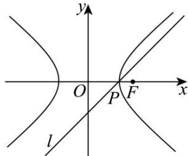
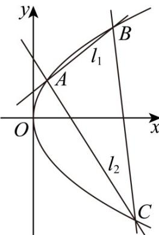

> [!faq]- 《第三章 圆锥曲线的方程（高效培优单元测试·提升卷）》官方解析
>
> > [!success]- **【答案】** (1) $y^{2}=4\sqrt{7}x$ (2) $\frac{3\sqrt{21}}{7}$ (3) $d=\frac{3\sqrt{2}}{2}$ 或 $d=\frac{\sqrt{2}}{2}$
>
> > [!note]- **【解析】**
> > （1）由双曲线 $C: \frac{x^2}{4} - \frac{y^2}{3} = 1$ ，可得 $c = \sqrt{7}$
> >
> > 则右焦点为 $F\left(\sqrt{7},0\right)$ ，所以以 F 为焦点的抛物线的标准方程为 $y^{2}=4\sqrt{7}x$ ；
> >
> > (2) 设 $Q(x_{0}, y_{0})$ ，则有 $\frac{x_{0}^{2}}{4}-\frac{y_{0}^{2}}{3}=1$
> >
> > $\left|QT\right| = \sqrt{(x_0 - 4)^2 + y_0^2} = \sqrt{\frac{7}{4} x_0^2 - 8x_0 + 13}$ ，由 $\left|x_0\right| = 2$
> >
> > 当 $x_{0}=\frac{16}{7}$ 时， $\left|QT\right|_{\min}=\frac{3\sqrt{21}}{7}$
> >
> > (3) 由题意，直线 l 法向量为 $n = (1, -1)$ ，可得直线 l 的斜率为 1，
> >
> > 设与直线 l 平行的直线方程为 $y = x + m$ ，
> >
> > 联立方程组 $\left\{ \begin{array}{l} y = x + m \\ \frac{x^2}{4} - \frac{y^2}{3} = 1 \end{array} \right.$ ，整理得 $x^2 + 8mx + 4m^2 + 12 = 0$ ，
> >
> > 令 $\Delta = 64m^{2} - 4(4m^{2} + 12) = 0$ ，解得 $m = \pm 1$ ，
> >
> > 当 $m = 1$ 时，直线 $y = x + 1$ 与 $y = x - 2$ 的距离为 $d_{1} = \frac{|-2 - 1|}{\sqrt{2}} = \frac{3\sqrt{2}}{2}$
> >
> > 当 $m = -1$ 时，直线 $y = x - 1$ 与 $y = x - 2$ 的距离为 $d_{1} = \frac{|-2 - (-1)|}{\sqrt{2}} = \frac{\sqrt{2}}{2}$
> >
> > 所以 $d$ 的值 $d = \frac{3\sqrt{2}}{2}$ 或 $d = \frac{\sqrt{2}}{2}$
> >
> > 
> >
> > 17. 过抛物线 $T: y^2 = 2px (p > 0)$ 上的点 $A(x_0, y_0)$ 的直线 $l_1$ ， $l_2$ 分别交抛物线 $T$ 于点 $B$ ， $C$ 。设直线 $l_1$ ， $l_2$ 的
> >
> > 斜率分别为 $k_{1}$ ， $k_{2}$ ， $k_{1}k_{2} = -1$ ，当 $x_0 = 0$ 且点 $B$ ， $C$ 关于 $x$ 轴对称时，VABC的面积为16.
> >
> > (1)求抛物线 $T$ 的方程；
> >
> > (2) 当 $y_0 = 2$ 时，证明：直线 $BC$ 过定点。
> >
> > 【答案】(1) $y^{2}=4x$
> >
> > (2)证明见解析
> >
> > 【详解】（1）已知当 $x_0 = 0$ 时， $A(0,0)$ ， $B$ ， $C$ 关于 $x$ 轴对称且 $k_1k_2 = -1$ 。
> >
> > 设 $B\left(\frac{y_1^2}{2p}, y_1\right) (y_1 > 0)$ ，因为 $k_1 k_2 = -1$ ，不妨设 $k_1 = -k_2 = 1$ 。
> >
> > $k_{1}=\frac{y_{1}-0}{\frac{y_{1}^{2}}{2p}-0}=1$ 由斜率公式 $\frac{y_{1}^{2}}{2p}-0$ ，即 $y_{1}=\frac{y_{1}^{2}}{2p}$ ，解得 $y_{1}=2p$ ，所以 $B(2p,2p)$ ， $C(2p,-2p)$ 。
> >
> > (2)
> >
> > VABC 面积 $S = 2p \cdot 2p = 4p^{2} = 16$ ，解得 p = 2，抛物线 T 方程为 $y^{2} = 4x$
> >
> > 
> >
> > 证明：设 $B\left(\frac{y_1^2}{4}, y_1\right)$ ， $C\left(\frac{y_2^2}{4}, y_2\right)$ ， $A(1,2)$ ，
> >
> > 则 $k_{1}=\frac{y_{1}-2}{\frac{y_{1}^{2}}{4}-1}=\frac{4}{y_{1}+2}$ ， $k_{2}=\frac{y_{2}-2}{\frac{y_{2}^{2}}{4}-1}=\frac{4}{y_{2}+2}$
> >
> > 因为 $k_{1}k_{2} = -1$ ，则 $\frac{4}{y_1 + 2}\cdot \frac{4}{y_2 + 2} = -1$ ，所以 $(y_{1} + 2)\cdot (y_{2} + 2) = -16$
> >
> > 则 $y_{1}y_{2} + 2(y_{1} + y_{2}) + 20 = 0$ ， $k_{BC} = \frac{y_1 - y_2}{\frac{y_1^2}{4} - \frac{y_2^2}{4}} = \frac{4}{y_1 + y_2}$
> >
> > 所以直线 $BC$ 的方程为 $y - y_{1} = \frac{4}{y_{1} + y_{2}}\left(x - \frac{y_{1}^{2}}{4}\right)$ ，整理得 $y = \frac{4x + y_1y_2}{y_1 + y_2}$
> >
> > 把 $y_{1}y_{2} = -2(y_{1} + y_{2}) - 20$ 代入直线 $BC$ 方程，得 $y = \frac{4(x - 5)}{y_1 + y_2} -2$
> >
> > 所以直线 BC 过定点 $(5,-2)$ .
