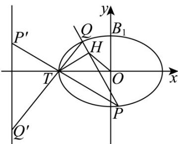

> [!faq]- 《第三章 圆锥曲线的方程（高效培优单元测试·提升卷）》官方解析
>
> > [!success]- **【答案】** (1)椭圆 $C_1: \frac{y^2}{4} + \frac{x^2}{2} = 1$ ，双曲线 $C_2: \frac{y^2}{4} - \frac{x^2}{2} = 1$ (2) $C: \frac{x^2}{2} + y^2 = 1 (xy \neq 0)$ (3)不存在·，理由见解 析
>
> > [!note]- **【解析】**
> > （1）对于椭圆 $C_{1}:\frac{y^{2}}{a^{2}}+\frac{x^{2}}{b^{2}}=1(a>b>0)$ ，已知焦点坐标为 $(0,\pm\sqrt{2})$ ，
> >
> > 则 $c = \sqrt{2}$ ， $a^2 -b^2 = c^2 = 2$
> >
> > 对于双曲线 $C_2: \frac{y^2}{a^2} - \frac{x^2}{b^2} = 1$ ，渐近线方程为 $y = \pm \sqrt{2} x$ ，所以 $\frac{a}{b} = \sqrt{2}$ ，即 $a = \sqrt{2} b$ .
> >
> > 联立 $\left\{ \begin{array}{l}a^2 -b^2 = 2\\ a = \sqrt{2} b \end{array} \right.$ ，将 $a = \sqrt{2} b$ 代入 $a^2 -b^2 = 2$ 得 $2b^{2} - b^{2} = 2$ ，解得 $b^{2} = 2$ ， $a^2 = 4$
> >
> > 所以椭圆 $C_{1}$ 的方程为 $\frac{y^{2}}{4} + \frac{x^{2}}{2} = 1$ ，双曲线 $C_{2}$ 的方程为 $\frac{y^{2}}{4} - \frac{x^{2}}{2} = 1$ 。
> >
> > (2) 联立 $\left\{\begin{aligned}y&=kx+m\\ \frac{y^{2}}{4}&+\frac{x^{2}}{2}=1\end{aligned}\right.$ ，消去 y 得 $(k^{2}+2)x^{2}+2kmx+m^{2}-4=0$
> >
> > 因为直线 l 与椭圆 $C_{1}$ 有唯一公共点 M，所以 $\Delta = (2km)^{2} - 4(k^{2} + 2)(m^{2} - 4) = 0$
> >
> > 化简得 $m^{2}=2k^{2}+4(m\neq0)$ .
> >
> > 设 $M(x_{0},y_{0})$ ，由韦达定理 $x_{0}=-\frac{km}{k^{2}+2}$ ，则 $y_{0}=kx_{0}+m=\frac{2m}{k^{2}+2}$ .
> >
> > 当 $k = 0$ 时，无不同的两点 $A, B$ ，与题意不符；
> >
> > 当 $k \neq 0$ 时，过点 $M$ 且与 $l$ 垂直的直线方程为 $y - \frac{2m}{k^2 + 2} = -\frac{1}{k}\left(x + \frac{km}{k^2 + 2}\right)$ .
> >
> > 可得 $A\left(\frac{km}{k^{2}+2},0\right)$ ， $B\left(0,\frac{m}{k^{2}+2}\right)$ ，即 $\left\{\begin{aligned}x&=\frac{km}{k^{2}+2}=\frac{2k}{m}\\ y&=\frac{m}{k^{2}+2}=\frac{2}{m}\end{aligned}\right.\Rightarrow\left\{\begin{aligned}k&=\frac{x}{y}\\ m&=\frac{2}{y}\end{aligned}\right.$
> >
> > $$
> > m ^ {2} = 2 k ^ {2} + 4 (m \neq 0) _ {\text {得}}: \frac {x ^ {2}}{2} + y ^ {2} = 1 (x y \neq 0)
> > $$
> >
> > 故点 N 的轨迹方程 $C: \frac{x^{2}}{2} + y^{2} = 1 (xy \neq 0)$ ;
> >
> > (3) 设直线 PQ 方程： $y = nx + p$ ， $P(x_{1}, y_{1})$ ， $Q(x_{2}, y_{2})$
> >
> > 联立 $\left\{\begin{aligned}\frac{x^{2}}{2}+y^{2}&=1\\ y&=nx+p\end{aligned}\right.\Rightarrow\left(2n^{2}+1\right)x^{2}+4npx+2p^{2}-2=0$
> >
> > 其中 $\Delta = 16n^{2}p^{2} - 4(2n^{2} + 1)(2p^{2} - 2) > 0\Rightarrow 2n^{2} - p^{2} + 1 > 0$ 由韦达定理得：
> >
> > $$
> > x _ {1} + x _ {2} = - \frac {4 n p}{2 n ^ {2} + 1}, x _ {1} x _ {2} = \frac {2 p ^ {2} - 2}{2 n ^ {2} + 1},
> > $$
> >
> > $$
> > k _ {T P ^ {\prime}} + k _ {T Q ^ {\prime}} = \frac {t}{- 2 \sqrt {2} + \sqrt {2}} + \frac {- 2 - t}{- 2 \sqrt {2} + \sqrt {2}} = \sqrt {2} = k _ {T P} + k _ {T Q}
> > $$
> >
> > $$
> > \text {即} \frac {y _ {1}}{x _ {1} + \sqrt {2}} + \frac {y _ {2}}{x _ {2} + \sqrt {2}} = \frac {n x _ {1} + p}{x _ {1} + \sqrt {2}} + \frac {n x _ {2} + p}{x _ {2} + \sqrt {2}} = 2 n + (p - \sqrt {2} n) \left(\frac {1}{x _ {1} + \sqrt {2}} + \frac {1}{x _ {2} + \sqrt {2}}\right) = \sqrt {2}
> > $$
> >
> > 由于直线 PQ 不过点 T，故 $p - \sqrt{2}n \neq 0$ 化简得 $\frac{1}{x_{1} + \sqrt{2}} + \frac{1}{x_{2} + \sqrt{2}} = \frac{\sqrt{2} - 2n}{p - \sqrt{2}n}$
> >
> > $$
> > \frac {1}{x _ {1} + \sqrt {2}} + \frac {1}{x _ {2} + \sqrt {2}} = \frac {x _ {1} + x _ {2} + 2 \sqrt {2}}{x _ {1} x _ {2} + \sqrt {2} (x _ {1} + x _ {2}) + 2} = \frac {2 \sqrt {2} (2 n ^ {2} + 1) - 4 n p}{2 p ^ {2} - 2 - 4 \sqrt {2} n p + 2 (1 + 2 n ^ {2})} = \frac {2 \sqrt {2} + 4 \sqrt {2} n ^ {2} - 4 n p}{(2 n - \sqrt {2} p) ^ {2}} = \frac {\sqrt {2} - 2 n}{p - \sqrt {2} n}
> > $$
> >
> > $$
> > \Rightarrow 2 n ^ {2} + 1 - \sqrt {2} n p = (1 - \sqrt {2} n) (p - \sqrt {2} n) \Rightarrow p = \sqrt {2} n + 1
> > $$
> >
> > 此时直线 $PQ:y = nx + \sqrt{2} n + 1$ ，恒过定点 $S\left(-\sqrt{2},1\right)$
> >
> > 由于 $TH \perp PQ$ ，故点 $H$ 在以 $TS$ 为直径的圆上，圆心 $G\left(-\sqrt{2}, -\frac{1}{2}\right)$ ，半径 $r = \frac{1}{2}$
> >
> > 所以 $\left|OH\right|$ $\left|OG\right|-r=\sqrt{2+\frac{1}{4}}-\frac{1}{2}=1$ 等号成立时 $H\left(-\frac{2\sqrt{2}}{3},\frac{1}{3}\right)$ ， $n=-\sqrt{2}<0$
> >
> > $PQ: y = -\sqrt{2}x - 1$ 经过点 $(0, -1)$ ，而点 $(0, -1)$ 不在曲线 C 上，故 $|OH|$ 的最小值不存在.
> >
> > 
