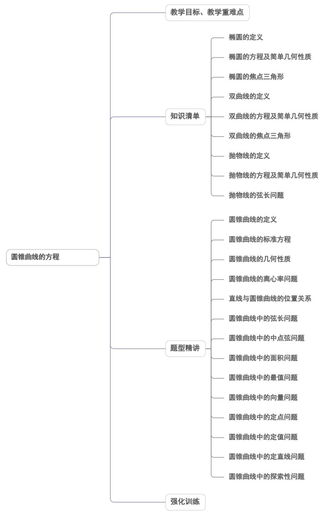
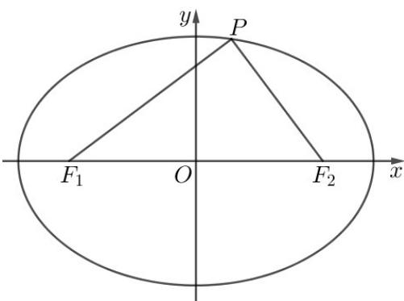
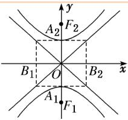
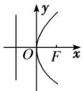
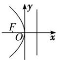
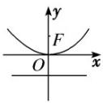
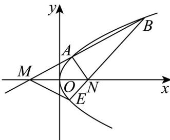
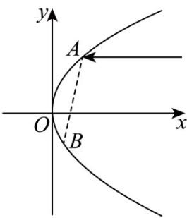

<!-- source-part:1 pages:1-50 -->

## 第三章 圆锥曲线的方程

内容概览

## 教学目标、教学重难点

<table><tr><td>教学目标</td><td>1、经历从具体情境中抽象出椭圆模型的过程,掌握椭圆的定义及标准方程.2、掌握椭圆的简单几何性质.3、通过椭圆与方程的学习,了解椭圆、双曲线及抛物线的简单应用,进一步体会数形结合的思想.4、了解双曲线、抛物线的定义、几何图形和标准方程.5、了解双曲线及抛物线的几何图形及简单几何性质.</td></tr><tr><td>教学重难点</td><td>1.重点掌握与圆锥曲线相关的轨迹问题。2.难点解决圆锥曲线的综合问题。</td></tr></table>

## 知识清单

## 知识点 01 椭圆的定义

1、文字形式：在平面内到两定点 $F_{1}$ 、 $F_{2}$ 的距离的和等于常数(大于 $\left|F_1F_2\right|$ )的点的轨迹(或集合)叫椭圆．这两定点叫做椭圆的焦点，两焦点间的距离叫做焦距．

2、代数式形式：集合 $P=\{M||MF_{1}|+|MF_{2}|=2a\}|F_{1}F_{2}|=2c.$

①若 $a > c$ ，则集合 $P$ 为椭圆；

②若 $a = c$ ，则集合 $P$ 为线段；

③若 $a < c$ ，则集合 $P$ 为空集.

## 【即学即练】

1. 已知动圆 $C$ 与圆 $(x - 2)^{2} + y^{2} = 25$ 内切，同时与圆 $(x + 2)^{2} + y^{2} = 1$ 外切，则动圆 $C$ 的圆心轨迹方程为（）A. $\frac{x^2}{25} + y^2 = 1$ B. $\frac{x^2}{25} + \frac{y^2}{24} = 1$ C. $\frac{x^2}{9} + y^2 = 1$ D. $\frac{x^2}{9} + \frac{y^2}{5} = 1$

【答案】D

【详解】圆 $(x-2)^{2}+y^{2}=25$ 圆心 $C_{1}(2,0)$ ，半径 $r_{1}=5$ ，圆 $(x+2)^{2}+y^{2}=1$ 圆心 $C_{2}(-2,0)$ ，半径 $r_{2}=1$ ，
设动圆 C 的圆心 $C(x,y)$ ，半径 r，而 $\left|C_{1}C_{2}\right|=4<r_{1}$ ，点 $C_{2}$ 在圆 $C_{1}$ 内，
由动圆 C 与圆 $C_{1}$ 内切，与圆 $C_{2}$ 外切，得动圆 C 在圆 $C_{1}$ 内，且 $\left\{\begin{aligned}|CC_{1}|&=r_{1}-r\\ |CC_{2}|&=r_{2}+r\end{aligned}\right.$ 因此 $\left|CC_{1}\right|+\left|CC_{2}\right|=r_{1}+r_{2}=6>4=\left|C_{1}C_{2}\right|$ ，动圆圆心 C 的轨迹为以 $C_{2}, C_{1}$ 为左右焦点，
长轴长 2a = 6 的椭圆，半焦距 c = 2，短半轴长 $b = \sqrt{5}$ ，
所以动圆圆心 C 的轨迹方程为 $\frac{x^{2}}{9} + \frac{y^{2}}{5} = 1$

故选：D

2．已知椭圆 $C : \frac{x^{2}}{49} + \frac{y^{2}}{24} = 1$ 的左、右焦点分别 $F_{1}, F_{2}$ ，点 P 在 C 上， $PF_{1} \perp PF_{2}$ ，则 $\triangle PF_{1}F_{2}$ 内切圆半径为

【答案】
() A.1 B.2 C.4 D.5

【答案】B

【详解】椭圆 $C: \frac{x^2}{49} + \frac{y^2}{24} = 1$ 的长轴长 $2a = 14$ ，焦距 $2c = 2\sqrt{49 - 24} = 10$

则 $\left|PF_{1}\right|+\left|PF_{2}\right|=2a=14$ ，由 $PF_{1}\perp PF_{2}$ ，得 $\left|PF_{1}\right|^{2}+\left|PF_{2}\right|^{2}=(2c)^{2}=100$ ，

则 $\left|PF_{1}\right|\left|PF_{2}\right|=48$ ，设 $\triangle PF_{1}F_{2}$ 内切圆半径为r，由 $S_{\triangle PF_{1}F_{2}}=\frac{1}{2}(2a+2c)r=\frac{1}{2}\left|PF_{1}\right|\left|PF_{2}\right|$ ，

得 $(14 + 10)r = 48$ ，所以 $r = 2$

故选：B

知识点 02 椭圆的方程及简单几何性质

<table><tr><td>焦点的位置</td><td>焦点在x轴上</td><td>焦点在y轴上</td></tr><tr><td>图形</td><td></td><td></td></tr><tr><td>标准方程</td><td>+ = 1(a &gt; b &gt; 0)</td><td>+ = 1(a &gt; b &gt; 0)</td></tr><tr><td>范围</td><td>- a≤x≤a且 - b≤y≤b</td><td>- b≤x≤b且 - a≤y≤a</td></tr><tr><td>顶点</td><td>A1(-a,0), A2(a,0), B1(0, -b), B2(0, b)</td><td>A1(0, -a), A2(0, a), B1(-b,0), B2(b,0)</td></tr><tr><td>轴长</td><td colspan="2">长轴长=,短轴长=</td></tr><tr><td>焦点</td><td>F1(-c,0), F2(c,0)</td><td>F1(0, -c), F2(0, c)</td></tr><tr><td>焦距</td><td colspan="2">|F1F2|=</td></tr><tr><td>对称性</td><td colspan="2">对称轴x轴和y轴,对称中心(0,0)</td></tr><tr><td>离心率</td><td colspan="2">e=(0&lt; e&lt;1)(注:e= = .)</td></tr></table>

【即学即练】

1. 已知椭圆 $C: \frac{x^2}{a^2} + \frac{y^2}{a^2 - 9} = 1(a > 3)$ ，圆 $x^2 + y^2 = 9$ 交 $x$ 轴负半轴于 $M$ ，与 $C$ 在第一象限的交点为 $N$ 。 $O$ 为坐标原点， $\angle MNO = 30^\circ$ ，则 $a = (\quad)$ A. $2(\sqrt{3} + 1)$ B. $2\sqrt{3}$ C. $\frac{3(\sqrt{3} + 1)}{2}$ D. $3\sqrt{3}$

【答案】C

【详解】由题设 $\triangle MON$ 是底角为 $30^{\circ}$ ，腰长为 3 的等腰三角形，得 $\angle NOx = 60^{\circ}$ 所以 $N\left(\frac{3}{2}, \frac{3}{2} \sqrt{3}\right)$ ，代入椭圆得 $\frac{9}{4a^{2}} + \frac{27}{4(a^{2} - 9)} = 1$ ，可得 $4a^{4} - 72a^{2} + 81 = 0$ ，由 $a > 3$ ，则 $a^{2} = \frac{18 + 9\sqrt{3}}{2}$ ，可得 $a^{2} = \frac{36 + 18\sqrt{3}}{4} = \frac{(3\sqrt{3} + 3)^{2}}{4}$ ，即 $a = \frac{3(\sqrt{3} + 1)}{2}$ .

故选：C

2．如图，已知椭圆 $C:\frac{x^{2}}{a^{2}}+\frac{y^{2}}{b^{2}}=1(a>b>0)$ 的左、右焦点分别为 $F_{1}$ ， $F_{2}$ ，P 是椭圆上的点， $\triangle PF_{1}F_{2}$ 的内切圆

的圆心为 $I$ ，延长 $PI$ ，交 $x$ 轴于点 $B$ ，若 $\frac{|PI|}{|IB|} = 2$ ，则椭圆的离心率等于（）

A. $\frac{1}{3}$ B. $\frac{1}{2}$ C. $\frac{1}{4}$ D. $\frac{1}{5}$

【答案】B

【详解】解法一：因为 I 是 $\triangle PF_{1}F_{2}$ 的内心，

由内角平分线定理得 $\frac{|PI|}{|IB|} = \frac{|PF_1|}{|F_1B|} = \frac{|PF_2|}{|F_2B|}$

则 $2=\frac{\left|PF_{1}\right|+\left|PF_{2}\right|}{\left|F_{1}B\right|+\left|F_{2}B\right|}=\frac{2a}{2c}$ ，所以 $e=\frac{1}{2}$

故选：B.

解法二：设内切圆的半径为 r，

$$
S _ {\triangle P F _ {1} F _ {2}} = \frac {1}{2} (2 a + 2 c) r = (a + c) r \quad S _ {\triangle I F _ {1} F _ {2}} = \frac {1}{2} \times 2 c \times r = c r
$$

所以 $\frac{S_{\triangle PF_{1}F_{2}}}{S_{\triangle IF_{1}F_{2}}}=\frac{a+c}{c}$

由已知条件 $\frac{|PI|}{|IB|} = 2$ ，得 $\frac{S_{\triangle PF_1F_2}}{S_{\triangle IF_1F_2}} = 3$

所以 $3=\frac{a+c}{c}$ ，得 a=2c，即 $e=\frac{1}{2}$

故选：B.

## 知识点 03 椭圆的焦点三角形

椭圆上的一点与两焦点所构成的三角形称为焦点三角形．解决焦点三角形问题常利用椭圆的定义和正弦定理、余弦定理．

以椭圆 $+ = 1(a > b > 0)$ 上一点 $P(x_0, y_0)(y_0 \neq 0)$ 和焦点 $F_1(-c, 0), F_2(c, 0)$ 为顶点的 $\triangle PF_1F_2$ 中，若 $\angle F_1PF_2 = \theta$ ，则

(1)椭圆的定义： $\left|PF_{1}\right|+\left|PF_{2}\right|=2a.$

(2)余弦定理： $4c^{2}=\left|PF_{1}\right|^{2}+\left|PF_{2}\right|^{2}-2\left|PF_{1}\right|\left|PF_{2}\right|\cdot\cos\theta.$

(3)面积公式： $S_{\triangle PF1F2} = |PF_1||PF_2|\cdot \sin \theta$ ，当 $\lfloor y_0\rfloor = b$ ，即 $P$ 为短轴端点时， $S_{\triangle PF1F2}$ 取最大值，为 $bc.$

重要结论： $S_{\triangle PF1F2}=b^{2}\tan\frac{\theta}{2}$

推导过程：由余弦定理得 $|\mathbf{F}_1\mathbf{F}_2|^2 = |PF_1|^2 + |PF_2|^2 - 2|PF_1||PF_2| \cdot \cos \theta$ 得

$$
4 c ^ {2} = \left(\left| P F _ {1} \right| + \left| P F _ {2} \right|\right) ^ {2} - 2 \left| P F _ {1} \right\lvert \left| P F _ {2} \right| (1 + \cos \theta)
$$

$$
4 c ^ {2} = 4 a ^ {2} - 2 \left| P F _ {1} \right\lVert P F _ {2} \left| (1 + \cos \theta) \right.
$$

$$
\left| P F _ {1} \right| \left| P F _ {2} \right| = \frac {2 b ^ {2}}{1 + \cos \theta}
$$

由三角形的面积公式可得

$$
S _ {\triangle P F 1 F 2} = \frac {1}{2} \left| \mathrm{PF} _ {1} \right| \left| \mathrm{PF} _ {2} \right| \sin \theta = \frac {1}{2} \cdot \frac {2 b ^ {2}}{1 + \cos \theta} \cdot \sin \theta = b ^ {2} \frac {\sin \theta}{1 + \cos \theta} = b ^ {2} \frac {2 \sin \frac {\theta}{2} \cos \frac {\theta}{2}}{2 \cos^ {2} \frac {\theta}{2}} = b ^ {2} \tan \theta
$$

注： $S_{\triangle PF1F2}=b^{2}\tan\frac{\theta}{2}=c\left|y_{p}\right|=(a+c)r$ （r是三角形内切圆的半径）

(4)焦点三角形的周长为 $2(a + c)$ .

(5)在椭圆 $\mathbf{C}: + = 1(a > b > 0)$ 中， $F_{1}$ ， $F_{2}$ 是椭圆的两个焦点， $\mathbf{P}$ 是椭圆上任意的一点，当点 $\mathbf{P}$ 在短轴端点时， $\angle F_{1}PF_{2}$ 最大.

【即学即练】

1．椭圆 $C:\frac{x^{2}}{16}+\frac{y^{2}}{25}=1$ 的两个焦点为 $F_{1}$ ， $F_{2}$ ，椭圆 C 上有一点 P，则 $\triangle PF_{1}F_{2}$ 的周长为（）

【答案】

A.12 B.18 C.16 D.20

【答案】C

【详解】因为 $a = 5$ ， $b = 4$ ，所以 $c = \sqrt{a^2 - b^2} = 3$ ，故 $\triangle PF_1F_2$ 的周长为 $2a + 2c = 16$

故选：C

2. 已知 $F_{1}, F_{2}$ 分别是椭圆 $C: \frac{x^{2}}{9} + \frac{y^{2}}{3} = 1$ 的左、右焦点，点 $P$ 在 $C$ 上， $\angle PF_{1}F_{2} = 90^{\circ}$ ，则 $\triangle PF_{1}F_{2}$ 的面积为（）A. $\sqrt{6}$ B. $2\sqrt{2}$ C. $2\sqrt{6}$ D. $4\sqrt{2}$

【答案】A

【详解】在椭圆 $C:\frac{x^{2}}{9}+\frac{y^{2}}{3}=1$ 中， $a=3,\quad b=\sqrt{3},\quad c=\sqrt{a^{2}-b^{2}}=\sqrt{6}$ ，
则 $\left|F_{1}F_{2}\right|=2\sqrt{6}$ 点 P 在 C 上， $\angle PF_{1}F_{2}=90^{\circ}$ ，所以 $\left|y_{P}\right|=1$ 则 $S_{\triangle PF_{1}F_{2}}=\frac{1}{2}\left|F_{1}F_{2}\right|\cdot\left|y_{P}\right|=\sqrt{6}$

故选：A

## 知识点 04 双曲线的定义

满足以下三个条件的点的轨迹是双曲线

(1)在平面内；

(2)动点到两定点的距离的差的绝对值为一定值；

(3)这一定值一定要小于两定点的距离.

【即学即练】

1．如图，已知 $F_{1}(-2,0)$ ， $F_{2}(2,0)$ ，M是圆 $O:x^{2}+y^{2}=1$ 上任意一点，点 $F_{1}$ 关于点M的对称点为N，线段 $F_{1}N$ 的垂直平分线与直线 $F_{2}N$ 相交于点T，记点T的轨迹为曲线E，若点 $(1,m)$ 在曲线E上，则m=（）

【答案】

A. 0 B. $\frac{1}{2}$ C. 1 D. $\sqrt{2}$

【答案】A

【详解】如图，连接 $OM$ ，由题意可得 $\left|OM\right| = 1$ ，且 $M$ 为 $NF_{1}$ 的中点，

又 $O$ 为 $F_{1}F_{2}$ 的中点，所以 $OM\parallel NF_{2}$ 且 $\left|NF_2\right| = 2\left|OM\right| = 2$

连接 $TF_{1}$ ，因为点 $F_{1}$ 关于点M的对称点为N，

线段 $F_{1}N$ 的垂直平分线与直线 $F_{2}N$ 相交于点 T ，

由垂直平分线的性质可得 $\left|TN\right|=\left|TF_{1}\right|$

所以 $\left\| TF_2\right| - \left|TF_1\right\| = \left\| TF_2\right| - \left|TN\right\| = \left|NF_2\right| = 2 <   \left|F_1F_2\right| = 4$

所以点 $T$ 的轨迹是以 $F_{1}, F_{2}$ 为焦点的双曲线， $a = 1$ ， $c = \frac{1}{2} |F_{1}F_{2}| = 2$ ，

所以 $b^{2} = c^{2} - a^{2} = 3$ ，所以曲线 $E$ 的方程为 $x^{2} - \frac{y^{2}}{3} = 1$

令 $x = 1$ 可得 $y = 0$ ，即 $m = 0$

2. 双曲线 $x^{2}-\frac{y^{2}}{16}=1$ 上一点 P 到它的一个焦点的距离为 4，那么点 P 到另一个焦点的距离为（）

【答案】
A. 2 B. 6 C. 2 或 6 D. 4

【答案】B

【详解】双曲线 $x^{2}-\frac{y^{2}}{16}=1$ ，a=1。

设双曲线的两个焦点为 $F_{1}$ ， $F_{2}$ ，已知 $\left|PF_1\right| = 4$ ，由双曲线定义 $\left\| PF_1\right| - \left|PF_2\right| = 2a = 2\times 1 = 2$ ，即 $\left|4 - \left|PF_2\right| = 2\right.$ 当 $4 - \left|PF_{2}\right| = 2$ 时，可得 $\left|PF_2\right| = 4 - 2 = 2$

当 $4 - |PF_{2}| = -2$ 时，可得 $|PF_{2}| = 4 + 2 = 6$ 所以 $|PF_{2}| = 6$ 或2.

在双曲线中，双曲线上的点到焦点的距离存在最小值，这个最小值为 c-a.

对于双曲线 $\frac{x^2}{1^2} -\frac{y^2}{4^2} = 1$ ，可得 $c = \sqrt{1^2 + 4^2} = \sqrt{1 + 16} = \sqrt{17}$

那么 $c - a = \sqrt{17} - 1$ ，因为 $\sqrt{16} = 4$ ， $\sqrt{17} > \sqrt{16}$ ，所以 $\sqrt{17} - 1 > 4 - 1 = 3 > 2$ 。

这就说明双曲线上的点到焦点的距离不可能为 2，所以要舍去 $\left|PF_{2}\right|=2$ 这个值.

因此 $\left|PF_{2}\right|=6$ ，即点 P 到另一个焦点的距离等于 6 .

故选：B

知识点 05 双曲线的方程及简单几何性质

<table><tr><td colspan="2">标准方程</td><td>- =1(a&gt;0,b&gt;0)</td><td>- =1(a&gt;0,b&gt;0)</td></tr><tr><td rowspan="9">性质</td><td>图形</td><td></td><td></td></tr><tr><td>焦点</td><td> $F_1(-c,0),F_2(c,0)$ </td><td> $F_1(0,-c),F_2(0,c)$ </td></tr><tr><td>焦距</td><td colspan="2"> $|F_1F_2|=2c$ </td></tr><tr><td>范围</td><td>x≤ -a或 x≥a,y∈</td><td>y≤ -a或 y≥a,x∈</td></tr><tr><td>对称性</td><td colspan="2">对称轴:坐标轴;对称中心:原点</td></tr><tr><td>顶点</td><td> $A_1(-a,0),A_2(a,0)$ </td><td> $A_1(0,-a),A_2(0,a)$ </td></tr><tr><td>轴</td><td colspan="2">实轴:线段  $A_1A_2$ ,长: ;虚轴:线段  $B_1B_2$ ,长: ;半实轴长:,半虚轴长:</td></tr><tr><td>离心率</td><td colspan="2">e= ∈(1,+∞)</td></tr><tr><td>渐近线</td><td>y= ±x</td><td>y= ±x</td></tr></table>

## 【即学即练】

1. 已知方程 $C: \frac{x^2}{16 + k} - \frac{y^2}{9 - k} = 1 (k \in R)$ 则下列说法中不正确的是（）A. 当 $k > 9$ 时，方程 $C$ 表示焦点在 $x$ 轴上的椭圆B. 当 $-16 < k < 9$ 时，方程 $C$ 表示焦点在 $x$ 轴上的双曲线C. 当方程 $C$ 表示椭圆或双曲线时，焦距均为10D. 方程 $C$ 可表示圆

【答案】D

【详解】对于 A，方程 C 表示焦点在 x 轴上的椭圆，

则 $\left\{ \begin{array}{l}16 + k > 0\\ k - 9 > 0\\ 16 + k > k - 9 \end{array} \right.$ ，解得 $k > 9$ ，故A正确；

对于 B，方程 C 表示焦点在 x 轴上的双曲线，

则 $\left\{ \begin{array}{l} 16 + k > 0 \\ 9 - k > 0 \end{array} \right.$ ，解得 $-16 < k < 9$ ，故B正确；

对于 C，当方程 C 表示双曲线时，则 $(16+k)(9-k)>0$ ，解得 -16<k<9，

则由 B 可知， $c^{2}=a^{2}+b^{2}=16+k+9-k=25$ ，即焦距为 10，

当方程 $C$ 表示椭圆时，由A可知， $c^2 = a^2 -b^2 = 16 + k - (k - 9) = 25$ ，即焦距为10，故C正确；

对于 D，当方程 C 表示圆时，则 $16 + k = k - 9$ ，无解，故 D 错误.

故选：D.

2．已知 $F_{1}$ ， $F_{2}$ 分别是双曲线 $E:\frac{x^{2}}{a^{2}}-\frac{y^{2}}{b^{2}}=1(a>0,b>0)$ 的左、右焦点，过点 $F_{1}$ 作倾斜角为 $\frac{\pi}{6}$ 的直线分别交y

轴与双曲线右支于点 $M$ ， $P$ ， $\left|PM\right| = \left|MF_1\right|$ ，则下列判断中不正确的是（ ）A. $\angle PF_{2}F_{1} = \frac{\pi}{3}$ B. $\left|MF_2\right| = \frac{1}{2}\left|PF_1\right|$

C．双曲线 E 的离心率等于 $\sqrt{3}$ D．双曲线 E 的渐近线方程为 $y = \pm\sqrt{2}x$

【答案】A

【详解】如图，由 $\left|PM\right|=\left|MF_{1}\right|$ ，可得M为 $PF_{1}$ 的中点，又O为 $F_{1}F_{2}$ 的中点，得 $OM//PF_{2}$

$\angle PF_{2}F_{1}=90^{\circ}$ ， $\angle PF_{1}F_{2}=30^{\circ}$ ， $\left|MF_{2}\right|=\frac{1}{2}\left|PF_{1}\right|$ ，故A错误，B正确。

$$
\text {设} \left| F _ {1} F _ {2} \right| = 2 c. \left| P F _ {1} \right| = \frac {2 c}{\cos 3 0 ^ {\circ}} = \frac {4 \sqrt {3}}{3} c, \left| P F _ {2} \right| = 2 c \tan 3 0 ^ {\circ} = \frac {2 \sqrt {3}}{3} c
$$

从而 $2a = \left|PF_{1}\right| - \left|PF_{2}\right| = \frac{2\sqrt{3}}{3} c$ ，得 $e = \frac{c}{a} = \sqrt{3}$ ， $\frac{b}{a} = \sqrt{\frac{c^2}{a^2} - 1} = \sqrt{2}$

则渐近线方程为 $y = \pm \frac{b}{a} x = \pm \sqrt{2} x$ ，故C，D正确。

故选：A.

## 知识点 06 双曲线的焦点三角形

双曲线上的一点与两焦点所构成的三角形称为焦点三角形．解决焦点三角形问题常利用双曲线的定义和正弦

定理、余弦定理．

以双曲线 $\frac{x^{2}}{a^{2}}-\frac{y^{2}}{b^{2}}=1(a>0,b>0)$ 上一点 $P(x_{0},y_{0})(y_{0}\neq0)$ 和焦点 $F_{1}(-c,0)$ ， $F_{2}(c,0)$ 为顶点的 $\triangle PF_{1}F_{2}$ 中，若 $\angle F_{1}PF_{2}=\theta$ ，则

(1)双曲线的定义： $\left|\left|PF_{1}\right|-\left|PF_{2}\right|\right|=2a$

(2)余弦定理： $\left|F_{1}F_{2}\right|^{2}=\left|PF_{1}\right|^{2}+\left|PF_{2}\right|^{2}-2\left|PF_{1}\right|\left|PF_{2}\right|\cdot\cos\theta.$

(3)面积公式： $S_{\triangle PF1F2}=|PF_{1}||PF_{2}|\cdot\sin\theta$

重要结论： $S_{\triangle PF1F2}=$

推导过程：由余弦定理得 $|\mathrm{F}_1\mathrm{F}_2|^2 = |PF_1|^2 + |PF_2|^2 - 2|PF_1||PF_2| \cdot \cos \theta$ 得

$$
4 c ^ {2} = \left(\left| \left| P F _ {1} \right| - \left| P F _ {2} \right| \right|\right) ^ {2} - 2 \left| P F _ {1} \right\lvert \left| P F _ {2} \right| (1 + \cos \theta)
$$

$$
4 c ^ {2} = 4 a ^ {2} + 2 \left| P F _ {1} \right\lVert P F _ {2} \left| (1 - \cos \theta) \right.
$$

$$
\left| P F _ {1} \right| \left| P F _ {2} \right| = \frac {2 b ^ {2}}{1 - \cos \theta}
$$

由三角形的面积公式可得

$$
\triangle_ {P F _ {1} F _ {2}} = \frac {1}{2} \left| \mathrm{PF} _ {1} \right| \left| \mathrm{PF} _ {2} \right| \sin \theta = \frac {1}{2} \cdot \frac {2 b ^ {2}}{1 - \cos \theta} \cdot \sin \theta = b ^ {2} \frac {\sin \theta}{1 - \cos \theta} = b ^ {2} \frac {2 \sin \frac {\theta}{2} \cos \frac {\theta}{2}}{2 \sin^ {2} \frac {\theta}{2}} = \frac {b ^ {2}}{\tan \frac {\theta}{2}}
$$

S

## 【即学即练】

1. 设 O 为坐标原点， $F_{1}$ ， $F_{2}$ 为双曲线 $C: \frac{x^{2}}{4} - \frac{y^{2}}{5} = 1$ 的两个焦点，点 P 在 C 上， $\cos \angle F_{1}PF_{2} = \frac{1}{6}$ ，则 $|OP| =$ ( )

【答案】
A. $\sqrt{11}$ B. 3 C. $\frac{3\sqrt{2}}{2}$ D. $\frac{\sqrt{91}}{7}$

【答案】A

【详解】由题意得 $\left|F_{1}F_{2}\right|=6,\quad\left|\left|PF_{1}\right|-\left|PF_{2}\right|\right|=2a=4$ ，所以 $\left|PF_{1}\right|^{2}+\left|PF_{2}\right|^{2}-2\left|PF_{1}\right|\left|PF_{2}\right|=16$ ①，
在 $\triangle F_{1}PF_{2}$ 中，由余弦定理得 $\left|PF_{1}\right|^{2}+\left|PF_{2}\right|^{2}-2\left|PF_{1}\right|\left|PF_{2}\right|\cos\angle F_{1}PF_{2}=\left|F_{1}F_{2}\right|^{2}$ 即 $\left|PF_{1}\right|^{2}+\left|PF_{2}\right|^{2}-\frac{1}{3}\left|PF_{1}\right|\left|PF_{2}\right|=36$ ②，联立①②，解得 $\left|PF_{1}\right|^{2}+\left|PF_{2}\right|^{2}=40$ 因为 $\cos\angle POF_{1}+\cos\angle POF_{2}=0$

所以在 $\triangle POF_{1}$ 和 $\triangle POF_{2}$ 中，由余弦定理，得 $\frac{|OP|^2 + |OF_1|^2 - |PF_1|^2}{2|OP||OF_1|} +\frac{|OP|^2 + |OF_2|^2 - |PF_2|^2}{2|OP||OF_2|} = 0$

结合 $\left|F_1F_2\right| = 2\left|OF_1\right| = 2\left|OF_2\right|$ ，可得 $\frac{2\left|OP\right|^2 + 2\left|OF_1\right|^2 - \left(\left|PF_1\right|^2 + \left|PF_2\right|^2\right)}{2\left|OP\right|\left|OF_1\right|} = 0$

所以 $2\left|OP\right|^2 + 2\left|OF_1\right|^2 - \left(\left|PF_1\right|^2 + \left|PF_2\right|^2\right) = 0$

所以 $4|OP|^{2}+4\left|OF_{1}\right|^{2}=2\left(\left|PF_{1}\right|^{2}+\left|PF_{2}\right|^{2}\right)=80$

所以 $4\left|OP\right|^2 +(2\left|OF_1\right|^2 = 80$ ，得 $4\left|OP\right|^2 +(F_1F_2|^2 = 80$

所以 $4|OP|^2 + 36 = 80$

所以 $\left|OP\right|^{2}=11$ ，解得 $\left|OP\right|=\sqrt{11}$

故选：A

2. 设 $P$ 是双曲线 $C: \frac{x^2}{4} - y^2 = 1$ 右支上一点， $F_1$ ， $F_2$ 分别是双曲线 $C$ 的左、右焦点， $O$ 为坐标原点， $Q$ 为线

段 $PF_{1}$ 的中点，若 $\left|OQ\right|=1$ ，则 $\left|PF_{1}\right|$ 的值为（）

A.2 B.4 C.6 D.8

【答案】C

【详解】由双曲线 $C:\frac{x^{2}}{4}-y^{2}=1$ ，则 a=2，由于 O 为 $F_{1}F_{2}$ 的中点，Q 为线段 $PF_{1}$ 的中点，且 $|OQ|=1$ ，
所以 $\left|PF_{2}\right|=2$ ，则 $\left|PF_{1}\right|=\left|PF_{2}\right|+2a=2+4=6$

故选：C.

## 知识点 07 抛物线的定义

平面内与一个定点 $F$ 和一条定直线 $l$ （ $l$ 不经过点 $F$ ）的距离相等的点的轨迹叫做抛物线，定点 $F$ 叫做抛物线的焦点，定直线 $l$ 叫做抛物线的准线。

## 【即学即练】

1. 已知抛物线 $C: y^2 = 4x$ 的焦点为 $F$ ，A 为 $C$ 上的一点，过 A 作 $C$ 的准线的垂线，垂足为 $B$ ， $|AF| = 5$ ，则直线 $BF$ 的方程为（）

【答案】
A. $y = -2x + 2$ 或 $y = 2x - 2$ B. $y = 2x + 2$ 或 $y = -2x - 2$ C. $y = -2x + 2$ D. $y = 2x - 2$

【答案】A

【详解】由题可知：抛物线的准线方程为 $x = -1, F(1,0)$ ，设 $A(x_{0}, y_{0})$ ，
由 $|AF|=5,\quad x_{0}+1=5\Rightarrow x_{0}=4$ ，所以 $y_{0}=\pm4$ ，所以 $A(4,4)$ 或 $A(4,-4)$ ，
所以 $B(-1,4)$ 或 $B(-1,-4)$ ，
所以直线 $_{BF}$ 的方程为 $y=\frac{4}{-1-1}(x-1)$ 或 $y=\frac{-4}{-1-1}(x-1)$ ，即 $y=-2x+2$ 或 y=2x-2.

故选：A

2. 已知动点 $P$ 到点 $F(2,0)$ 的距离比它到直线 $x = -1$ 的距离大 1，则动点 $P$ 的轨迹方程为（）A. $y^{2} = 4x$ B. $y^{2} = -4x$ C. $y^{2} = -8x$ D. $y^{2} = 8x$

【答案】D

【详解】由题意可知，动点 $P$ 到点 $F(2,0)$ 的距离等于它到直线 $x = -2$ 的距离，

由抛物线的定义可知，点 $P$ 在以 $F(2,0)$ 为焦点， $x = -2$ 为准线的抛物线上，其轨迹方程为 $y^{2} = 8x$

故选：D

## 知识点 08 抛物线的方程及简单几何性质

<table><tr><td colspan="2">类型</td><td> $y^{2} = 2px(p>0)$ </td><td> $y^{2} = -2px(p>0)$ </td><td> $x^{2} = 2py(p>0)$ </td><td> $x^{2} = -2py(p>0)$ </td></tr><tr><td colspan="2">图象</td><td></td><td></td><td></td><td></td></tr><tr><td rowspan="4">性质</td><td>焦点</td><td>F</td><td>F</td><td>F</td><td>F</td></tr><tr><td>准线</td><td>x = -</td><td>x =</td><td>y = -</td><td>y =</td></tr><tr><td>范围</td><td> $x \geq 0, y \in R$ </td><td> $x \leq 0, y \in R$ </td><td> $x \in R, y \geq 0$ </td><td> $x \in R, y \leq 0$ </td></tr><tr><td>对称轴</td><td colspan="2">x 轴</td><td colspan="2">y 轴</td></tr><tr><td rowspan="3"></td><td>顶点</td><td colspan="4">O(0,0)</td></tr><tr><td>离心率</td><td colspan="4">e=1</td></tr><tr><td>开口方向</td><td>向右</td><td>向左</td><td>向上</td><td>向下</td></tr></table>

## 【即学即练】

1．抛物线 $y = mx^{2}(m < 0)$ 上一点 $A(x_{0}, -4)$ 到其焦点的距离为 6，则 m 的值为（）

【答案】
A. $-\frac{1}{8}$ B. $-\frac{1}{4}$ C.-8 D.-4

【答案】A

【详解】因为 $y = mx^{2}(m < 0)$ ，所以 $x^{2} = \frac{1}{m} y$ ，其准线方程为 $y = -\frac{1}{4m}$

根据抛物线定义，得 $-\frac{1}{4m} - (-4) = 6$ ，解得 $m = -\frac{1}{8}$

故选：A

2．如图，过点 $M(-1,0)$ 的直线交抛物线 $C:y^{2} = 2x$ 于 $A,B$ 两点，点 $A$ 在 $M,B$ 之间，点 $N$ 与点 $M$ 关于原点

对称，连接 $BN$ 并延长交抛物线 $C$ 于 $E$ ，记直线 $AN$ 的斜率为 $k_{1}$ ，直线 $ME$ 的斜率为 $k_{2}$ ，当 $k_{1} = 3k_{2}$ 时， $\triangle ABN$

的面积为（）

A.1 B. $\sqrt{2}$ C. $\sqrt{3}$ D.2

【答案】A

【详解】由题意可得直线 AB 的斜率存在且不为零，设 $l_{AB}$ : x = my - 1, $l_{BE}$ : $x = ny + 1$ , $A(x_{1}, y_{1})$ , $B(x_{2}, y_{2})$ , $E(x_{3}, y_{3})$ ,

联立 $\left\{ \begin{array}{l} y^{2} = 2x \\ x = my - 1 \text{得} y^{2} - 2my + 2 = 0 \end{array} \right.$

所以 $\Delta_{1}=4m^{2}-8>0$ ，即 $m^{2}>2$ ， $y_{1}+y_{2}=2m$ ， $y_{1}y_{2}=2$

联立 $\left\{\begin{aligned}y^{2}&=2x\\ x&=ny+1\text{得}y^{2}-2ny-2=0\end{aligned}\right.$

$\Delta_{2} = 4n^{2} + 8 > 0$ $y_{2} + y_{3} = 2n$ $y_{2}y_{3} = -2$

所以 $y_{3} = -y_{1}$ ，则 $x_{3} = x_{1}$ ，

故 $k_{1} = \frac{y_{1}}{x_{1} - 1}, k_{2} = \frac{y_{3}}{x_{3} + 1} = \frac{-y_{1}}{x_{1} + 1}$

又 $k_{1}=3k_{2}$ ，所以 $\frac{y_{1}}{x_{1}-1}=3\times\frac{-y_{1}}{x_{1}+1}$ ，解得 $x_{1}=\frac{1}{2}$ ，

则 $y_{1}^{2}=2x_{1}=1$ ， $m=\frac{x_{1}+1}{y_{1}}=\pm\frac{3}{2}$

故 $\left|AB\right|=\sqrt{m^{2}+1}\cdot\sqrt{\left(y_{1}+y_{2}\right)^{2}-4y_{1}y_{2}}=\frac{\sqrt{13}}{2}\times\sqrt{9-8}=\frac{\sqrt{13}}{2}$

点 N 到直线 AB 的距离 $d = \frac{|1 + 1|}{\sqrt{m^{2} + 1}} = \frac{4\sqrt{13}}{13}$

故 $S_{\triangle ABN} = \frac{1}{2} d \times |AB| = \frac{1}{2} \times \frac{4\sqrt{13}}{13} \times \frac{\sqrt{13}}{2} = 1$

故选：A

## 知识点 09 抛物线的弦长问题

过抛物线 $y^{2} = 2px(p > 0)$ 的焦点的直线交抛物线于 $A(x_{1},y_{1})$ ， $B(x_{2},y_{2})$ 两点，那么线段 $AB$ 叫做焦点弦，

如图：设 $AB$ 是过抛物线 $y^{2} = 2px(p > 0)$ 焦点 $F$ 的弦，若 $A(x_{1},y_{1})$ ， $B(x_{2},y_{2})$ ，则 $\vert AB\vert = x_1 + x_2 + p.$ 注：(1) $x_{1}\cdot x_{2} =$ ：

(2) $y_{1}\cdot y_{2}=-p^{2}.$

(3) $|AB|=x_{1}+x_{2}+p=(\alpha$ 是直线AB的倾斜角).

(4) + = 为定值(F 是抛物线的焦点).

## (5) 求弦长问题的方法

①一般弦长： $|AB|=|x_{1}-x_{2}|$ ，或 $|AB|=|y_{1}-y_{2}|$ .

②焦点弦长：设过焦点的弦的端点为 $A(x_{1},y_{1})$ ， $B(x_{2},y_{2})$ ，则 $\vert AB\vert = x_1 + x_2 + p.$

【即学即练】

1. 若抛物线 $y = \frac{1}{2} x^2$ 的准线为直线 $l$ ，则 $l$ 截圆 $C: x^2 + y^2 = 1$ 所得的弦长为（）

【答案】
A. $\sqrt{3}$ B. $\frac{\sqrt{3}}{2}$ C. $\frac{3\sqrt{7}}{4}$ D. $\frac{3\sqrt{7}}{8}$

【答案】A

【详解】抛物线 $x^{2} = 2y$ 的准线方程为 $y = -\frac{1}{2}$

圆 C 的圆心为原点，半径为 1 ，圆心到直线 l 的距离为 $d = \frac{1}{2}$

所以， $l$ 截圆 $C$ 所得的弦长为 $2\sqrt{1 - \left(\frac{1}{2}\right)^2} = \sqrt{3}$

故选：A.

2. 抛物线绕它的对称轴旋转所得到的曲面叫抛物面，用于加热水和水壶食物的太阳灶应用了抛物线的光学性

质：一束平行于抛物线对称轴的光线，经过抛物面的反射后，集中于它的焦点·已知一束平行于 $x$ 轴的入射光

线的一束光线与抛物线 $y^{2} = 2px$ 的交点为 $A(4,4)$ ，则反射光线所在直线被抛物线截得的弦长为（）

A. $\frac{27}{4}$ B. $\frac{21}{4}$ C. $\frac{25}{4}$ D. $\frac{29}{4}$

【答案】C

【详解】因为点 $A(4,4)$ 在抛物线上，所以 $16 = 8p$ ，解得 $p = 2$

所以抛物线的方程为 $y^{2}=4x$ ，则焦点为 $F(1,0)$ ，

又因为反射光线经过点 $A(4,4)$ 及焦点 $F(1,0)$ ， $k_{AB} = k_{AF} = \frac{4 - 0}{4 - 1} = \frac{4}{3}$ ，

所以反射光线 $AB$ 的方程为 $y=\frac{4}{3}(x-1)$

联立抛物线方程得 $\left\{ \begin{array}{l} y^{2} = 4x \\ y = \frac{4}{3} (x - 1) \end{array} \right.$ ，解得 $\left\{ \begin{array}{l} x = 4 \\ y = 4 \end{array} \right.$ 或 $\left\{ \begin{array}{l} x = \frac{1}{4} \\ y = -1 \end{array} \right.$ ，

所以反射光线 $AB$ 与抛物线的交点为 $B(\frac{1}{4}, -1)$ ，

由两点间距离公式可得 $|AB| = \sqrt{(4 - \frac{1}{4})^2 + (4 + 1)^2} = \frac{25}{4}$

所以反射光线所在直线被抛物线截得的弦长为 $\frac{25}{4}$ .

故选：C.

## 题型精讲

![[高中/课堂同步/题库/人教A版高中数学同步讲义(2026)/03_选择性必修第一册/第三章 圆锥曲线的方程/第三章 圆锥曲线的方程（高效培优讲义）/题型01_圆锥曲线的定义/题型01_圆锥曲线的定义.md]]
![[高中/课堂同步/题库/人教A版高中数学同步讲义(2026)/03_选择性必修第一册/第三章 圆锥曲线的方程/第三章 圆锥曲线的方程（高效培优讲义）/题型02_圆锥曲线的标准方程/题型02_圆锥曲线的标准方程.md]]
![[高中/课堂同步/题库/人教A版高中数学同步讲义(2026)/03_选择性必修第一册/第三章 圆锥曲线的方程/第三章 圆锥曲线的方程（高效培优讲义）/题型03_圆锥曲线的几何性质/题型03_圆锥曲线的几何性质.md]]
![[高中/课堂同步/题库/人教A版高中数学同步讲义(2026)/03_选择性必修第一册/第三章 圆锥曲线的方程/第三章 圆锥曲线的方程（高效培优讲义）/题型04_圆锥曲线的离心率问题/题型04_圆锥曲线的离心率问题.md]]
![[高中/课堂同步/题库/人教A版高中数学同步讲义(2026)/03_选择性必修第一册/第三章 圆锥曲线的方程/第三章 圆锥曲线的方程（高效培优讲义）/题型05_直线与圆锥曲线的位置关系/题型05_直线与圆锥曲线的位置关系.md]]
![[高中/课堂同步/题库/人教A版高中数学同步讲义(2026)/03_选择性必修第一册/第三章 圆锥曲线的方程/第三章 圆锥曲线的方程（高效培优讲义）/题型06_圆锥曲线中的弦长问题/题型06_圆锥曲线中的弦长问题.md]]
![[高中/课堂同步/题库/人教A版高中数学同步讲义(2026)/03_选择性必修第一册/第三章 圆锥曲线的方程/第三章 圆锥曲线的方程（高效培优讲义）/题型07_圆锥曲线中的中点弦问题/题型07_圆锥曲线中的中点弦问题.md]]
![[高中/课堂同步/题库/人教A版高中数学同步讲义(2026)/03_选择性必修第一册/第三章 圆锥曲线的方程/第三章 圆锥曲线的方程（高效培优讲义）/题型08_圆锥曲线中的面积问题/题型08_圆锥曲线中的面积问题.md]]
![[高中/课堂同步/题库/人教A版高中数学同步讲义(2026)/03_选择性必修第一册/第三章 圆锥曲线的方程/第三章 圆锥曲线的方程（高效培优讲义）/题型09_圆锥曲线中的最值问题/题型09_圆锥曲线中的最值问题.md]]
![[高中/课堂同步/题库/人教A版高中数学同步讲义(2026)/03_选择性必修第一册/第三章 圆锥曲线的方程/第三章 圆锥曲线的方程（高效培优讲义）/题型10_圆锥曲线中的向量问题/题型10_圆锥曲线中的向量问题.md]]
![[高中/课堂同步/题库/人教A版高中数学同步讲义(2026)/03_选择性必修第一册/第三章 圆锥曲线的方程/第三章 圆锥曲线的方程（高效培优讲义）/题型11_圆锥曲线中的定点问题/题型11_圆锥曲线中的定点问题.md]]
![[高中/课堂同步/题库/人教A版高中数学同步讲义(2026)/03_选择性必修第一册/第三章 圆锥曲线的方程/第三章 圆锥曲线的方程（高效培优讲义）/题型12_圆锥曲线中的定值问题/题型12_圆锥曲线中的定值问题.md]]
![[高中/课堂同步/题库/人教A版高中数学同步讲义(2026)/03_选择性必修第一册/第三章 圆锥曲线的方程/第三章 圆锥曲线的方程（高效培优讲义）/题型13_圆锥曲线中的定直线问题/题型13_圆锥曲线中的定直线问题.md]]
![[高中/课堂同步/题库/人教A版高中数学同步讲义(2026)/03_选择性必修第一册/第三章 圆锥曲线的方程/第三章 圆锥曲线的方程（高效培优讲义）/题型14_圆锥曲线中的探索性问题/题型14_圆锥曲线中的探索性问题.md]]
![[高中/课堂同步/题库/人教A版高中数学同步讲义(2026)/03_选择性必修第一册/第三章 圆锥曲线的方程/第三章 圆锥曲线的方程（高效培优讲义）/强化训练/强化训练.md]]
