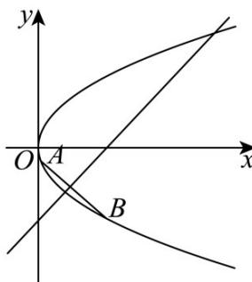

<!-- question-source:start -->
7．已知抛物线 $C: y^{2} = 2px (p > 0)$ ，若抛物线 C 上存在两点 A，B 关于直线 x - y - 2 = 0 对称，如图，则 p 的

取值范围是（）

A. $0 < p < \frac{2}{3}$ B. $0 < p < \frac{4}{3}$ C. $0 < p < 2$ D. $0 < p < \frac{8}{3}$
<!-- question-source:end -->

![[高中/课堂同步/题库/人教A版高中数学同步讲义(2026)/03_选择性必修第一册/第三章 圆锥曲线的方程/第三章 圆锥曲线的方程（高效培优讲义）/强化训练/questions/answers/Q00080371A1.md]]
