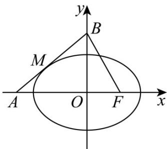

> [!faq]- 《第三章 圆锥曲线的方程（高效培优讲义）》官方解析
>
> > [!success]- **【答案】** B
>
> > [!note]- **【解析】**
> > 
> >
> > 解法1：设直线 $AB$ 与椭圆的切点为 $M(x_0, y_0)$ ，则切线 $AB$ 的方程为 $\frac{x_0x}{8} + \frac{y_0y}{4} = 1$
> >
> > 因为点 $B(0,2\sqrt{2})$ 在直线 $\frac{x_{0}x}{8}+\frac{y_{0}y}{4}=1$ 上，所以 $y_{0}=\sqrt{2}$
> >
> > 又因为 $\frac{x_0^2}{8} +\frac{1}{4}\left(\sqrt{2}\right)^2 = 1$ ，即 $x_0 = -2$ ，故 $M\left(-2,\sqrt{2}\right)$ ，所以 $k_{AB} = k_{MB} = \frac{2\sqrt{2} - \sqrt{2}}{2} = \frac{\sqrt{2}}{2}$
> >
> > 因为 $B(0,2\sqrt{2}), F(2,0)$ ，所以 $k_{BF} = -\sqrt{2}$
> >
> > 所以 $k_{AB}k_{BF} = -1$ ，所以 $\angle ABF = \frac{\pi}{2}$
> >
> > 故选：B.
> >
> > 解法2：设直线 $AB$ 的方程为 $y = kx + 2\sqrt{2}$
> >
> > 由 $\left\{\begin{aligned}y&=kx+2\sqrt{2},\\ \frac{x^{2}}{8}+\frac{y^{2}}{4}&=1,\end{aligned}\right.$ 得 $\left(2k^{2}+1\right)x^{2}+8\sqrt{2}kx+8=0$ ，故 $\Delta=128k^{2}-32\left(2k^{2}+1\right)=0$ ，即 $k^{2}=\frac{1}{2}$
> >
> > 又 $k > 0$ ，所以 $k = \frac{\sqrt{2}}{2}$ ，因为 $k_{BF} = \frac{2\sqrt{2} - 0}{0 - 2} = -\sqrt{2}$ ，所以 $k_{BF}k = -1$ ，所以 $\angle ABF = \frac{\pi}{2}$
> >
> > 故选：B
> >
> > 解法三：设过点 $B$ 的直线方程为： $y = kx + a$ ，其中 $a = 2\sqrt{2}, b = c = 2$
> >
> > 由 $\left\{ \begin{array}{l} y = kx + a \\ \frac{x^2}{a^2} + \frac{y^2}{b^2} = 1 \end{array} \right.$ ，得 $\left(a^2k^2 + b^2\right)x^2 + 2a^3kx + a^4 - a^2b^2 = 0$
> >
> > 由 $\Delta = 4a^{6}k^{2} - 4(a^{2}k^{2} + b^{2})(a^{4} - a^{2}b^{2}) = 0$ ，得 $k = \pm \frac{c}{a}$
> >
> > 由题意取 $k = \frac{c}{a}$ ，则过点 $_B$ 的直线方程为： $y = \frac{c}{a} x + a$
> >
> > 令 y=0 ，得 $x=-\frac{a^{2}}{c}$ ，所以 $A\left(-\frac{a^{2}}{c}\right)$
> >
> > 在 $\triangle ABF$ 中， $|AB|^{2} = a^{2} + \frac{a^{4}}{c^{2}}$ ， $|BF|^{2} = a^{2} + c^{2}$
> >
> > $$
> > \left| A F \right| ^ {2} = \left(c + \frac {a ^ {2}}{c}\right) ^ {2} = c ^ {2} + 2 a ^ {2} + \frac {a ^ {4}}{c ^ {2}} = | A B | ^ {2} + | B F | ^ {2}
> > $$
> >
> > 所以 $\triangle ABF$ 为直角三角形，即 $\angle ABF = 90^{\circ}$
> >
> > 故选 **B**.
