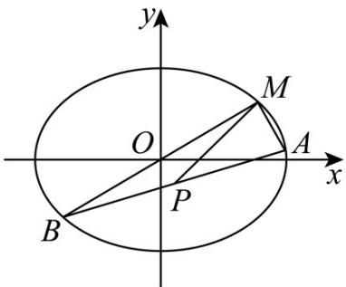

> [!faq]- 《第三章 圆锥曲线的方程（高效培优讲义）》官方解析
>
> > [!success]- **【答案】** (1) $\angle AMB=\frac{\pi}{2}$ (2)证明见解析
>
> > [!note]- **【解析】**
> > （1）设 $A(x_{1},y_{1})$ ， $B(x_{2},y_{2})$ ，则 $k_{MA} = \frac{y_1 - 1}{x_1 - \sqrt{2}}, k_{MB} = \frac{y_2 - 1}{x_2 - \sqrt{2}}$
> >
> > 设直线 $l:m(x-\sqrt{2})+n(y-1)=1$ ，其中 $2\sqrt{2}m+4n=-3$ 。
> >
> > 由 $x^{2} + 2y^{2} = 4$ 得，
> >
> > $$
> > \left(x - \sqrt {2}\right) ^ {2} + 2 (y - 1) ^ {2} + 2 \sqrt {2} (x - \sqrt {2}) [ m (x - \sqrt {2}) + n (y - 1) ] + 4 (y - 1) [ m (x - \sqrt {2}) + n (y - 1) ] = 0
> > $$
> >
> > 变形得 $2(2n + 1)\left(\frac{y - 1}{x - \sqrt{2}}\right)^2 + 2(2m + \sqrt{2} n) \cdot \frac{y - 1}{x - \sqrt{2}} + (2\sqrt{2} m + 1) = 0$
> >
> > 所以 $k_{MA}k_{MB}=\frac{2\sqrt{2}m+1}{2(2n+1)}=-1$ ，即 $\angle AMB=\frac{\pi}{2}$
> >
> > (2) 如图，
> >
> > 
> >
> > 设 $\angle MPA = \alpha$ ，则
> >
> > $$
> > S = S _ {\triangle A P M} + S _ {\triangle B P M} = \frac {1}{2} | P M | | P A | \sin \alpha + \frac {1}{2} | P M | | P B | \sin (\pi - \alpha) = \frac {1}{2} | P M | | A B | \sin \alpha \leq \frac {1}{2} | P M | d
> > $$
> >
> > 其中 $d$ 为与直线 $PM$ 平行且与椭圆相切的两条平行直线之间的距离.
> >
> > 由 $k_{PM}=\frac{1+\frac{1}{3}}{\sqrt{2}-\frac{\sqrt{2}}{3}}=\sqrt{2}$ 得直线 的方程为 $y-1=\sqrt{2}\left(x-\sqrt{2}\right)$ 即 $y=\sqrt{2}x-1$
> >
> > 设与直线 $PM$ 平行且与椭圆相切的直线方程为 $y = \sqrt{2} x + m$
> >
> > 联立方程 $\left\{ \begin{array}{l} y = \sqrt{2} x + m \\ \frac{x^2}{4} + \frac{y^2}{2} = 1 \end{array} \right.$ ，消去可得 $y = 5x^{2} + 4\sqrt{2} mx + 2m^{2} - 4 = 0$ 由 $\Delta=\left(4\sqrt{2}m\right)^{2}-20\left(2m^{2}-4\right)=0$ 即 $m^{2}-10=0$ ，解得 $m=\pm\sqrt{10}$
> >
> > 此时两条平行直线的方程为 $y = \sqrt{2} x \pm \sqrt{10}$ ，则 $d = \frac{\left|\sqrt{10} + \sqrt{10}\right|}{\sqrt{3}} = \frac{2\sqrt{10}}{\sqrt{3}}$ ，
> >
> > 所以 $S \leq \frac{1}{2} |PM| d = \frac{1}{2} \times \frac{2\sqrt{6}}{3} \times \frac{2\sqrt{10}}{\sqrt{3}} = \frac{4\sqrt{5}}{3} < 3$
