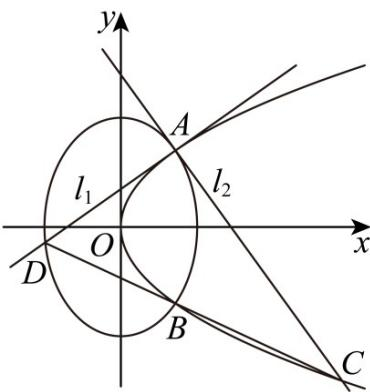

> [!faq]- 《第三章 圆锥曲线的方程（高效培优讲义）》官方解析
>
> > [!success]- **【答案】** (1) $\frac{\sqrt{2}}{2}$ $$ \frac {3 6 \sqrt {2 3}}{5} $$
>
> > [!note]- **【解析】**
> > （1）设 $A(x_0,y_0)$ ， $l_{1}:yy_{0} = 2(x + x_{0})$ ， $l_{2}:\frac{yy_{0}}{a^{2}} +\frac{xx_{0}}{b^{2}} = 1$ ，则 $k_{l_1} = \frac{2}{y_0}$ ， $k_{l_2} = -\frac{x_0a^2}{y_0b^2}$
> >
> > 因为 $k_{l_1}k_{l_2} = -1$ ，所以 $a^2 = 2b^2$ ，得 $e = \frac{c}{a} = \sqrt{1 + \frac{b^2}{a^2}} = \frac{\sqrt{2}}{2}$
> >
> > (2)
> >
> > 
> >
> > 设 $A\left(\frac{t^2}{4}, t\right)(t > 0)$ ， $k_{l_2} = -\frac{x_0 a^2}{y_0 b^2} = -\frac{t}{4} \cdot 2 = -\frac{t}{2}$ ， $l_2: y - t = -\frac{t}{2}\left(x - \frac{t^2}{4}\right)$
> >
> > 将 $(4,0)$ 代入得 $t = 2\sqrt{2}$ ，所以 $A(2,2\sqrt{2})$
> >
> > 由（1）得 $a^2 = 2b^2$ ，所以 $\frac{4}{2b^2} +\frac{8}{b^2} = 1$ ，解得 $b^{2} = 10,a^{2} = 20$
> >
> > 从而得椭圆方程为 $\frac{y^2}{20} +\frac{x^2}{10} = 1$
> >
> > 而 $k_{l_{2}} = -\frac{t}{2} = -\sqrt{2}$ ，从而 $k_{l_{1}} = \frac{-1}{-\sqrt{2}} = \frac{\sqrt{2}}{2}$ ，
> >
> > 所以 $l_{1}$ 的方程为 $y - 2\sqrt{2} = \frac{\sqrt{2}}{2}(x - 2)$
> >
> > 将 $l_{1}: x = \sqrt{2} y - 2$ 与 $\frac{y^2}{20} + \frac{x^2}{10} = 1$ 联立，得 $\frac{y^2}{20} + \frac{\left(\sqrt{2} y - 2\right)^2}{10} = 1$
> >
> > 设 $A(x_{1},y_{1}),D(x_{2},y_{2}),C(x_{3},y_{3})$
> >
> > 即 $5y^{2} - 8\sqrt{2} y - 12 = 0$ ， $y_{1} + y_{2} = \frac{8\sqrt{2}}{5},y_{1}y_{2} = -\frac{12}{5}$
> >
> > 进而得 $\left|AD\right|=\sqrt{1+2}\sqrt{\left(y_{1}+y_{2}\right)^{2}-4y_{1}y_{2}}=\sqrt{3}\cdot\sqrt{\frac{128}{25}+\frac{48}{5}}=\frac{4}{5}\sqrt{69}$
> >
> > $l_{2}:y - t = -\frac{t}{2}\left(x - \frac{t^{2}}{4}\right)$ 即 $y - 2\sqrt{2} = -\sqrt{2}(x - 2)$ ，即 $x = -\frac{\sqrt{2}}{2} y + 4$
> >
> > 将 $x = -\frac{\sqrt{2}}{2} y + 4$ 与 $y^{2} = 4x$ 联立，得 $y^{2} + 2\sqrt{2} y - 16 = 0$ ， $y_{1} + y_{3} = -2\sqrt{2}, y_{1}y_{3} = -16$
> >
> > 进而得 $\left|AC\right| = \sqrt{1 + \frac{1}{2}}\sqrt{\left(y_1 + y_3\right)^2 - 4y_1y_3} = \sqrt{\frac{3}{2}}\cdot \sqrt{8 + 64} = 6\sqrt{3}$
> >
> > 因为 $AC \perp AD$ ，
> >
> > 所以 $S_{\triangle ADC} = \frac{1}{2}|AC||AD| = \frac{1}{2}\cdot \frac{4}{5}\sqrt{69}\cdot 6\sqrt{3} = \frac{36\sqrt{23}}{5}$
