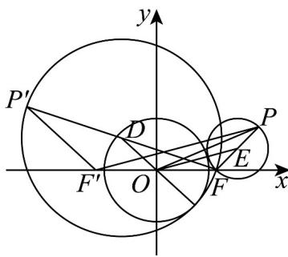
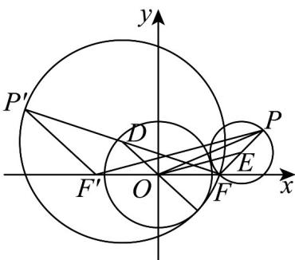

> [!faq]- 《第三章 圆锥曲线的方程（高效培优讲义）》官方解析
>
> > [!success]- **【答案】** A
>
> > [!note]- **【解析】**
> > 由已知圆 $O$ 半径为 $\sqrt{3}$
> >
> > 如图，当两圆外切时，设 PF 的中点为 E，即为圆心，
> >
> > 
> >
> > ，即
> >
> > $$
> > \mid E O \mid = \mid E F \mid + \sqrt {3}
> > $$
> >
> > $$
> > \mid E O \mid - \mid E F \mid = \sqrt {3}
> > $$
> >
> > 取 $F^{\prime}(-2,0)$ ，连接 $F^{\prime}P$ ， $O$ 是 $FF^{\prime}$ 中点，则 $\left|PF^{\prime}\right| = 2\left|OE\right|$
> >
> > 因此 $\left|PF^{\prime}\right| - \left|PF\right| = 2\left|OE\right| - 2\left|EF\right| = 2\sqrt{3}$
> >
> > 当两圆内切时，记动点为 $P'$ ， $FP'$ 的中点为 D，
> >
> > 
> >
> > 则 $|DO|=|DF|-\sqrt{3}$ ，所以 $|DF|-|DO|=\sqrt{3}$
> >
> > 因为点 $D$ 、 $O$ 分别是 $P^{\prime}F$ 、 $F^{\prime}F$ 的中点，所以 $\left|P^{\prime}F\right| = 2\left|DF\right|,\left|P^{\prime}F^{\prime}\right| = 2\left|DO\right|$
> >
> > 所以 $\left|P^{\prime}F\right|-\left|P^{\prime}F^{\prime}\right|=2\left|DF\right|-2\left|DO\right|=2\sqrt{3}$
> >
> > 所以动点 $P$ 满足 $\left\| PF\right| - \left|PF\right| = 2\sqrt{3}$ ，而 $\left|FF'\right| = 4 > 2\sqrt{3}$
> >
> > 所以点 $P$ 轨迹是以 $F$ ， $F'$ 为焦点，实轴长为 $2\sqrt{3}$ 的双曲线，
> >
> > $2a=2\sqrt{3}$ ，则 $a=\sqrt{3}$ ，又c=2，因此 $b=\sqrt{4-3}=1$
> >
> > 双曲线方程为 $\frac{x^2}{3} - y^2 = 1$
> >
> > ## 方法技巧
> >
> > 1.应用椭圆的定义，可以得到结论：
> >
> > (1) 椭圆上任意一点 $P(x, y) (y \neq 0)$ 与两焦点 $F_{1}(-c, 0)$ , $F_{2}(c, 0)$ 构成的 $\triangle PF_{1}F_{2}$ 称为焦点三角形，其周长为 $2(a + c)$ .
> >
> > (2)椭圆的一个焦点、中心和短轴的一个端点构成直角三角形，其中 $a$ 是斜边， $a^2 = b^2 + c^2$ .
> >
> > 定义式的平方
> >
> > 2.对焦点三角形 $\triangle F_{1}PF_{2}$ 的处理方法，通常是运用
> >
> > 余弦定理
> >
> > $$
> > \Leftrightarrow \left\{ \begin{array}{c} \left(\left| P F _ {1} \right| + \left| P F _ {2} \right|\right) ^ {2} = (2 a) ^ {2} \\ (2 c) ^ {2} = \left| P F _ {1} \right| ^ {2} + \left| P F _ {2} \right| ^ {2} - 2 \left| P F _ {1} \right| \left| P F _ {2} \right| \cos \theta \\ S _ {\Delta} = \frac {1}{2} \left| P F _ {1} \right| \left| P F _ {2} \right| \sin \theta \end{array} . \right.
> > $$
> >
> > 3.椭圆定义的应用技巧
> >
> > (1)椭圆定义的应用主要有：求椭圆的标准方程，求焦点三角形的周长、面积及弦长、最值和离心率等.
> >
> > (2)通常定义和余弦定理结合使用，求解关于焦点三角形的周长和面积问题.
> >
> > 4. 双曲线定义的主要应用
> >
> > (1)判定平面内动点与两定点的轨迹是否为双曲线，进而根据要求可求出曲线方程.
> >
> > (2)在“焦点三角形”中，常利用正弦定理、余弦定理，结合 $\left\|PF_{1}\right|-\left|PF_{2}\right|=2a$ ，运用平方的方法，建立与 $\left|PF_{1}\right|\cdot\left|PF_{2}\right|$ 的联系。
> >
> > 5.用定义法求双曲线方程，应依据条件辨清是哪一支，还是全部曲线。
> >
> > 6. 与双曲线两焦点有关的问题常利用定义求解.
> >
> > 7. 如果题设条件涉及动点到两定点的距离，求轨迹方程时可考虑能否应用定义求解。
> >
> > 8. 涉及抛物线几何性质的问题常结合图形思考，通过图形可以直观地看出抛物线的顶点、对称轴、开口方向等几何特征，体现了数形结合思想解题的直观性。
> >
> > 9. 抛物线上的点到焦点距离等于到准线距离，注意转化思想的运用。
> >
> > 10.利用抛物线定义可以解决距离的最大和最小问题，该类问题一般情况下都与抛物线的定义有关．实现由点到点的距离与点到直线的距离的转化．
> >
> > (1)将抛物线上的点到准线的距离转化为该点到焦点的距离，构造出“两点之间线段最短”，使问题得解。
> >
> > (2)将抛物线上的点到焦点的距离转化为到准线的距离，利用“与直线上所有点的连线中垂线段最短”原理解决．
