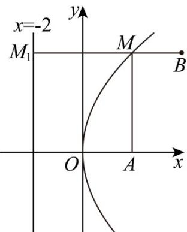

> [!faq]- 《第三章 圆锥曲线的方程（高效培优讲义）》官方解析
>
> > [!success]- **【答案】** A.4 B.5 C. $2\sqrt{5}$ D.6
>
> > [!note]- **【解析】**
> > 根据题意可得动点 $M$ 到A的距离与到直线 $x = -2$ 的距离相等，所以动点 $M$ 的轨迹方程是以 $A(2,0)$ 为焦点的抛物线，即 $y^{2} = 8x$ 过 $M$ 作 $MM_{1}$ 垂直于准线 $x = -2$ ，垂足为 $M_{1}$ ，如下图所示：
> >
> > 
> >
> > 易知 $|MA|=|MM_{1}|$ ，所以 $|MA|+|MB|=|MM_{1}|+|MB|$ ，
> >
> > 当 $B, M, M_{1}$ 三点共线时，取得最小值，即为点 $B$ 到准线的距离 $4 - (-2) = 6$
> >
> > 所以 $|MA| + |MB|$ 的最小值为6.
> >
> > 故选 **D**
