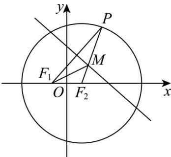

> [!faq]- 《第三章 圆锥曲线的方程（高效培优讲义）》官方解析
>
> > [!success]- **【答案】** (1) $\frac{x^{2}}{4}+\frac{y^{2}}{3}=1$ (2) $\frac{7}{4}$
>
> > [!note]- **【解析】**
> > （1）圆 $(x-1)^{2}+y^{2}=16$ 上的圆心为 $F_{2}(1,0)$ ，半径为4，
> >
> > 因为线段 $F_{1}P$ 的垂直平分线与半径 $F_{2}P$ 交于点 $M$ ，所以 $\left|MF_1\right| = \left|M P\right|$
> >
> > 所以 $\left|MF_{1}\right|+\left|MF_{2}\right|=\left|MP\right|+\left|MF_{2}\right|=\left|F_{2}P\right|=4>\left|F_{1}F_{2}\right|$
> >
> > 由椭圆定义可知，动点 $M$ 的轨迹是以 $F_{1}, F_{2}$ 为焦点，长轴长为4的椭圆
> >
> > $$
> > \because a = 2, c = 1, \therefore b = \sqrt {3}
> > $$
> >
> > ∴求动点M的轨迹方程为 $\frac{x^{2}}{4}+\frac{y^{2}}{3}=1$
> >
> > 
> >
> > (2) 设 $A(x_{1}, y_{1}), B(x_{2}, y_{2})$
> >
> > 过 $F_{2}(1,0)$ 且斜率为1的直线 $AB$ 的方程为 $y = x - 1$
> >
> > 代入 $\frac{x^{2}}{4}+\frac{y^{2}}{3}=1$ 整理得 $7x^{2}-8x-8=0$
> >
> > $$
> > \therefore x _ {1} + x _ {2} = \frac {8}{7}, x _ {1} x _ {2} = - \frac {8}{7}
> > $$
> >
> > 设 $C(x_{0},y_{0})$ ，因为点 A, B, C 都在椭圆上
> >
> > $$
> > \therefore 3 x _ {0} ^ {2} + 4 y _ {0} ^ {2} = 3 x _ {1} ^ {2} + 4 y _ {1} ^ {2} = 3 x _ {1} ^ {2} + 4 y _ {1} ^ {2} = 1 2
> > $$
> >
> > $$
> > \because \overrightarrow {O C} = \lambda O A + \mu O B, \therefore \left\{ \begin{array}{l} x _ {0} = \lambda x _ {1} + \mu x _ {2} \\ y _ {0} = \lambda y _ {1} + \mu y _ {2} \end{array} \right.
> > $$
> >
> > 代入 $3x_{0}^{2} + 4y_{0}^{2} = 12$ 得
> >
> > $$
> > \lambda^ {2} \left(3 x _ {1} ^ {2} + 4 y _ {1} ^ {2}\right) + \mu^ {2} \left(3 x _ {2} ^ {2} + 4 y _ {2} ^ {2}\right) + 2 \lambda \mu \left(3 x _ {1} x _ {2} + 4 y _ {1} y _ {2}\right) = 1 2
> > $$
> >
> > $\therefore 12\left(\lambda^{2} + \mu^{2}\right) + 2\lambda \mu \left(3x_{1}x_{2} + 4y_{1}y_{2}\right) = 12\dots\dots$ ①
> >
> > $$
> > \because 3 x _ {1} x _ {2} + 4 y _ {1} y _ {2} = 3 x _ {1} x _ {2} + 4 (x _ {1} - 1) (x _ {2} - 1) = 7 x _ {1} x _ {2} - 4 (x _ {1} + x _ {2}) + 4
> > $$
> >
> > $$
> > = - 8 - \frac {3 2}{7} + 4 = - \frac {6 0}{7}
> > $$
> >
> > 代入①式整理得 $\lambda^2 +\mu^2 -\frac{10}{7}\lambda \mu = 1$ $\because \lambda^2 +\mu^2 -\frac{10}{7}\lambda \mu 2\lambda \mu -\frac{10}{7}\lambda \mu = \frac{4}{7}\lambda \mu$
> >
> > $\therefore \lambda\mu \leq \frac{7}{4}$ （当且仅当 $\lambda = \mu$ 时，等号成立）
> >
> > $\therefore \lambda\mu$ 的最大值为 $\frac{7}{4}$ .
