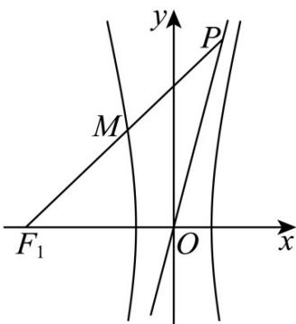

> [!faq]- 《第三章 圆锥曲线的方程（高效培优讲义）》官方解析
>
> > [!success]- **【答案】** C
>
> > [!note]- **【解析】**
> > 双曲线 $C:\frac{x^{2}}{a^{2}}-\frac{y^{2}}{b^{2}}=1(a,b>0)$ 的左焦点 $F_{1}(-c,0)$ ，渐近线 $y=\pm\frac{b}{a}x$
> >
> > 依题意，点 $P$ 在直线 $y = \frac{b}{a} x$ 上，设 $P(at, bt), t > 0$ ，则 $M\left(\frac{at - c}{2}, \frac{bt}{2}\right)$
> >
> > 
> >
> > 由点 $M$ 在 $C$ 的左支上，得 $\frac{(at - c)^2}{4a^2} -\frac{t^2}{4} = 1$ ，整理得 $2act = c^2 -4a^2$
> >
> > 由 $\left|OF_{1}\right|=\left|MF_{1}\right|$ ，得 $\left(\frac{at+c}{2}\right)^{2}+\left(\frac{bt}{2}\right)^{2}=c^{2}$ ，整理得 $c^{2}t^{2}+2act=3c^{2}$ ，
> >
> > 消去 $ct$ 得 $\frac{(c^2 - 4a^2)^2}{4a^2} + c^2 - 4a^2 = 3c^2$ ，解得 $c = 4a$ ，所以双曲线 $C$ 的离心率 $\frac{c}{a} = 4$
> >
> > 故选 **C**
