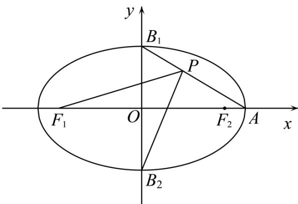

> [!faq]- 《第三章 圆锥曲线的方程（高效培优讲义）》官方解析
>
> > [!success]- **【答案】** B
>
> > [!note]- **【解析】**
> > 由已知，点 $A(a,0)$ ， $B_{1}(0,b)$ ， $B_{2}(0,-b)$ ， $F_{1}(-c,0)$ ， $F_{2}(c,0)$ ，则线段 $AB_{1}$ 的方程为 $\frac{x}{a} + \frac{y}{b} = 1(0 \leq x \leq a)$ ，则 $y = b - \frac{b}{a}x$ ，在线段 $AB_{1}$ 上取一点 $P(m, -\frac{b}{a}m + b)(0 < m < a)$ ，
> >
> > 
> >
> > $$
> > P F _ {1} = \left(- c - m, - b + \frac {b}{a} m\right)
> > $$
> >
> > $$
> > P B _ {2} = \left(- m, - 2 b + \frac {b}{a} m\right)
> > $$
> >
> > 所以 $PF_{1} \cdot PB_{2} = (-c - m)(-m) + \left(-b + \frac{b}{a}m\right)\left(-2b + \frac{b}{a}m\right)$
> >
> > $$
> > = m ^ {2} + c m + \frac {b ^ {2}}{a ^ {2}} m ^ {2} - \frac {3 b ^ {2}}{a} m + 2 b ^ {2} = \left(1 + \frac {b ^ {2}}{a ^ {2}}\right) m ^ {2} + \left(c - \frac {3 b ^ {2}}{a}\right) m + 2 b ^ {2}
> > $$
> >
> > 由 $PF_{1} \cdot PB_{2} = 2b^{2}$ ，得 $\left(1 + \frac{b^2}{a^2}\right)m^2 + \left(c - \frac{3b^2}{a}\right)m = 0$ 因为 $0 < m < a$ ，所以 $m = -\frac{c - \frac{3b^{2}}{a}}{1 + \frac{b^{2}}{a^{2}}}$ ，
> >
> > 从而 $0 < -\frac{c - \frac{3b^2}{a}}{1 + \frac{b^2}{a^2}} < a$ ，整理得 $\left\{ \begin{array}{l}ac - 3b^{2} <   0\\ a^{2} + ac - 2b^{2} > 0 \end{array} \right.$ ，即 $\left\{ \begin{array}{l}ac - 3(a^2 -c^2) <   0\\ a^2 +ac - 2(a^2 -c^2) > 0 \end{array} \right.$
> >
> > 即 $\left\{ \begin{array}{l}3c^{2} + ac - 3a^{2} <   0\\ 2c^{2} + ac - a^{2} > 0 \end{array} \right.$ ，即 $\left\{ \begin{array}{l}3e^{2} + e - 3 <   0\\ 2e^{2} + e - 1 > 0 \end{array} \right.$
> >
> > 结合0<e<1，解得 $\frac{1}{2}<e<\frac{\sqrt{37}-1}{6}$
> >
> > 故选：B.
> >
> > ## 方法技巧
> >
> > 1、求解有关离心率的问题时，一般并不是直接求出 $c$ 和 $a$ 的值，而是根据题目给出的椭圆的几何特征，建立关于参数 $c$ 、 $a$ 、 $b$ 的方程或不等式，通过解方程或不等式求得离心率的值或范围．较多时候利用 $e = \frac{c}{a},e = \sqrt{1 - \frac{b^2}{a^2}}$ 解题.
> >
> > 2、在解析几何中，求“范围”问题，一般可从以下几个方面考虑：①与已知范围联系，通过求值域或解不等式来完成；
> > - **②**：通过判别式 $\Delta$ 求解；
> > - **③**：利用点在双曲线内部形成的不等关系求解；
> > - **④**：利用解析式的结构特点，如 $a$ ，， $|a|$ 等非负性求解。
> >
> > 3、求双曲线离心率的取值范围，关键是根据题目条件得到不等关系，并想办法转化为关于 $a, b, c$ 的不等关系，结合 $c^2 = a^2 + b^2$ 和 $= e$ 得到关于 $e$ 的不等式，然后求解。在建立不等式求 $e$ 时，经常用到的结论：双曲线上一点到相应焦点距离的最小值为 $c - a$ 。双曲线的离心率常以双曲线的渐近线为载体进行命题，注意二者参数之间的转化。
> >
> > 4、双曲线离心率有关问题的解题策略：双曲线的离心率 $e =$ 是一个比值，故只需根据条件得到关于 $a, b, c$ 的一个关系式，利用 $b^2 = c^2 - a^2$ 消去 $b$ ，然后变形成关于 $e$ 的关系式，并且需注意 $e > 1$ .
