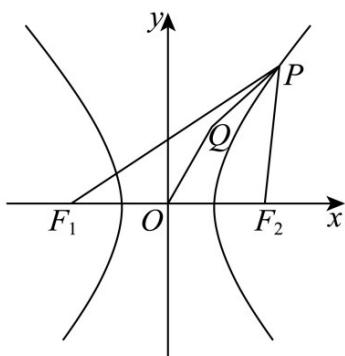

> [!faq]- 《第三章 圆锥曲线的方程（高效培优讲义）》官方解析
>
> > [!success]- **【答案】** C
>
> > [!note]- **【解析】**
> > 设点 $P(x_{1},y_{1})$ ， $F_{1}(-c,0),F_{2}(c,0)$ ，则 $\overline{PQ} = (x_Q - x_1,a - y_1)$ ， $\overline{OQ} = (x_Q,a)$ ， $\overline{F_1F_2} = (2c,0)$
> >
> > 由 $PQ + 3OQ$ 与 $F_{1}F_{2}$ 共线有 $PQ + 3OQ = \lambda F_{1}F_{2}$ ，即有 $y_{1} = 4a$
> >
> > 因为 $\triangle PF_{1}F_{2}$ 的内心为 $Q(x_{Q},a)$ ，内切圆半径为 r=a，
> >
> > 所以 $S_{\triangle PF_{1}F_{2}}=\frac{1}{2}\left(\left|PF_{1}\right|+\left|PF_{2}\right|+\left|F_{1}F_{2}\right|\right)r=\frac{1}{2}\left|F_{1}F_{2}\right|y_{1}$
> >
> > 即 $\frac{1}{2}\left(\left|PF_1\right| + \left|PF_2\right| + \left|F_1F_2\right|\right)a = \frac{1}{2} \times 2c \times 4a$
> >
> > 所以 $\left|PF_{1}\right|+\left|PF_{2}\right|=6c$ ，又 $\left|PF_{1}\right|-\left|PF_{2}\right|=2a$
> >
> > 所以 $\left|PF_{1}\right|=a+3c,\left|PF_{2}\right|=3c-a$ ，又 $\left|PF_{1}\right|>\left|PF_{2}\right|$ ，所以点 P 在右支上，
> >
> > 所以 $\left|PF_{1}\right|=\sqrt{\left(x_{1}+c\right)^{2}+y_{1}^{2}}=\sqrt{\left(x_{1}+c\right)^{2}+\frac{b^{2}}{a^{2}}x_{1}^{2}-b^{2}}=\frac{c}{a}x_{1}+a$
> >
> > 所以 $\frac{c}{a} x_1 + a = a + 3c$ ，所以 $x_{1} = 3a$ ，所以 $P(3a,4a)$
> >
> > 又 $P(3a,4a)$ 在双曲线上，所以 $\frac{9a^2}{a^2} -\frac{16a^2}{b^2} = 1$ 得 $b^{2} = 2a^{2}$ ，所以
> >
> > $$
> > b ^ {2} = 2 a ^ {2} = c ^ {2} - a ^ {2} \Rightarrow c ^ {2} = 3 a ^ {2} \Rightarrow e ^ {2} = \frac {c ^ {2}}{a ^ {2}} = 3 \Rightarrow e = \sqrt {3}
> > $$
> >
> > 故选：C.
> >
> > 
