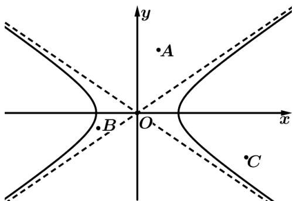

<!-- question-source:start -->
【典例1】点 $P(x,y)$ ，定义 $F(P) = \frac{x^2}{a^2} -\frac{y^2}{b^2}$ ，如图为双曲线 $\frac{x^2}{a^2} -\frac{y^2}{b^2} = 1$ 及渐近线，则关于点A、B、C，下

列结论正确的是（）

A. $F(A) > F(B) > F(C)$ B. $F(B) > F(C) > F(A)$

C. $F(A) > F(C) > F(B)$ D. $F(C) > F(B) > F(A)$
<!-- question-source:end -->

![[高中/课堂同步/题库/人教A版高中数学同步讲义(2026)/03_选择性必修第一册/第三章 圆锥曲线的方程/第三章 圆锥曲线的方程（高效培优讲义）/题型05_直线与圆锥曲线的位置关系/questions/answers/Q00080321A1.md]]
