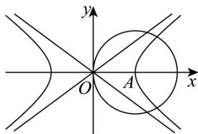
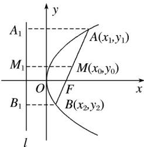

> [!faq]- 《第三章 圆锥曲线的方程（高效培优讲义）》官方解析
>
> > [!success]- **【答案】** D
>
> > [!note]- **【解析】**
> > 因为 $a^{2}=16, b^{2}=9$ ，所以 $a=4, b=3$ ， $A(4,0)$ ，
> >
> > 且圆的半径为 r = 4 ，
> >
> > 可得双曲线 $\frac{x^{2}}{16}-\frac{y^{2}}{9}=1$ 的一条渐近线方程为 $y=\frac{3x}{4}$
> >
> > 即 $3x - 4y = 0$
> >
> > 圆心到直线 $3x - 4y = 0$ 的距离为 $\frac{|3\times 4 - 4\times 0|}{\sqrt{9 + 16}} = \frac{12}{5}$
> >
> > 所以截得的弦长为 $2\sqrt{4^2 - \left(\frac{12}{5}\right)^2} = \frac{32}{5}$
> >
> > 故选：D.
> >
> > 
> >
> > ## 方法技巧
> >
> > ## 一、直线与椭圆相交的弦长公式
> >
> > 1. 定义：连接椭圆上两个点的线段称为椭圆的弦。
> >
> > 2. 求弦长的方法
> >
> > (1)交点法：将直线的方程与椭圆的方程联立，求出两交点的坐标，然后运用两点间的距离公式来求.
> >
> > (2)根与系数的关系法：如果直线的斜率为 $k$ ，被椭圆截得弦 $AB$ 两端点坐标分别为 $(x_1, y_1), (x_2, y_2)$ ，则弦长公式为： $|AB| = \cdot = \cdot$ 。
> >
> > ## 二、直线被双曲线截得的弦长公式
> >
> > 1、弦长公式
> >
> > 直线被双曲线截得的弦长公式，设直线与椭圆交于 $A(x_{1},y_{1})$ ， $B(x_{2},y_{2})$ 两点，则
> >
> > $$
> > \left| A B \right| = \sqrt {\left(1 + \mathrm{k} ^ {2}\right) \left(x _ {1} - x _ {2}\right) ^ {2}} = \sqrt {\left(1 + \mathrm{k} ^ {2}\right)} \sqrt {\left(x _ {1} + x _ {2}\right) ^ {2} - 4 x _ {1} x _ {2}} = \sqrt {\left(1 + \frac {1}{\mathrm{k} ^ {2}}\right) \left(y _ {1} - y _ {2}\right) ^ {2}} = \sqrt {\left(1 + \frac {1}{\mathrm{k} ^ {2}}\right)} \sqrt {\left(y _ {1} + y _ {2}\right) ^ {2} - 4 y _ {1} y _ {2}}
> > $$
> >
> > ( k 为直线斜率 )
> >
> > 2、通径的定义：过焦点且垂直于实轴的直线与双曲线相交于 $A$ 、 $B$ 两点，则弦长 $a = \pm 1$
> >
> > ## 三、直线被抛物线截得的弦长公式
> >
> > 抛物线 $y^{2} = 2px(p > 0)$ 的焦点的直线交抛物线于 $A(x_{1},y_{1})$ ， $B(x_{2},y_{2})$ 两点，那么线段 $AB$ 叫做焦点弦，
> >
> > 
> >
> > 如图：设 $AB$ 是过抛物线 $y^{2} = 2px(p > 0)$ 焦点 $F$ 的弦，若 $A(x_{1},y_{1})$ ， $B(x_{2},y_{2})$ ，则 $\vert AB\vert = \underline{x_1 + x_2 + p}$ . 注：(1) $x_{1} \cdot x_{2} =$ ：
> >
> > (2) $y_{1}\cdot y_{2}=-p^{2}.$
> >
> > (3) $|AB|=x_{1}+x_{2}+p=(\alpha$ 是直线AB的倾斜角).
> >
> > (4) $+ =$ 为定值 $(F$ 是抛物线的焦点）.
> >
> > (5) 求弦长问题的方法
> > - **①**：一般弦长： $|AB|=|x_{1}-x_{2}|$ ，或 $|AB|=|y_{1}-y_{2}|$ .
> > - **②**：焦点弦长：设过焦点的弦的端点为 $A(x_{1},y_{1})$ ， $B(x_{2},y_{2})$ ，则 $\vert AB\vert = x_1 + x_2 + p.$
