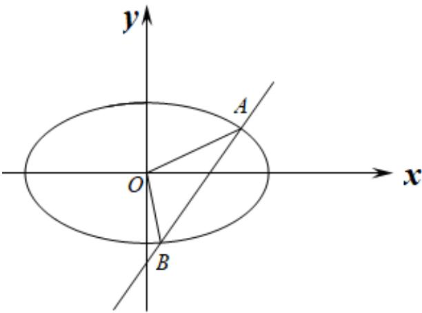

> [!faq]- 《第三章 圆锥曲线的方程（高效培优讲义）》官方解析
>
> > [!success]- **【答案】** (1) $\frac{x^{2}}{3}+y^{2}=1$ (2) $y = x \pm 1$ (3) $\frac{\sqrt{3}}{2}$
>
> > [!note]- **【解析】**
> > （1）设椭圆的半焦距为 c，依题意 $a = \sqrt{b^{2} + c^{2}} = \sqrt{3}$ ，而 $\frac{c}{a} = \frac{\sqrt{6}}{3}$ ，
> >
> > 解得 $c = \sqrt{2}, b = 1$ ，所以椭圆 $C$ 的方程为 $\frac{x^2}{3} + y^2 = 1$
> >
> > (2) 设直线 $l: y = x + m$ ，直线 与椭圆的交点为 $A(x_{1}, y_{1}), B(x_{2}, y_{2})$
> >
> > 联立方程 $\left\{\begin{aligned}y&=x+m\\ \frac{x^{2}}{3}&+y^{2}=1\end{aligned}\right.$ ，消去 y 得 $4x^{2}+6mx+3m^{2}-3=0$ ，
> >
> > 则 $\Delta = 36m^{2} - 16(3m^{2} - 3) > 0$ ，解得 $-2 < m < 2$
> >
> > 可得 $x_{1} + x_{2} = -\frac{3m}{2}, x_{1}x_{2} = \frac{3(m^{2} - 1)}{4}$
> >
> > $$
> > \left| A B \right| = \sqrt {1 + 1 ^ {2}} \cdot \sqrt {\left(x _ {1} + x _ {2}\right) ^ {2} - 4 x _ {1} x _ {2}} = \sqrt {2} \cdot \sqrt {\left(- \frac {3 m}{2}\right) ^ {2} - 4 \times \frac {3 (m ^ {2} - 1)}{4}}
> > $$
> >
> > $= \frac{\sqrt{6}}{2}\cdot \sqrt{4 - m^2} = \frac{3\sqrt{2}}{2}$ ，解得 $m = \pm 1$
> >
> > 所以直线 l 方程为 $y = x \pm 1$ .
> >
> > (3) 设 $A(x_{1}, y_{1}), B(x_{2}, y_{2})$ ，当 $AB \perp x$ 轴时，直线 $AB: x = \pm \frac{\sqrt{3}}{2}$
> >
> > 由 $\left\{ \begin{array}{l} x = \pm \frac{\sqrt{3}}{2} \\ x^2 + 3y^2 = 3 \end{array} \right.$ ，得 $|y| = \frac{\sqrt{3}}{2}$ ，则 $|AB| = \sqrt{3}$ ；
> >
> > 当 $AB$ 与 $x$ 轴不垂直时，设直线 $AB$ 的方程为 $y = kx + m$ ，即 $kx - y + m = 0$
> >
> > 依题意， $\frac{|m|}{\sqrt{1 + k^2}} = \frac{\sqrt{3}}{2}$ ，则 $m^2 = \frac{3}{4} (k^2 +1)$
> >
> > 联立 $\left\{ \begin{array}{l} y = kx + m \\ \frac{x^2}{3} + y^2 = 1 \end{array} \right.$ ，得 $\left(3k^2 + 1\right)x^2 + 6kmx + 3m^2 - 3 = 0$ ，
> >
> > $$
> > \Delta = 3 6 k ^ {2} m ^ {2} - 4 \left(3 k ^ {2} + 1\right) \left(3 m ^ {2} - 3\right) = 3 6 k ^ {2} - 1 2 m ^ {2} + 1 2 > 0
> > $$
> >
> > $$
> > x _ {1} + x _ {2} = \frac {- 6 k m}{3 k ^ {2} + 1}, x _ {1} x _ {2} = \frac {3 (m ^ {2} - 1)}{3 k ^ {2} + 1},
> > $$
> >
> > 当 $k \neq 0$ 时， $\left|AB\right| = \sqrt{1 + k^2} \cdot \sqrt{\left(x_2 + x_1\right)^2 - 4x_1x_2} = \sqrt{\left(1 + k^2\right)\left[\frac{36k^2m^2}{\left(3k^2 + 1\right)^2} - \frac{12(m^2 - 1)}{3k^2 + 1}\right]}$
> >
> > $$
> > \begin{array}{l} = \sqrt {\frac {1 2 (k ^ {2} + 1) (3 k ^ {2} + 1 - m ^ {2})}{(3 k ^ {2} + 1) ^ {2}}} = \sqrt {\frac {3 (k ^ {2} + 1) (9 k ^ {2} + 1)}{(3 k ^ {2} + 1) ^ {2}}} \\ = \sqrt {3 + \frac {1 2 k ^ {2}}{9 k ^ {4} + 6 k ^ {2} + 1}} = \sqrt {3 + \frac {1 2}{9 k ^ {2} + \frac {1}{k ^ {2}} + 6}} \leq \sqrt {3 + \frac {1 2}{2 \sqrt {9 k ^ {2} \cdot \frac {1}{k ^ {2}}} + 6}} = 2 \end{array}
> > $$
> >
> > 当且仅当 $9k^{2}=\frac{1}{k^{2}}$ ，即 $k=\pm\frac{\sqrt{3}}{3}$ 时等号成立；
> >
> > 当 $k = 0$ 时，直线 $AB:y = \pm \frac{\sqrt{3}}{2}$ ，由 $\left\{ \begin{array}{l}y = \pm \frac{\sqrt{3}}{2}\\ x^2 +3y^2 = 3 \end{array} \right.$
> >
> > 得 $\left|x\right|=\frac{\sqrt{3}}{2}$ ，则 $\left|AB\right|=\sqrt{3}$ ；
> >
> > 综上所述， $\left|AB\right|_{\max}=2$
> >
> > 则VAOB的面积 $S_{\triangle AOB} = \frac{1}{2}|AB|\times \frac{\sqrt{3}}{2}\leq \frac{1}{2}\times 2\times \frac{\sqrt{3}}{2} = \frac{\sqrt{3}}{2}$
> >
> > 所以VAOB面积的最大值 $\frac{\sqrt{3}}{2}$
> >
> > 
