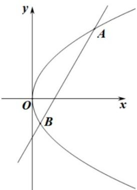

> [!faq]- 《第三章 圆锥曲线的方程（高效培优讲义）》官方解析
>
> > [!success]- **【答案】** (1) $x = -1$ ， $(1,0)$ (2) $\frac{16}{3}$
>
> > [!note]- **【解析】**
> > （1）由题意抛物线 $C: y^{2} = 4x$ 可知 p = 2，则抛物线准线方程为 x = -1，焦点
> >
> > (2) 过焦点 $F$ 且倾斜角为 $60^{\circ}$ 的直线 $l$ 的方程为 $y = \sqrt{3}(x - 1)$
> >
> > 联立 $C:y^{2} = 4x$ 可得 $3x^{2} - 10x + 3 = 0$
> >
> > 设 $A(x_{1},y_{1}), B(x_{2},y_{2})$ ，则 $x_{1} + x_{2} = \frac{10}{3}$ ,
> >
> > 故 $\left|AB\right|=x_{1}+x_{2}+p=\frac{10}{3}+2=\frac{16}{3}$
> >
> > 
