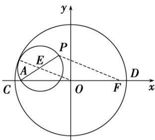

> [!faq]- 《第三章 圆锥曲线的方程（高效培优讲义）》官方解析
>
> > [!success]- **【答案】** D
>
> > [!note]- **【解析】**
> > 如图，设以 PA 为直径的圆心为 E，半径为 r，
> >
> > 因为 $\odot E$ 与 $\odot O$ 相内切，则 $|OE| = 5 - r$
> >
> > 设 $F(4,0)$ ，连接 $PF$ ，则 $\left|OE\right| = \frac{1}{2}\left|PF\right|$
> >
> > $$
> > \therefore \left| P F \right| = 2 \left| O E \right| = 1 0 - 2 r, \text {又} \left| P A \right| = 2 r
> > $$
> >
> > 所以， $\left|PA\right|+\left|PF\right|=10>8$
> >
> > 所以，点 $P$ 的轨迹是以 $A$ ， $F$ 为焦点的椭圆，
> >
> > 由 $2a = 10$ ，得 $a = 5$ ，又 $c = 4$ ，所以 $b = 3$
> >
> > 显然 $P$ 为椭圆短轴端点即 $(0,3)$ 或 $(0,-3)$ 时 $\triangle CPD$ 的面积最大，为 $\frac{1}{2} |CD| \times 3 = \frac{1}{2} \times 10 \times 3 = 15$
> >
> > 故选：D
> >
> > 
