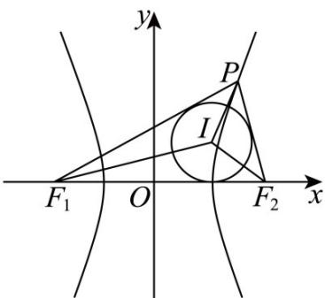

> [!faq]- 《第三章 圆锥曲线的方程（高效培优讲义）》官方解析
>
> > [!success]- **【答案】** C
>
> > [!note]- **【解析】**
> > 如图，设圆 $I$ 的半径为 $r$ ，由 $\frac{S_{\triangle PIF_1} - S_{\triangle PIF_2}}{S_{\triangle F_1IF_2}} = \frac{1}{2}$ ，得 $\frac{\frac{1}{2} r \cdot |PF_1| - \frac{1}{2} r \cdot |PF_2|}{\frac{1}{2} \cdot r \cdot |F_1F_2|} = \frac{1}{2}$
> >
> > 化简可得 $\frac{|PF_1| - |PF_2|}{|F_1F_2|} = \frac{1}{2}$ ，即 $\frac{2a}{2c} = \frac{1}{2}$ ，得 $\frac{b}{a} = \sqrt{\frac{c^2}{a^2} - 1} = \sqrt{3}$ ，即 $C$ 的渐近线方程为 $y = \pm \sqrt{3} x$
> >
> > 
> >
> > 故选 **C**.
