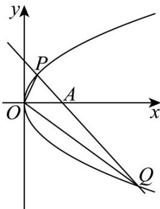

> [!faq]- 《第三章 圆锥曲线的方程（高效培优讲义）》官方解析
>
> > [!success]- **【答案】** (1)抛物线的标准方程为 $y^{2}=8x$ ，准线方程为 x=-2 或抛物线的标准方程为 $x^{2}=y$ ，准线方程为 $y=-\frac{1}{4}$ . (2)48
>
> > [!note]- **【解析】**
> > （1）根据题意，当抛物线开口向右时，设抛物线方程为 $y^{2} = 2px, p > 0$
> >
> > 将点 $P(2,4)$ 代入方程可得 $4^{2} = 2p \times 2$ ，解得 $p = 4$
> >
> > 此时抛物线的标准方程为 $y^{2}=8x$ ，准线方程为 x=-2；
> >
> > 当抛物线开口向上时，设其方程为 $x^{2}=2py, p>0$
> >
> > 将点 $P(2,4)$ 代入方程可得 $2^{2} = 2p \times 4$ ，解得 $p = \frac{1}{2}$ ，
> >
> > 此时抛物线的标准方程为 $x^{2}=y$ ，准线方程为 $y=-\frac{1}{4}$ .
> >
> > 综上，抛物线的标准方程为 $y^{2} = 8x$ ，准线方程为 $x = -2$ 或 $x^{2} = y$ ，准线方程为 $y = -\frac{1}{4}$ .
> >
> > (2) 根据题意，因为点 $Q$ 在第四象限，所以抛物线的标准方程为 $y^{2} = 8x$ ，准线方程为 $x = -2$ .
> >
> > 画出图象为：
> >
> > 
> >
> > 由题意可知 $k_{2}$ 存在， $k_{1} = \frac{4 - 0}{2 - 0} = 2$ ，因为 $k_{1} + 2k_{2} = 0$ ，所以 $k_{2} = -1$ .
> >
> > 设点 $Q\left(\frac{y_{0}^{2}}{8},y_{0}\right)$ ，所以 $k_{2}=\frac{y_{0}-4}{\frac{y_{0}^{2}}{8}-2}=-1$ ，解得 $y_{0}=4$ （舍去）或 $y_{0}=-12$
> >
> > 直线 $PQ_{的方程为}$ $y-4=-\left(x-2\right)$ ，即 $x+y-6=0$
> >
> > 所以 $^{A}$ 点的坐标为 $(6,0)$
> >
> > 所以 $\triangle OPQ$ 的面积为 $S_{\triangle OPQ} = S_{\triangle OPA} + S_{\triangle OQA} = \frac{1}{2} \times 6 \times (4 + 12) = 48$
