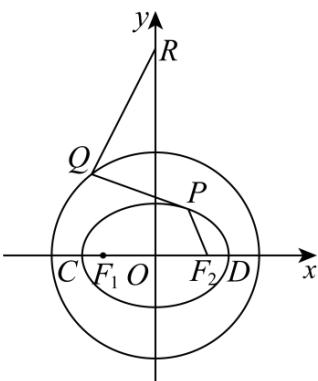

<!-- question-source:start -->
【变式3】已知椭圆 $E: \frac{x^2}{a^2} + \frac{y^2}{b^2} = 1 (a > b > 0)$ 的左、右焦点分别为 $F_1, F_2$ ，离心率 $e = \frac{\sqrt{2}}{2}, P$ 为椭圆上一动点， $\triangle PF_1F_2$ 面积的最大值为2.

(1)求椭圆 $E$ 的方程；

(2)若 $C, D$ 分别是椭圆 $E$ 长轴的左、右端点，动点 $M$ 满足： $MD \perp CD$ ，连接 $CM$ 交椭圆于点 $N, O$ 为坐标原点，

证明： $OM \cdot ON$ 为定值；

(3)若点 $Q$ 为圆 $x^{2} + y^{2} = 8$ 上的动点，点 $R\left(0,4\sqrt{2}\right)$ ，求 $\left|QR\right| + \left|QP\right| - \left|PF_{2}\right|$ 的最小值.
<!-- question-source:end -->

![[高中/课堂同步/题库/人教A版高中数学同步讲义(2026)/03_选择性必修第一册/第三章 圆锥曲线的方程/第三章 圆锥曲线的方程（高效培优讲义）/题型09_圆锥曲线中的最值问题/questions/answers/Q00080343A1.md]]
