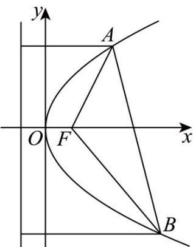

> [!faq]- 《第三章 圆锥曲线的方程（高效培优讲义）》官方解析
>
> > [!success]- **【答案】** A
>
> > [!note]- **【解析】**
> > 由抛物线的定义知， $\left|AF\right|=d_{1}$ ， $\left|BF\right|=d_{2}$ ， $\angle AFB=\frac{2\pi}{3}$
> >
> > 
> >
> > 所以在 $\triangle AFB$ 中，由余弦定理得 $|AB|^2 = d_1^2 +d_2^2 -2d_1d_2\cos \frac{2\pi}{3} = d_1^2 +d_2^2 +d_1d_2$
> >
> > 所以 $\frac{(d_1 + d_2)^2}{|AB|^2} = \frac{(d_1 + d_2)^2}{d_1^2 + d_2^2 + d_1d_2} = \frac{(d_1 + d_2)^2}{(d_1 + d_2)^2 - d_1d_2} = \frac{1}{1 - \frac{d_1d_2}{(d_1 + d_2)^2}}$
> >
> > 又因为 $(d_{1} + d_{2})^{2}$ $4d_{1}d_{2}$ ，所以 $\frac{d_1d_2}{(d_1 + d_2)^2} \leq \frac{1}{4}$ ，当且仅当 $d_{1} = d_{2}$ 时等号成立，
> >
> > 所以 $\frac{(d_1 + d_2)^2}{|AB|^2} \leq \frac{1}{1 - \frac{1}{4}} = \frac{4}{3}$ ，故 $\frac{d_1 + d_2}{|AB|} \leq \frac{2\sqrt{3}}{3}$ ，
> >
> > 所以 $\frac{d_{1}+d_{2}}{|AB|}$ 的最大值为 $\frac{2\sqrt{3}}{3}$ .
> >
> > 故选 **A**
