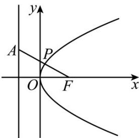
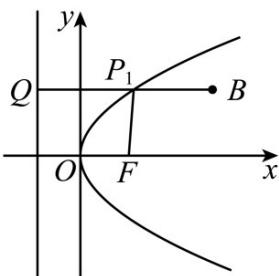

> [!faq]- 《第三章 圆锥曲线的方程（高效培优讲义）》官方解析
>
> > [!success]- **【答案】** （1）① $\sqrt{5}$ ；②4；（2） $P(0,0)$ ， $\frac{2}{3}$
>
> > [!note]- **【解析】**
> > （1）①抛物线焦点为 $F(1,0)$ ，准线方程为x=-1，
> >
> > 
> >
> > ∵点 P 到准线 x=-1 的距离等于 P 到点 $F(1,0)$ 的距离.
> >
> > ∴问题转化为：在曲线上求一点 P，使点 P 到 $A(-1,1)$ 的距离与 P 到 $F(1,0)$ 的距离之和最小.
> >
> > 显然 P 是 AF 的连线与抛物线的交点，最小值为 $\left|AF\right|=\sqrt{5}$
> > - **②**：同理 PF 与 P 点到准线的距离相等.如图：
> >
> > 
> >
> > 过 B 作 $BQ \perp$ 准线于 Q 点，交抛物线于 $P_{1}$ 点.
> >
> > $\left|P_{1}Q\right| = \left|P_{1}F\right|$
> >
> > $$
> > \left| P B \right| + \left| P F \right| \quad \left| P _ {1} B \right| + \left| P _ {1} Q \right| = \left| B Q \right| = 4
> > $$
> >
> > $\left|PB\right|+\left|PF\right|$ 的最小值为 4.
> >
> > (2) 由题意设抛物线上任一点 P 的坐标为 $(x, y)$ ,
> >
> > $$
> > \left| P A \right| ^ {2} = \left(x - \frac {2}{3}\right) ^ {2} + y ^ {2} = \left(x - \frac {2}{3}\right) ^ {2} + 2 x = \left(x + \frac {1}{3}\right) ^ {2} + \frac {1}{3},
> > $$
> >
> > 因为 x 0 ，所以当 x = 0 时， $\left|PA\right|_{\min} = \frac{2}{3}$
> >
> > 故距离点 A 最近的点 P 的坐标为 $(0,0)$ ，最短距离是 $\frac{2}{3}$ .
