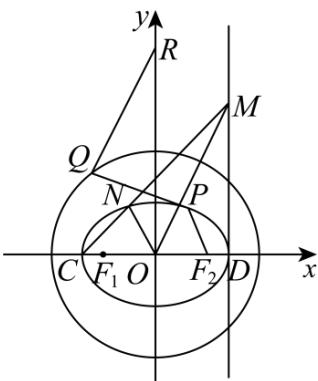
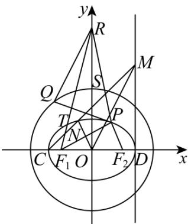

> [!faq]- 《第三章 圆锥曲线的方程（高效培优讲义）》官方解析
>
> > [!success]- **【答案】** (1) $\frac{x^2}{4} +\frac{y^2}{2} = 1$ (2)证明见解析 (3) $\sqrt{34}-4$
>
> > [!note]- **【解析】**
> > （1）由题意离心率 $e=\frac{\sqrt{2}}{2},P$ 为椭圆上一动点， $\Delta PF_{1}F_{2}$ 面积的最大值为2.
> >
> > 所以 $e=\frac{c}{a}=\frac{\sqrt{2}}{2},\frac{1}{2}\times b\times(2c)=2$
> >
> > 又 $a^2 = c^2 + b^2$ ，所以解得 $b = c = \sqrt{2}, a = 2$ ，所以椭圆 $E$ 的方程为 $\frac{x^2}{4} + \frac{y^2}{2} = 1$ 。
> >
> > (2) 由 (1) 椭圆 $E$ 的方程为 $\frac{x^2}{4} + \frac{y^2}{2} = 1$ .
> >
> > 
> >
> > 由题意 $C(-2,0),D(2,0)$ ，因为 $MD\bot CD$ ，所以设 $M(2,m)$
> >
> > 则直线 的方程为 $y = \frac{m}{4}(x + 2)$ ，将其与椭圆方程联立得 $\left\{\begin{aligned}y &= \frac{m}{4}(x + 2) \\ \frac{x^2}{4} + \frac{y^2}{2} &= 1\end{aligned}\right.$ ，
> >
> > 消去 $y$ 并整理得， $\frac{m^2}{8} (x + 2)^2 = 4 - x^2$ ，当 $x\neq x_{C} = -2$ 时， $m^2 (x + 2) = 8(2 - x)$
> >
> > 所以解得 $x_{M} = \frac{2(8 - m^{2})}{8 + m^{2}}, y_{M} = \frac{m}{4}(x_{M} + 2) = \frac{8m}{8 + m^{2}}$ ，即 $N\left(\frac{2(8 - m^2)}{8 + m^2}, \frac{8m}{8 + m^2}\right)$
> >
> > 所以 $\overrightarrow{OM} = (2,m),\overrightarrow{ON} = \left(\frac{2(8 - m^2)}{8 + m^2},\frac{8m}{8 + m^2}\right)$
> >
> > 所以 $\overrightarrow{OM} \cdot \overrightarrow{ON} = \frac{4(8 - m^{2})}{8 + m^{2}} + \frac{8m^{2}}{8 + m^{2}} = 4$
> >
> > (3)
> >
> > 
> >
> > 设 $PR$ 交圆 $x^{2} + y^{2} = 8$ 于点S，由三角形三边关系得 $\left|QR\right| + \left|QP\right|$ $|PR|$ 等号成立，当且仅当 $P,R,Q$ 三点共线，即
> >
> > 点 $Q, S$ 重合时，
> >
> > 由椭圆定义有 $\left|PF_1\right| + \left|PF_2\right| = 2a = 4$
> >
> > 所以 $\left|QR\right| + \left|QP\right| - \left|PF_{2}\right|$ $\left|PR\right| - \left|PF_{2}\right| = \left|PR\right| - \left(4 - \left|PF_{1}\right|\right) = \left|PR\right| + \left|PF_{1}\right| - 4$ $\left|RF_{1}\right| - 4 = \sqrt{\left(-\sqrt{2}\right)^{2} + \left(4\sqrt{2}\right)^{2}} - 4 = \sqrt{34} - 4$
> >
> > 等号成立当且仅当点 $Q, S$ 重合时，且点 $P, N$ 重合，其中点 $N$ 是 $RF_{1}$ 与椭圆 $\frac{x^{2}}{4} + \frac{y^{2}}{2} = 1$ 的交点，
> >
> > 综上所述， $\left|QR\right|+\left|QP\right|-\left|PF_{2}\right|$ 的最小值为 $\sqrt{34}-4$
