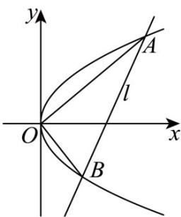

<!-- question-source:start -->
【典例1】已知抛物线 $C:y^{2} = 2px(p > 0)$ 的焦点与椭圆 $\frac{x^2}{4} +\frac{y^2}{3} = 1$ 的右焦点重合.

(1)求抛物线 $C$ 的方程；

(2)如图，若过点 $\left(4,0\right)$ 的直线 $l$ 与抛物线 $C$ 交于不同的两点 $A,B,O$ 为坐标原点，证明： $\overline{OA}\perp \overline{OB}$
<!-- question-source:end -->

![[高中/课堂同步/题库/人教A版高中数学同步讲义(2026)/03_选择性必修第一册/第三章 圆锥曲线的方程/第三章 圆锥曲线的方程（高效培优讲义）/题型10_圆锥曲线中的向量问题/questions/answers/Q00080344A1.md]]
