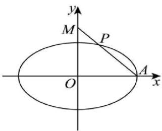

> [!faq]- 《第三章 圆锥曲线的方程（高效培优讲义）》官方解析
>
> > [!success]- **【答案】** (1) $\frac{x^{2}}{4}+\frac{y^{2}}{3}=1$ (2) $m = \pm \sqrt{6}$ (3)存在， $a=\frac{\sqrt{165}}{5}$
>
> > [!note]- **【解析】**
> > （1）依题意，在椭圆 $C: \frac{x^2}{a^2} + \frac{y^2}{3} = 1$ 中， $a > \sqrt{3}$
> >
> > 由离心率 $e = \frac{1}{2}$ ，得 $\frac{\sqrt{a^2 - 3}}{a} = \frac{1}{2}$ ，解得 $a^2 = 4$
> >
> > 所以椭圆 C 标准方程为： $\frac{x^{2}}{4}+\frac{y^{2}}{3}=1$
> >
> > (2) 由 (1) 知 $A(2,0)$ ， $M(0,m)$ ，设 $P(x_{P},y_{P})$ ，由 $\overline{PA} = 2\overline{MP}$ ，得 $\left\{ \begin{array}{l} 2 - x_{P} = 2x_{P} \\ -y_{P} = 2y_{p} - 2m \end{array} \right.$ ，
> >
> > 解得 $P\left(\frac{2}{3}, \frac{2m}{3}\right)$ ，由点 $P$ 在椭圆 $\frac{x^2}{4} + \frac{y^2}{3} = 1$ 上，得 $\frac{1}{9} + \frac{4m^2}{27} = 1$ ，解得 $m = \pm \sqrt{6}$
> >
> > 
> >
> > 所以 $m = \pm \sqrt{6}$
> >
> > (3) 由线段 $AM$ 的中垂线 $l$ 的斜率为 2，得直线 $AM$ 的斜率为 $-\frac{1}{2}$ ，由 $\frac{m - 0}{0 - a} = -\frac{1}{2}$ ，得 $m = \frac{a}{2}$
> >
> > 直线 $l$ 过线段 $AM$ 的中点 $\left(\frac{a}{2},\frac{a}{4}\right)$ ，直线 $l$ 的方程为 $y - \frac{a}{4} = 2(x - \frac{a}{2})$ ，即 $y = 2x - \frac{3}{4} a$
> >
> > 显然直线 $l$ 过椭圆内点 $(\frac{3}{8} a,0)$ ，则直线与椭圆恒有两不同交点，设 $S(x_{1},y_{1}),T(x_{2},y_{2})$
> >
> > 由 $\left\{ \begin{array}{l} y = 2x - \frac{3}{4} a \\ 3x^2 + a^2y^2 = 3a^2 \text{消} y \text{得} (4a^2 + 3)x^2 - 3a^3x + \frac{9}{16} a^4 - 3a^2 = 0 \end{array} \right.$
> >
> > $x_{1} + x_{2} = \frac{3a^{3}}{4a^{2} + 3}$ ， $x_{1}x_{2} = \frac{\frac{9}{16}a^{4} - 3a^{2}}{4a^{2} + 3}$ ，由 $\angle SMT = \frac{\pi}{2}$ ，得 $\square \square \square \square \square$ $MS\cdot MT = 0$
> >
> > 而 $\overline{MS}=(x_{1},y_{1}-\frac{a}{2}),\overline{MT}=(x_{2},y_{2}-\frac{a}{2})$ ，则有 $x_{1}x_{2}+(y_{1}-\frac{a}{2})(y_{2}-\frac{a}{2})=0$ ，
> >
> > $$
> > x _ {1} x _ {2} + \left(2 x _ {1} - \frac {5 a}{4}\right) \left(2 x _ {2} - \frac {5 a}{4}\right) = 5 x _ {1} x _ {2} - \frac {5}{2} a \left(x _ {1} + x _ {2}\right) + \frac {2 5}{1 6} a ^ {2} = 0
> > $$
> >
> > 即 $5\left(\frac{9}{16} a^4 - 3a^2\right) - \frac{5a}{2} \times 3a^3 + \frac{25}{16} a^2 (4a^2 + 3) = 0$ ，解得 $a^2 = \frac{33}{5} > 3$
> >
> > 所以存在这样的椭圆，使得 $\angle SMT = \frac{\pi}{2}$ ， $a = \frac{\sqrt{165}}{5}$
