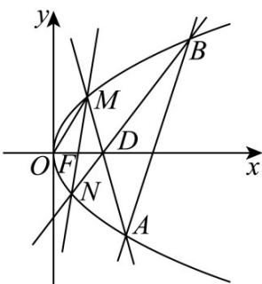

> [!faq]- 《第三章 圆锥曲线的方程（高效培优讲义）》官方解析
>
> > [!success]- **【答案】** (1)是，2 (2)证明见解析
>
> > [!note]- **【解析】**
> > （1）设直线MN，AB斜率分别为 $k_{1},k_{2}$ ，则 $\frac{k_{1}}{k_{2}}$ 为定值.
> >
> > 理由如下：如图，
> >
> > 
> >
> > 易知 $F(1,0)$ ，设 $M\left(\frac{y_1^2}{4}, y_1\right), N\left(\frac{y_2^2}{4}, y_2\right), A\left(\frac{y_3^2}{4}, y_3\right), B\left(\frac{y_4^2}{4}, y_4\right)$ ，直线 $MN: x = my + 1$ ，
> >
> > 联立 $\left\{\begin{aligned}y^{2}&=4x,\\ x&=my+1,\end{aligned}\right.$ 得 $y^{2}-4my-4=0$
> >
> > $$
> > \Delta_ {1} = 1 6 m ^ {2} + 1 6 > 0, y _ {1} y _ {2} = - 4 \quad . \tag {①}
> > $$
> >
> > $$
> > k _ {1} = \frac {y _ {1} - y _ {2}}{\frac {y _ {1} ^ {2}}{4} - \frac {y _ {2} ^ {2}}{4}} = \frac {4}{y _ {1} + y _ {2}}, k _ {2} = \frac {y _ {3} - y _ {4}}{\frac {y _ {3} ^ {2}}{4} - \frac {y _ {4} ^ {2}}{4}} = \frac {4}{y _ {3} + y _ {4}},
> > $$
> >
> > 因为 $2MF = MO - DM$ ，所以 $2MF = MO + MD$ ，
> >
> > 所以点 F 为线段 OD 的中点，
> >
> > 因为 $F(1,0)$ ，所以 $D(2,0)$ ，
> >
> > 故直线 MD: $x = \frac{\frac{y_{1}^{2}}{4} - 2}{y_{1}} y + 2 = \frac{y_{1}^{2} - 8}{4y_{1}} y + 2$
> >
> > 代入抛物线方程可得： $y^{2}-\frac{y_{1}^{2}-8}{y_{1}}y-8=0$
> >
> > 则 $\Delta_{2}>0, y_{1}y_{3}=-8$ . ②
> >
> > 联立①②得 $y_{3}=2y_{2}$ ，同理可得 $y_{4}=2y_{1}$
> >
> > 所以 $k_{2}=\frac{4}{y_{3}+y_{4}}=\frac{4}{2\left(y_{1}+y_{2}\right)}=\frac{k_{1}}{2}$
> >
> > $\frac{k_{1}}{k_{2}}=2$ ，为定值。
> >
> > (2) 由 (1) 知 $y_{1}y_{2} = -4, y_{1}y_{3} = -8$
> >
> > $$
> > \overrightarrow {D B} = \left(\frac {y _ {4} ^ {2}}{4} - 2, y _ {4}\right), \overrightarrow {D N} = \left(\frac {y _ {2} ^ {2}}{4} - 2, y _ {2}\right)
> > $$
> >
> > 因为 $N, B, D$ 三点共线，所以 $y_{2}\left(\frac{y_{4}^{2}}{4} - 2\right) = y_{4}\left(\frac{y_{2}^{2}}{4} - 2\right)$
> >
> > 化简得 $y_{2}y_{4} = -8$ ，
> >
> > 所以 $y_{1}y_{2}y_{3}y_{4} = 64$ ，即 $-4y_{3}y_{4} = 64$
> >
> > 所以 $y_{3}y_{4} = -16$
> >
> > 设直线 $AB: x = ny + b$
> >
> > 由 $\left\{\begin{aligned}x&=ny+b\\ y^{2}&=4x\end{aligned}\right.$ 得 $y^{2}-4ny-4b=0$
> >
> > $$
> > \Delta_ {3} = 1 6 n ^ {2} + 1 6 b > 0, y _ {3} y _ {4} = - 4 b = - 1 6
> > $$
> >
> > 解得 b=4 ，所以直线 AB 方程为： $x=ny+4$
> >
> > 当 $y = 0\Rightarrow x = 4$
> >
> > 所以直线 AB 过定点 $(4,0)$ .
