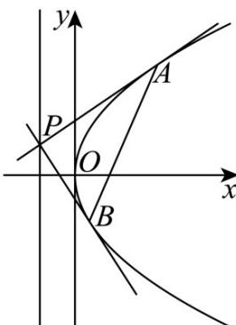

<!-- question-source:start -->
【变式2】已知以 $F(2,0)$ 为焦点的抛物线C的顶点为原点，点P是抛物线C的准线上任意一点，过点P作抛

物线 C 的两条切线 PA，PB，其中 A，B 为切点，设直线 PA，PB 的斜率分别是 $k_{1}$ 和 $k_{2}$ .

(1)求抛物线 C 的标准方程及其准线方程.

(2)求证： $k_{1} \cdot k_{2}$ 为定值.

(3)求 $\triangle PAB$ 面积的最小值.
<!-- question-source:end -->

![[高中/课堂同步/题库/人教A版高中数学同步讲义(2026)/03_选择性必修第一册/第三章 圆锥曲线的方程/第三章 圆锥曲线的方程（高效培优讲义）/题型12_圆锥曲线中的定值问题/questions/answers/Q00080355A1.md]]
