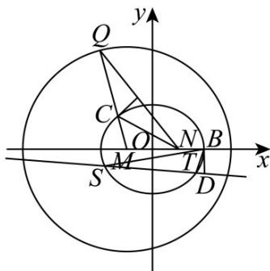

> [!faq]- 《第三章 圆锥曲线的方程（高效培优讲义）》官方解析
>
> > [!success]- **【答案】** (1) $\frac{x^{2}}{4}+\frac{y^{2}}{3}=1$ (2)存在定点 $A(2, - 1)$
>
> > [!note]- **【解析】**
> > （1）因为点 C 在线段 QN 的垂直平分线上，所以 $\left|CQ\right|=\left|CN\right|$
> >
> > 又 $QM$ 是圆的半径，所以 $\left|CN\right| + \left|CM\right| = \left|CQ\right| + \left|CM\right| = \left|QM\right| = 4 > \left|MN\right|$
> >
> > 所以点 $C$ 的轨迹是椭圆，方程为 $\frac{x^2}{4} +\frac{y^2}{3} = 1$
> >
> > (2) 设 $S(x_{1}, y_{1})$ , $T(x_{2}, y_{2})$ . 联立 $\left\{\begin{aligned}\frac{x^{2}}{4}+\frac{y^{2}}{3}=1,\\ y=kx+m,\end{aligned}\right.$
> >
> > 得 $\left(3 + 4k^2\right)x^2 +8kmx + 4m^2 -12 = 0$ ，则 $x_{1} + x_{2} = \frac{-8km}{3 + 4k^{2}}$ ， $x_{1}x_{2} = \frac{4m^{2} - 12}{3 + 4k^{2}}$
> >
> > 由 $\Delta > 0$ 得 $4k^{2} - m^{2} + 3 > 0$
> >
> > $$
> > k _ {1} + k _ {2} = \frac {y _ {1}}{x _ {1} - 2} + \frac {y _ {2}}{x _ {2} - 2} = \frac {(k x _ {1} + m) (x _ {2} - 2) + (k x _ {2} + m) (x _ {1} - 2)}{(x _ {1} - 2) (x _ {2} - 2)} = \frac {2 k x _ {1} x _ {2} + (m - 2 k) (x _ {1} + x _ {2}) - 4 m}{x _ {1} x _ {2} - 2 (x _ {1} + x _ {2}) + 4} = 3
> > $$
> >
> > 化简得 $\left(2k - 3\right)\left(4m^2 -12\right) + (m - 2k + 6)\cdot (-8km) - (4m + 12)\left(3 + 4k^2\right) = 0$
> >
> > 即 $\left(m + 2k\right)\left(m + 2k + 1\right) = 0$ ，解得 $m = -2k$ 或 $m = -2k - 1$
> >
> > 当 $m = -2k$ 时，直线 $y = k(x - 2)$ 过点 $(2,0)$ ，舍去。
> >
> > 当 $m = -2k - 1$ 时，满足 $\Delta >0$ ，此时直线 $y = k(x - 2) - 1$ ，且过定点 $(2, - 1)$
> >
> > 又因为点 $D$ 在以 $AB$ 为直径的圆上，所以点A在直线 $y = k(x - 2) - 1$ 上，
> >
> > 所以存在定点 $A(2,-1)$ 满足条件．
> >
> > 
