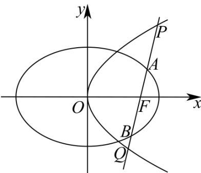

> [!faq]- 《第三章 圆锥曲线的方程（高效培优讲义）》官方解析
>
> > [!success]- **【答案】** (1) $\frac{x^{2}}{4}+\frac{y^{2}}{3}=1$ ; $y^{2}=4x$ (2)存在， $\frac{\lambda}{\mu}=-\frac{1}{3}$
>
> > [!note]- **【解析】**
> > （1）因为椭圆 $C_{1}$ 过点 $\left(1,\frac{3}{2}\right)$ ，所以 $\frac{1}{4}+\frac{9}{4b^{2}}=1$ ，所以 $b^{2}=3$
> >
> > 所以 $C_{1}$ 方程： $\frac{x^{2}}{4}+\frac{y^{2}}{3}=1$
> >
> > 又因为椭圆 $C_1$ 的右焦点 $F(1,0)$
> >
> > 所以 $\frac{p}{2} = 1, p = 2$ ，所以 $C_2$ 方程： $y^2 = 4x$ 。
> >
> > (2) 解：假设存在这样的 l，
> >
> > 设直线 l 的方程为： $x = my + 1, A(x_{1}, y_{1}), B(x_{2}, y_{2})$
> >
> > $$
> > \left\{ \begin{array}{c} x = m y + 1 \\ 3 x ^ {2} + 4 y ^ {2} = 1 2 \end{array} \Rightarrow 3 (m ^ {2} y ^ {2} + 2 m y + 1) + 4 y ^ {2} = 1 2, (3 m ^ {2} + 4) y ^ {2} + 6 m y - 9 = 0 \right.
> > $$
> >
> > $$
> > \Delta_ {1} = 3 6 m ^ {2} + 3 6 (3 m ^ {2} + 4) = 1 4 4 (m ^ {2} + 1) > 0
> > $$
> >
> > $$
> > \therefore y _ {1} + y _ {2} = \frac {- 6 m}{3 m ^ {2} + 4}, \quad y _ {1} y _ {2} = \frac {- 9}{3 m ^ {2} + 4},
> > $$
> >
> > $$
> > \therefore | A B | = \sqrt {1 + m ^ {2}} \cdot | y _ {1} - y _ {2} | = \sqrt {1 + m ^ {2}} \cdot \sqrt {(y _ {1} + y _ {2}) ^ {2} - 4 y _ {1} y _ {2}}
> > $$
> >
> > $$
> > = \sqrt {1 + m ^ {2}} \cdot \frac {\sqrt {1 4 4 (m ^ {2} + 1)}}{3 m ^ {2} + 4} = \frac {1 2 (m ^ {2} + 1)}{3 m ^ {2} + 4},
> > $$
> >
> > $$
> > P \left(x _ {3}, y _ {3}\right), Q \left(x _ {4}, y _ {4}\right) \text {设}
> > $$
> >
> > $$
> > \left\{ \begin{array}{l} x = m y + 1 \\ y ^ {2} = 4 x \end{array} \Rightarrow y ^ {2} = 4 m y + 4, y ^ {2} - 4 m y - 4 = 0, \Delta_ {2} = 1 6 m ^ {2} + 1 6 > 0 \right.
> > $$
> >
> > $$
> > \therefore y _ {3} + y _ {4} = 4 m, \quad y _ {3} y _ {4} = - 4,
> > $$
> >
> > $$
> > \therefore \left| P Q \right| = \sqrt {1 + m ^ {2}} \cdot \left| y _ {3} - y _ {4} \right| = \sqrt {1 + m ^ {2}} \cdot \sqrt {\left(y _ {3} + y _ {4}\right) ^ {2} - 4 y _ {3} y _ {4}}
> > $$
> >
> > $$
> > = \sqrt {1 + m ^ {2}} \cdot \sqrt {1 6 m ^ {2} + 1 6} = 4 (m ^ {2} + 1)
> > $$
> >
> > $$
> > \therefore \frac {\mu}{| A B |} + \frac {\lambda}{| P Q |} \frac {(3 m ^ {2} + 4) \mu}{1 2 (m ^ {2} + 1)} + \frac {\lambda}{4 (m ^ {2} + 1)} = \frac {(3 m ^ {2} + 4) \mu + 3 \lambda}{1 2 (m ^ {2} + 1)} = C (C _ {\text {为定值}})
> > $$
> >
> > $\therefore 3m^{2}(4C - \mu) + (12C - 3\lambda - 4\mu) = 0$ ，任意的实数 $m$ 恒成立
> >
> > $\therefore \left\{ \begin{array}{l} 4C = \mu \\ 12C - 3\lambda - 4\mu = 0 \end{array} \right.$ ，得到 $\left\{ \begin{array}{l} \mu = 4C \\ 3\lambda = -4C \end{array} \right.$
> >
> > ∴当 $\frac{\lambda}{\mu}=-\frac{1}{3}$ 时， $\frac{\mu}{\left|AB\right|}+\frac{\lambda}{\left|PQ\right|}$ 为定值.
> >
> > 
