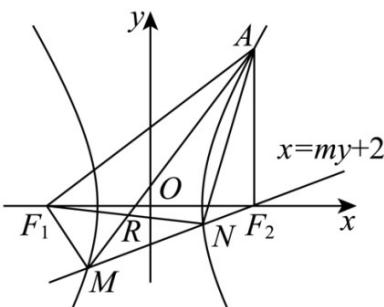

> [!faq]- 《专题3_2_双曲线_高效培优讲义_》官方解析
>
> > [!success]- **【答案】** (1) $\frac{x^2}{3} - y^2 = 1$ (2) $\frac{98\sqrt{3}}{45}$
>
> > [!note]- **【解析】**
> > （1）因为 $AF_{2} \perp F_{1}F_{2}$ ，且 $A\left(2, \frac{\sqrt{3}}{3}\right)$ ，所以焦点 $F_{2}(2,0)$ ，即 $c = 2$ ，
> >
> > 又 $\frac{4}{a^2} -\frac{1}{3b^2} = 1$ ，由 $\left\{ \begin{array}{l}\frac{4}{a^2} -\frac{1}{3b^2} = 1\\ a^2 +b^2 = 4 \end{array} \right.$ ，解得 $\left\{ \begin{array}{l}a^2 = 3\\ b^2 = 1 \end{array} \right.$ ，所以双曲线 $C:\frac{x^2}{3} -y^2 = 1\cdot$
> >
> > (2) 由题知直线斜率不为0，设过 $F_{2}(2,0)$ 的直线为 $x=my+2(m>0)$
> >
> > 由 $\left\{ \begin{array}{l} x = my + 2 \\ \frac{x^2}{3} - y^2 = 1 \end{array} \right.$ ，消 $x$ 得到 $\left(m^2 - 3\right)y^2 + 4my + 1 = 0$
> >
> > 则 $\Delta = (4m)^2 - 4 \times (m^2 - 3) = 12(m^2 + 1) > 0$ ，且 $m \neq \sqrt{3}$
> >
> > 设 $M\left(x_{1},y_{1}\right),N\left(x_{2},y_{2}\right)$ ，则由韦达定理有 $y_{1} + y_{2} = -\frac{4m}{m^{2} - 3},y_{1}y_{2} = \frac{1}{m^{2} - 3}$
> >
> > 因为 $S_{\triangle F_1RM} = S_{\triangle ARN}$ ，所以 $S_{\triangle F_1NM} = S_{\triangle ANM}$
> >
> > 即点 $F_{1}(-2,0)$ 和点 $A\left(2,\frac{\sqrt{3}}{3}\right)$ 到直线 $x=my+2$ 的距离相等，
> >
> > 则有 $d = \frac{|-4|}{\sqrt{1 + m^{2}}} = \frac{\left| -\frac{\sqrt{3}}{3} m \right|}{\sqrt{1 + m^{2}}}$ ，解得 $m = 4\sqrt{3}$ ，
> >
> > 所以 $\left|MN\right|=\sqrt{1+m^{2}}\left|y_{1}-y_{2}\right|=\sqrt{1+m^{2}}\sqrt{\left(y_{1}+y_{2}\right)^{2}-4y_{1}y_{2}}=\frac{2\sqrt{3}\left(m^{2}+1\right)}{\left|m^{2}-3\right|}=\frac{98\sqrt{3}}{45}$
> >
> > $$
> > \left| M N \right| = \frac {9 8 \sqrt {3}}{4 5}
> > $$
> >
> > 
