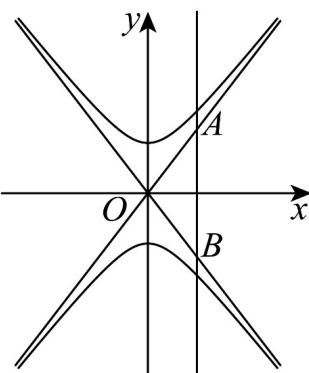

> [!faq]- 《专题3_2_双曲线_高效培优讲义_》官方解析
>
> > [!success]- **【答案】** B
>
> > [!note]- **【解析】**
> > 联立 $\left\{\begin{aligned}x&=b\\ y&=\pm\frac{a}{b}x\end{aligned}\right.$ ，解得 $\left\{\begin{aligned}x&=b\\ y&=\pm a\end{aligned}\right.$ ，不妨令 $A(b,a)$ ， $B(b,-a)$ ，则 $\left|AB\right|=2a$ ，
> > AB 边上的高为 b，所以 $\frac{1}{2} \times 2a \times b = 8$ ，ab = 8，
> > 故 C 的焦距 $2c = 2\sqrt{a^{2} + b^{2}}$ $2\sqrt{2ab} = 2\sqrt{2 \times 8} = 8$
> >
> > 故选：B
> >
> > 
