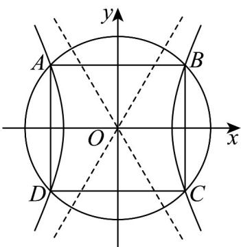

> [!faq]- 《专题3_2_双曲线_高效培优讲义_》官方解析
>
> > [!success]- **【答案】** $\sqrt{3}$
>
> > [!note]- **【解析】**
> > 双曲线 $M: x^{2} - \frac{y^{2}}{3} = 1$ 与圆 $O: x^{2} + y^{2} = r^{2} (r > 0)$ 交于 A, B, C, D 四点，
> >
> > 且这四个点恰为正方形的四个顶点，
> >
> > 设 $A(m,n)$ ，则 $|m|=|n|$ ，
> >
> > 所以 $m^{2}-\frac{m^{2}}{3}=1$ ，解得 $m^{2}=\frac{3}{2}$
> >
> > 所以 $r^{2}=m^{2}+n^{2}=2m^{2}=3$ ，即 $r=\sqrt{3}$ ，
> >
> > 
> >
> > 故答案为： $\sqrt{3}$
