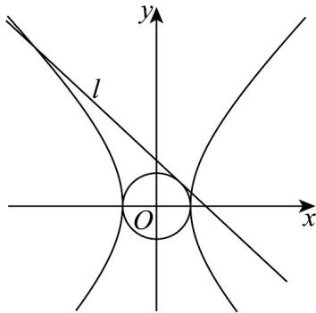

> [!faq]- 《专题3_2_双曲线_高效培优讲义_》官方解析
>
> > [!success]- **【答案】** (1) $b = 2$ (2)证明见解析
>
> > [!note]- **【解析】**
> > （1）由题意可得 $e^{2}=\frac{c^{2}}{a^{2}}=\frac{1+b^{2}}{1}=5$ ，因为 b>0，解得 b=2。
> >
> > (2) 因为直线 $l: y = kx + b$ 与圆 $O: x^2 + y^2 = 1$ 相切，所以 $\frac{|b|}{\sqrt{k^2 + 1}} = 1$ ，可得 $b^2 = k^2 + 1$ ，
> >
> > 联立 $\left\{ \begin{array}{l} y = kx + b \\ b^2 x^2 - y^2 = b^2 \text{得} (b^2 - k^2) x^2 - 2kbx - 2b^2 = 0 \end{array} \right.$ ，即 $x^2 - 2kbx - 2b^2 = 0$ ，
> >
> > 则 $\Delta = 4k^2 b^2 + 8b^2 > 0$ ，所以方程 $x^2 - 2kbx - 2b^2 = 0$ 有两个不等的实根，
> >
> > 设这两个实根分别为 $x_{1}$ 、 $x_{2}$ ，则 $x_{1}x_{2} = -2b^{2} < 0$ ，
> >
> > 因此，直线 l 与双曲线 $\Gamma$ 的左右两支各有一个公共点·
> >
> > 
