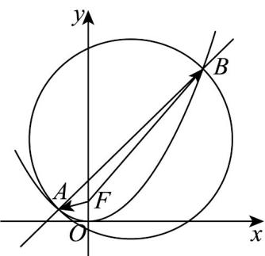

> [!faq]- 《专题3_2_双曲线_高效培优讲义_》官方解析
>
> > [!success]- **【答案】** (1) $x^{2}=4y$ (2) $\left(3 - 2\sqrt{3}, 3 + 2\sqrt{3}\right)$
>
> > [!note]- **【解析】**
> > （1）因为点 $M(2\sqrt{3}, 3)$ 在抛物线上，所以 $(2\sqrt{3})^2 = 2p \times 3$ ，解得 $p = 2$ ，所以抛物线 $C$ 的方程为 $x^2 = 4y$
> >
> > (2) 易知抛物线 $C$ 的焦点为 $F(0,1)$ ，且“点 $F(0,1)$ 在以 $AB$ 为直径的圆内”等价于“ $FA \cdot FB < 0$ ，
> >
> > 设 $A(x_{1},y_{1})$ ， $B(x_{2},y_{2})$ ，则 $FA \cdot FB = (x_{1}, y_{1} - 1) \cdot (x_{2}, y_{2} - 1) = x_{1}x_{2} + y_{1}y_{2} - (y_{1} + y_{2}) + 1$ ，记为①
> >
> > 由题意，过点 $(0,t)$ 且斜率为 $^{1}$ 的直线方程为 $y=x+t$ 。于是有 $y_{1}=x_{1}+t$ 和 $y_{2}=x_{2}+t$ ，将其代入①式，得 $FA\cdot FB=2x_{1}x_{2}+(t-1)(x_{1}+x_{2})+t^{2}-2t+1$ ，记为②
> >
> > 由 $\left\{ \begin{array}{l} x^{2} = 4y \\ y = x + t \text{联立消去} y \end{array} \right.$ ，整理得 $x^{2} - 4x - 4t = 0$ 。于是有 $\Delta = 16 + 16t > 0$ ，即 $t > -1$ 且 $\left\{ \begin{array}{l} x_{1} + x_{2} = 4 \\ x_{1}x_{2} = -4t \end{array} \right.$ ，记为③
> >
> > 再将③代入②，整理得
> >
> > $$
> > F A \cdot F B = - 8 t + 4 (t - 1) + t ^ {2} - 2 t + 1 = t ^ {2} - 6 t - 3
> > $$
> >
> > 要 $\overline{FA}\cdot\overline{FB}<0$ 成立，只要 $t^{2}-6t-3=(t-3)^{2}-12<0$ 在 $t\in(-1,+\infty)$ 上恒成立即可.
> >
> > 解不等式 $\left(t - 3\right)^2 -12 <   0$ 得 $t\in \left(3 - 2\sqrt{3},3 + 2\sqrt{3}\right)$ ，符合题意.
> >
> > 综上可知，实数 $t$ 的取值范围为 $\left(3 - 2\sqrt{3}, 3 + 2\sqrt{3}\right)$
> >
> > 
