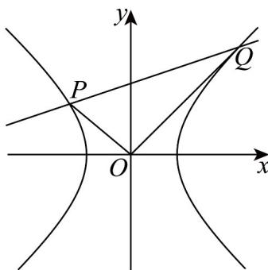

> [!faq]- 《专题3_2_双曲线_高效培优讲义_》官方解析
>
> > [!success]- **【答案】** (1) $x^{2}-\frac{y^{2}}{3}=1(x\neq\pm1)$ (2) $\left[\sqrt{6}, +\infty\right)$
>
> > [!note]- **【解析】**
> > （1）设点 $M(x,y)$ ， $x\neq \pm 1$ ，则 $k_{MA} = \frac{y}{x + 1}$ ， $k_{MB} = \frac{y}{x - 1}$
> >
> > 所以 $\frac{y}{x + 1}\times \frac{y}{x - 1} = 3$ ，化简得 $x^{2} - \frac{y^{2}}{3} = 1$
> >
> > 所以点 M 的轨迹方程为 $x^{2}-\frac{y^{2}}{3}=1(x\neq\pm1)$
> >
> > (2) 当直线 l 斜率不存在时，可设 $P(x_{p}, y_{p})$ ， $Q(x_{p}, -y_{p})$
> >
> > 则 $\overline{OP}=\left(x_{p},y_{p}\right)$ ， $\overline{OQ}=\left(x_{p},-y_{p}\right)$
> >
> > 将其代入双曲线方程得 $x_{P}^{2} - \frac{y_{P}^{2}}{3} = 1$
> >
> > 又 $OP \cdot OQ = x_P^2 - y_P^2 = 0$ ，解得 $y_P = \pm \frac{\sqrt{6}}{2}$ ，此时 $|PQ| = 2|y_P| = \sqrt{6}$
> >
> > 当直线 l 斜率存在时，设其方程为 $y = kx + m$ ，设 $P(x_{1}, y_{1})$ ， $Q(x_{2}, y_{2})$
> >
> > 联立 $\left\{ \begin{array}{l} y = kx + m \\ x^2 - \frac{y^2}{3} = 1 \end{array} \right. \Rightarrow (3 - k^2)x^2 - 2kmx - m^2 - 3 = 0$ ， $3 - k^2 \neq 0$ ， $\Delta = 12(m^2 - k^2 + 3) > 0$
> >
> > 由韦达定理： $x_{1} + x_{2} = \frac{2km}{3 - k^{2}}$ ， $x_{1}x_{2} = \frac{-m^{2} - 3}{3 - k^{2}}$
> >
> > $$
> > \text {则} \stackrel {\square \square \square} {O P} \cdot \stackrel {\square \square \square} {O Q} = x _ {1} x _ {2} + y _ {1} y _ {2} = x _ {1} x _ {2} + (k x _ {1} + m) (k x _ {2} + m)
> > $$
> >
> > $$
> > = \left(1 + k ^ {2}\right) x _ {1} x _ {2} + k m \left(x _ {1} + x _ {2}\right) + m ^ {2} = \left(1 + k ^ {2}\right) \frac {- m ^ {2} - 3}{3 - k ^ {2}} + k m \frac {2 k m}{3 - k ^ {2}} + m ^ {2} = 0
> > $$
> >
> > 化简得 $3k^{2} + 3 = 2m^{2}$ ，此时 $\Delta = 6(k^2 +9) > 0$
> >
> > 所以 $\left|PQ\right|=\sqrt{1+k}\left|x_{1}-x_{2}\right|=\sqrt{1+k^{2}}\cdot\sqrt{\left(x_{1}+x_{2}\right)^{2}-4x_{1}x_{2}}$
> >
> > $$
> > = \sqrt {1 + k ^ {2}} \sqrt {\left(\frac {2 k m}{3 - k ^ {2}}\right) ^ {2} - 4 \frac {- m ^ {2} - 3}{3 - k ^ {2}}} = \sqrt {1 + k ^ {2}} \sqrt {\frac {1 2 (m ^ {2} - k ^ {2} + 3)}{(3 - k ^ {2}) ^ {2}}}
> > $$
> >
> > $$
> > = \sqrt {6} \sqrt {\frac {k ^ {4} + 1 0 k ^ {2} + 9}{k ^ {4} - 6 k ^ {2} + 9}} = \sqrt {6} \sqrt {1 + \frac {1 6 k ^ {2}}{k ^ {4} - 6 k ^ {2} + 9}},
> > $$
> >
> > 当 $k = 0$ 时，此时 $|PQ| = \sqrt{6}$ ，当 $k\neq 0$ 时，此时 $|PQ| = \sqrt{6}\cdot \sqrt{1 + \frac{16}{k^2 + \frac{9}{k^2} - 6}}$
> >
> > $\because 3-k^{2}\neq0,\therefore k^{2}+\frac{9}{k^{2}}>2\sqrt{k^{2}\cdot\frac{9}{k^{2}}}=6,故\frac{16}{k^{2}+\frac{9}{k^{2}}-6}>0,$
> >
> > $|PQ|=\sqrt{6}\cdot\sqrt{1+\frac{16}{k^{2}+\frac{9}{k^{2}}-6}}>\sqrt{6}$ 因此 $\sqrt{\frac{16}{k^{2}+\frac{9}{k^{2}}-6}} > \sqrt{6}$ ，综上可得 $\left|PQ\right| \in \left[\sqrt{6}, +\infty\right)$
> >
> > 
