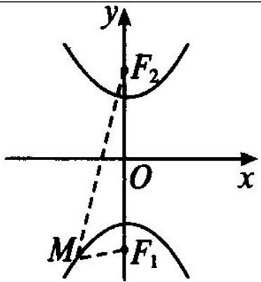

## 知识点 04 双曲线两个标准方程几何性质的比较

<table><tr><td colspan="2">标准方程</td><td> $\frac{x^2}{a^2} - \frac{y^2}{b^2} = 1 (a > 0, b > 0)$ </td><td> $\frac{y^2}{a^2} - \frac{x^2}{b^2} = 1 (a > 0, b > 0)$ </td></tr><tr><td colspan="2">图形</td><td></td><td></td></tr><tr><td rowspan="8">性质</td><td>焦点</td><td> $F_1(-c,0), F_2(c,0)$ </td><td> $F_1(0,-c), F_2(0,c)$ </td></tr><tr><td>焦距</td><td> $|F_1F_2|=2c (c=\sqrt{a^2+b^2})$ </td><td> $|F_1F_2|=2c (c=\sqrt{a^2+b^2})$ </td></tr><tr><td>范围</td><td> $\{x|x\leq-a或x a\}, y\in R$ </td><td> $\{y|y\leq-a或y a\}, x\in R$ </td></tr><tr><td>对称性</td><td colspan="2">关于x轴、y轴和原点对称</td></tr><tr><td>顶点</td><td> $(\pm a,0)$ </td><td> $(0,\pm a)$ </td></tr><tr><td>轴</td><td colspan="2">实轴长=2a,虚轴长=2b</td></tr><tr><td>离心率</td><td colspan="2"> $e=\frac{c}{a}(e>1)$ </td></tr><tr><td>渐近线方程</td><td> $y=\pm\frac{b}{a}x$ </td><td> $y=\pm\frac{a}{b}x$ </td></tr></table>

【即学即练】

1. 已知双曲线 $E: \frac{x^2}{9} - \frac{y^2}{7} = 1$ ， $F_1$ ， $F_2$ 分别为其左、右焦点， $O$ 为坐标原点， $P$ 为 $E$ 上一点，且 $\left|PF_1\right| = 8$ ， $M$

为 $PF_{1}$ 的中点，则 $\left|OM\right| =$ \_\_\_\_ .

【答案】 $^{1}$ 或 $^{7}$

【详解】因为双曲线 $E: \frac{x^2}{9} - \frac{y^2}{7} = 1$ ，所以 $a = 3, b = \sqrt{7}$ ， $c = \sqrt{a^2 + b^2} = 4$

故焦点坐标为 $F_{1}(-4,0)$ , $F_{2}(4,0)$ .

①若 P 在左支上，

$$
\left| P F _ {1} \right| _ {\min} = c - a = 1 \quad \left| P F _ {2} \right| _ {\min} = c + a = 7
$$

由双曲线的定义可知 $\left|PF_2\right| - \left|PF_1\right| = 2a = 6$

因为 $\left|PF_{1}\right|=8$ ，所以 $\left|PF_{2}\right|=14$ ，而 8>1,14>7，所以符合题意。

因为 M 为 $PF_{1}$ 的中点，所以在 $\Delta PF_{1}F_{2}$ 中，

由三角形中位线定理可知 $\left|OM\right|=\frac{1}{2}\left|PF_{2}\right|=7$ ；

②若 $P$ 在右支上，

$$
\left| P F _ {1} \right| _ {\min} = c + a = 7 \quad \left| P F _ {2} \right| _ {\min} = c - a = 1
$$

由双曲线的定义可知 $\left|PF_1\right| - \left|PF_2\right| = 2a = 6$

因为 $\left|PF_{1}\right|=8$ ，所以 $\left|PF_{2}\right|=2$ ，而 8>7,2>1，所以符合题意。

因为 M 为 $PF_{1}$ 的中点，所以在 $\triangle PF_{1}F_{2}$ 中，

由三角形中位线定理可知 $\left|OM\right|=\frac{1}{2}\left|PF_{2}\right|=1$ ；

故答案为： $^{1}$ 或 $^{7}$

2. 已知双曲线 $\frac{x^2}{4} - y^2 = 1$ 的左、右焦点分别为 $F_1$ 、 $F_2$ ，设点 $P\left(\sqrt{5}, \frac{1}{2}\right)$ ，则 $\left|PF_1\right| - \left|PF_2\right|$ 的值为 \_\_\_\_.

【答案】4

【详解】由双曲线的标准方程可得 a = 2 ，

由 $P\left(\sqrt{5},\frac{1}{2}\right)$ 满足方程 $\frac{x^{2}}{4}-y^{2}=1$ ，知点 P 在双曲线的右支上，

$$
\therefore \left| P F _ {1} \right| - \left| P F _ {2} \right| = 2 a = 4
$$

故答案为：4.
