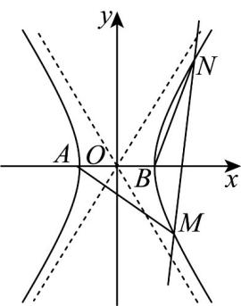

## 知识点 07 直线与双曲线的位置关系判断

将双曲线方程 $\frac{x^2}{a^2} -\frac{y^2}{b^2} = 1$ 与直线方程 $l:y = kx + b$ 联立消去 $y$ ，得到关于 $_x$ 的一元二次方程 $\left(b^{2} - a^{2}k^{2}\right)x^{2} - 2a^{2}mkx - a^{2}m^{2} - a^{2}b^{2} = 0$

1、当 $b^{2} - a^{2}k^{2} = 0$ ，即 $k = \pm \frac{b}{a}$ 时，直线 $l$ 与双曲线的渐近线平行，直线 $l$ 与双曲线只有一个交点；

2、当 $b^{2} - a^{2}k^{2}\neq 0$ ，即 $k\neq \pm \frac{b}{a}$ 时，设该一元二次方程的判别式为 $\varDelta$ ，

若 $\Delta > 0$ ，直线与双曲线相交，有两个公共点；

若 $\Delta = 0$ ，直线与双曲线相切，有一个公共点；

若 $\Delta < 0$ ，直线与双曲线相离，没有公共点；

注意：直线与双曲线有一个公共点时，可能相交或相切。

【即学即练】

1. 已知双曲线 $C: \frac{x^2}{a^2} - \frac{y^2}{b^2} = 1 (a > 0, b > 0)$ 的左焦点为 $F$ ， $C$ 的一条渐近线方程为 $2x + y = 0$ ，其顶点到渐近线

的距离为 2.

(1)求 $C$ 的方程；

(2)过 $F$ 的直线 $l$ 与 $C$ 交于A， $B$ 两点， $O$ 为坐标原点·若 $\triangle OAB$ 的面积为 $\overline{3}$ ，求直线 $l$ 的方程·

$$
\frac {2 0 \sqrt {1 0}}{3}
$$

【答案】(1) $\frac{x^{2}}{5}-\frac{y^{2}}{20}=1$

(2) $x + y + 5 = 0$ 或 $x - y + 5 = 0$

【详解】（1）因为一条渐近线方程为 $2x + y = 0$ ，其顶点到渐近线的距离为2.

所以 $\left\{\begin{aligned}\frac{b}{a}&=2\\\frac{|2a|}{\sqrt{5}}&=2\end{aligned}\right.$ ，解得 $\left\{\begin{aligned}a&=\sqrt{5}\\ b&=2\sqrt{5}\end{aligned}\right.$

所以 C 的方程为 $\frac{x^{2}}{5}-\frac{y^{2}}{20}=1$

(2) 由题知 $F(-5,0)$ ，且直线 $l$ 的斜率不为 0，

设直线 $l$ 的方程为 $x = my - 5$ ， $A(x_1, y_1)$ ， $B(x_2, y_2)$

联立方程 $\left\{ \begin{array}{l} x = my - 5 \\ \frac{x^2}{5} - \frac{y^2}{20} = 1 \end{array} \right.$ ，消得 $x \left(4m^2 - 1\right)y^2 - 40my + 80 = 0 \left(4m^2 - 1 \neq 0\right)$

$$
\Delta = 1 6 0 0 m ^ {2} - 4 \times 8 0 \times (4 m ^ {2} - 1) = 3 2 0 (m ^ {2} + 1) > 0
$$

所以 $y_{1} + y_{2} = \frac{40m}{4m^{2} - 1}$ ， $y_{1}y_{2} = \frac{80}{4m^{2} - 1}$ ，

设 $O$ 到 $l$ 的距离为 $d$ ，则 $d = \frac{5}{\sqrt{m^2 + 1}}$

$$
\left| A B \right| = \sqrt {m ^ {2} + 1} \cdot \sqrt {\left(\frac {4 0 m}{4 m ^ {2} - 1}\right) ^ {2} - \frac {4 \times 8 0}{4 m ^ {2} - 1}} = \frac {8 \sqrt {5} (m ^ {2} + 1)}{\left| 4 m ^ {2} - 1 \right|},
$$

所以 $S_{\triangle OAB}=\frac{1}{2}|AB|\cdot d=\frac{1}{2}\times\frac{8\sqrt{5}(m^{2}+1)}{|4m^{2}-1|}\times\frac{5}{\sqrt{m^{2}+1}}=\frac{20\sqrt{10}}{3}$ ，解得 $m=\pm1$ ，

所以直线 l 的方程为 $x + y + 5 = 0$ 或 $x - y + 5 = 0$ .

2. 已知双曲线 $C: \frac{x^2}{a^2} - \frac{y^2}{b^2} = 1 (a > 0, b > 0)$ 经过 $M\left(-\frac{4\sqrt{3}}{3}, 1\right)$ ， $N(4, -3)$ 两点，

(1)求 $C$ 的方程；

(2)若直线 $l:y = kx + b$ 交 $C$ 于 $P$ ， $Q$ 两点，点 $A(4,3)$ （异于点 $P$ ， $Q$ ）， $\angle PAQ$ 的平分线与 $x$ 轴垂直，求证： $l$

的倾斜角为定值.

【答案】(1) $\frac{x^{2}}{4}-\frac{y^{2}}{3}=1$

(2)证明见解析

【详解】（1）（方法1）当双曲线焦点在 $x$ 轴上时，设双曲线方程为 $\frac{x^2}{a^2} -\frac{y^2}{b^2} = 1(a > 0,b > 0)$

由题意得， $\left\{\begin{aligned}\frac{16}{3a^{2}}-\frac{1}{b^{2}}=1\\\frac{16}{a^{2}}-\frac{9}{b^{2}}=1\end{aligned}\right.$ ，解得 $\left\{\begin{aligned}a^{2}=4\\b^{2}=3\end{aligned}\right.$ ，双曲线方程为 $\frac{x^{2}}{4}-\frac{y^{2}}{3}=1$

当双曲线焦点在 $y$ 轴上时，设双曲线方程为 $\frac{y^2}{a^2} -\frac{x^2}{b^2} = 1(a > 0,b > 0)$

由题意得， $\left\{ \begin{array}{l} \frac{1}{a^2} - \frac{16}{3b^2} = 1 \\ \frac{9}{a^2} - \frac{16}{b^2} = 1 \end{array} \right.$ ，方程组无解。

综上，双曲线方程为 $\frac{x^2}{4} -\frac{y^2}{3} = 1$

(方法 $^{2}$ ) 设双曲线方程为 $mx^{2}-ny^{2}=1(mn>0)$ ，则 $\left\{\begin{aligned}&\left(-\frac{4\sqrt{3}}{3}\right)^{2}m-n=1\\ &4^{2}m-\left(-3\right)^{2}n=1\end{aligned}\right.$

解得 $m = \frac{1}{4}$ ， $n = \frac{1}{3}$ 所求双曲线方程为 $\frac{x^2}{4} -\frac{y^2}{3} = 1$

(2) 由已知得直线 l 的斜率存在，设其方程为 $y = kx + b$ ，设 $P(x_{1}, y_{1})$ ， $Q(x_{2}, y_{2})$

所以 $\left\{ \begin{array}{l} y = kx + b \\ \frac{x^2}{4} - \frac{y^2}{3} = 1 \end{array} \right. \Rightarrow \left(3 - 4k^2\right)x^2 - 8kbx - 4b^2 - 12 = 0$

所以 $\Delta=(-8kb)^{2}-4(3-4k^{2})(-4b^{2}-12)=48(b^{2}-4k^{2}+3)>0$

由题意知 $3 - 4k^{2}\neq 0$ ， $\therefore x_{1} + x_{2} = \frac{8kb}{3 - 4k^{2}}$ ， $x_{1}x_{2} = -\frac{4b^{2} + 12}{3 - 4k^{2}}$

又因为 $\angle PAQ$ 的平分线与 $x$ 轴垂直，所以 $k_{AP} + k_{AQ} = 0$

即 $\frac{y_1 - 3}{x_1 - 4} +\frac{y_2 - 3}{x_2 - 4} = 0$ ，所以 $\left(y_{1} - 3\right)\left(x_{2} - 4\right) + \left(y_{2} - 3\right)\left(x_{1} - 4\right) = 0$

即 $2kx_{1}x_{2} + (b - 3 - 4k)(x_{1} + x_{2}) - 8(b - 3) = 0$

所以 $-2k\cdot \frac{4b^2 + 12}{3 - 4k^2} +(b - 3 - 4k)\cdot \frac{8kb}{3 - 4k^2} -8(b - 3) = 0$

即 $-24(k+1)(b+4k-3)=0$ ，所以 k=-1 或 b=3-4k，

当 $b = 3 - 4k$ 时，直线 $l$ 的方程为 $y = kx + 3 - 4k = k(x - 4) + 3$

即直线 $l$ 过点 $A(4,3)$ ，不符合题意，所以 $k = -1$ ，设倾斜角为 $\alpha (0\leq \alpha <  \pi)$

即 $k = \tan \alpha = -1$ ， $\alpha = \frac{3\pi}{4}$ ，即直线 $l$ 的倾斜角为定值 $\frac{3\pi}{4}$

知识点 08 弦长公式

若直线 $l:y = kx + m$ 与双曲线 $\frac{x^2}{a^2} -\frac{y^2}{b^2} = 1$ （ $a > 0$ ， $b > 0$ ）交于 $A(x_{1},y_{1})$ ， $B(x_{2},y_{2})$ 两点，则 $AB = \sqrt{1 + k^2}\left|x_1 - x_2\right|$ 或 $AB = \sqrt{1 + \frac{1}{k^2}}\left|y_1 - y_2\right|$ （ $k\neq 0$ ）.

【即学即练】

1. 已知双曲线 $C: \frac{x^2}{a^2} - \frac{y^2}{b^2} = 1 (a > 0, b > 0)$ 的右焦点为 $F$ ，一条渐近线被以点 $F$ 为圆心， $2a$ 为半径的圆截得的

弦长为 $2a$ ，则双曲线 $C$ 的离心率为

【答案】2

【详解】渐近线方程为 $bx \pm ay = 0$ ，

∵点 F 到渐近线的距离为 $\frac{bc}{\sqrt{a^{2}+b^{2}}}=b$ ，∴ $b^{2}+a^{2}=4a^{2}$ ，即 $b=\sqrt{3}a$ ，所以 $e=\sqrt{1+\left(\frac{b}{a}\right)^{2}}=2$ 。

故答案为：2·

2. 已知双曲线 $\Gamma: x^2 - \frac{y^2}{3} = 1$ ，设其左、右顶点分别为 $A, B$ ，中心为 $O \cdot$

(1)求双曲线 $\Gamma$ 的焦点；

$$
\sqrt {1 5}
$$

(2)斜率为 $\overline{5}$ 的直线 l 交双曲线 $\Gamma$ 于 C, D 两点，且 $OC \perp OD$ ，求弦长 $|CD|$ ;

(3)设双曲线 $F$ 右支上两点 $M, N$ 满足直线 $AM$ 与 $BN$ 在 $y$ 轴上的截距之比为 $1:3$ ，判断直线 $MN$ 是否过定点，

并说明理由·

【答案】(1)(-2,0),(2,0)

(2) 4

(3)过定点，理由见解析

【详解】（1）由双曲线 $\Gamma: x^{2} - \frac{y^{2}}{3} = 1$ ，易知 $a = 1, b = \sqrt{3}$ ，则 $c = \sqrt{a^{2} + b^{2}} = 2$ ，

所以双曲线 $\Gamma$ 的焦点为 $(-2,0),(2,0)$ .

(2) 由题意设直线 l 的方程为 $y = \frac{\sqrt{15}}{5}(x - k)$ ，且 $C(x_{1}, y_{1}), D(x_{2}, y_{2})$

联立直线 l 和双曲线方程得 $\left\{\begin{aligned}y&=\frac{\sqrt{15}}{5}(x-k)\\ x^{2}&-\frac{y^{2}}{3}=1\end{aligned}\right.$ ，消并整理得 $4x^{2}+2kx-(k^{2}+5)=0$ ，
所以 $\Delta=(2k)^{2}+16(k^{2}+5)>0$ ，且 $x_{1}+x_{2}=-\frac{k}{2},x_{1}x_{2}=-\frac{k^{2}+5}{4}$ ，
则 $y_{1}y_{2}=\frac{3}{5}(x_{1}-k)(x_{2}-k)=\frac{3}{5}\left[x_{1}x_{2}-k(x_{1}+x_{2})+k^{2}\right]$ ，
因为 OC⊥OD，则 OC⊥OD，即 OC·OD=0，
∴ $x_{1}x_{2} + y_{1}y_{2} = 0$ ，则 $8x_{1}x_{2} - 3k(x_{1} + x_{2}) + 3k^{2} = 0$ ，
∴ $-2(k^{2}+5)+\frac{3}{2}k^{2}+3k^{2}=0$ ，解得 $k=\pm2$ ，
弦长 $\left|CD\right|=\sqrt{\left(x_{1}-x_{2}\right)^{2}+\left(y_{1}-y_{2}\right)^{2}}=\sqrt{1+\left(\frac{\sqrt{15}}{5}\right)^{2}}\cdot\left|x_{1}-x_{2}\right|$ $\therefore \sqrt{1+\left(\frac{\sqrt{15}}{5}\right)^{2}}\cdot\sqrt{\left(x_{1}+x_{2}\right)^{2}-4x_{1}x_{2}}=\sqrt{\frac{8}{5}}\times\sqrt{\frac{k^{2}}{4}+k^{2}+5}=4.$

（3）由题意得 $A(-1,0), B(1,0)$ ，则设直线 $AM$ 的方程为 $y = t(x + 1)$ ，则直线 $BN$ 的方程为 $y = -3t(x - 1)$ ，联立直线 $AM$ 与双曲线的方程得 $\left\{ \begin{array}{l} y = t(x + 1) \\ x^2 - \frac{y^2}{3} = 1 \end{array} \right.$ ，整理得 $\left(3 - t^2\right)x^2 - 2t^2x - t^2 - 3 = 0$ ， $\therefore x_A x_M = \frac{-t^2 - 3}{3 - t^2}$ ，则 $x_M = \frac{t^2 + 3}{3 - t^2}$ ，联立直线 $BN$ 与双曲线的方程得 $\left\{ \begin{array}{l} y = -3t(x - 1) \\ x^2 - \frac{y^2}{3} = 1 \end{array} \right.$ ，整理得 $\left(3 - 9t^2\right)x^2 + 18t^2x - 9t^2 - 3 = 0$ ， $\therefore x_B x_N = \frac{-9t^2 - 3}{3 - 9t^2}$ ，则 $x_N = \frac{-9t^2 - 3}{3 - 9t^2}$ ，

$\therefore M\left(\frac{t^2 + 3}{3 - t^2}, \frac{6t}{3 - t^2}\right), N\left(\frac{-9t^2 - 3}{3 - 9t^2}, \frac{18t}{3 - 9t^2}\right)$ .

若直线 MN 过定点，由对称性得定点在 x 轴上，设定点为 $P(x,0)$ ，

则 $k_{PM} = k_{PN}$ ，即 $\frac{\frac{6t}{3 - t^2}}{\frac{t^2 + 3}{3 - t^2} - x} = \frac{\frac{18t}{3 - 9t^2}}{\frac{-9t^2 - 3}{3 - 9t^2} - x}$ ，化简得 $(6x - 12)(t^2 + 1) = 0$

$\therefore 6x - 12 = 0$ ，解得 $x = 2$

∴ 直线 MN 过定点 $(2,0)$ .

