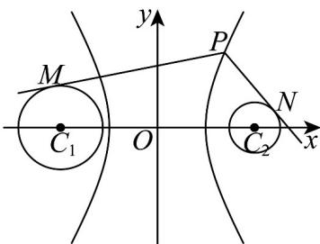

<!-- question-source:start -->
【变式1】过双曲线 $\frac{x^2}{4} -\frac{y^2}{12} = 1$ 的右支上一点 $P$ ，分别向 $\odot C_1:(x + 4)^2 +y^2 = 3$ 和 $\odot C_2:(x - 4)^2 +y^2 = 1$ 作切线，切点分别为 $M,N$ ，则 $\left( \begin{array}{cc} \overline{\mu}\overline{\mu}\overline{\mu}\\ PM + PN \end{array} \right)\cdot \overline{\mu}\overline{\mu}\overline{\mu}$ 的最小值为（）

A. 28 B. 30 C. 31 D. 32
<!-- question-source:end -->

![[高中/课堂同步/题库/人教A版高中数学同步讲义(2026)/03_选择性必修第一册/第三章 圆锥曲线的方程/讲义/专题3_2_双曲线_高效培优讲义_/题型01_双曲线的定义_sec_15/questions/answers/Q00063071A1.md]]
